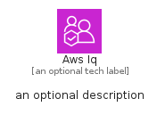
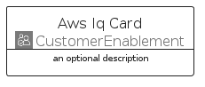
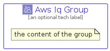

# AwsIq


```text
aws-q2-2024/Architecture/CustomerEnablement/AwsIq
```

```text
include('aws-q2-2024/Architecture/CustomerEnablement/AwsIq')
```


| Illustration | AwsIq | AwsIqCard | AwsIqGroup |
| :---: | :---: | :---: | :---: |
|  |  |  |  |


## Sprites
The item provides the following sriptes:

- `<$AwsIqXs>`
- `<$AwsIqSm>`
- `<$AwsIqMd>`
- `<$AwsIqLg>`


## AwsIq

### Load remotely
```plantuml
@startuml
' configures the library
!global $LIB_BASE_LOCATION="https://raw.githubusercontent.com/tmorin/plantuml-libs/master/distribution"

' loads the library's bootstrap
!include $LIB_BASE_LOCATION/bootstrap.puml

' loads the package bootstrap
include('aws-q2-2024/bootstrap')

' loads the Item which embeds the element AwsIq
include('aws-q2-2024/Architecture/CustomerEnablement/AwsIq')

' renders the element
AwsIq('AwsIq', 'Aws Iq', 'an optional tech label', 'an optional description')
@enduml
```

### Load locally
```plantuml
@startuml
' configures the library
!global $INCLUSION_MODE="local"
!global $LIB_BASE_LOCATION="../../.."

' loads the library's bootstrap
!include $LIB_BASE_LOCATION/bootstrap.puml

' loads the package bootstrap
include('aws-q2-2024/bootstrap')

' loads the Item which embeds the element AwsIq
include('aws-q2-2024/Architecture/CustomerEnablement/AwsIq')

' renders the element
AwsIq('AwsIq', 'Aws Iq', 'an optional tech label', 'an optional description')
@enduml
```

## AwsIqCard

### Load remotely
```plantuml
@startuml
' configures the library
!global $LIB_BASE_LOCATION="https://raw.githubusercontent.com/tmorin/plantuml-libs/master/distribution"

' loads the library's bootstrap
!include $LIB_BASE_LOCATION/bootstrap.puml

' loads the package bootstrap
include('aws-q2-2024/bootstrap')

' loads the Item which embeds the element AwsIqCard
include('aws-q2-2024/Architecture/CustomerEnablement/AwsIq')

' renders the element
AwsIqCard('AwsIqCard', 'Aws Iq Card', 'an optional description')
@enduml
```

### Load locally
```plantuml
@startuml
' configures the library
!global $INCLUSION_MODE="local"
!global $LIB_BASE_LOCATION="../../.."

' loads the library's bootstrap
!include $LIB_BASE_LOCATION/bootstrap.puml

' loads the package bootstrap
include('aws-q2-2024/bootstrap')

' loads the Item which embeds the element AwsIqCard
include('aws-q2-2024/Architecture/CustomerEnablement/AwsIq')

' renders the element
AwsIqCard('AwsIqCard', 'Aws Iq Card', 'an optional description')
@enduml
```

## AwsIqGroup

### Load remotely
```plantuml
@startuml
' configures the library
!global $LIB_BASE_LOCATION="https://raw.githubusercontent.com/tmorin/plantuml-libs/master/distribution"

' loads the library's bootstrap
!include $LIB_BASE_LOCATION/bootstrap.puml

' loads the package bootstrap
include('aws-q2-2024/bootstrap')

' loads the Item which embeds the element AwsIqGroup
include('aws-q2-2024/Architecture/CustomerEnablement/AwsIq')

' renders the element
AwsIqGroup('AwsIqGroup', 'Aws Iq Group', 'an optional tech label') {
    note as note
        the content of the group
    end note
}
@enduml
```

### Load locally
```plantuml
@startuml
' configures the library
!global $INCLUSION_MODE="local"
!global $LIB_BASE_LOCATION="../../.."

' loads the library's bootstrap
!include $LIB_BASE_LOCATION/bootstrap.puml

' loads the package bootstrap
include('aws-q2-2024/bootstrap')

' loads the Item which embeds the element AwsIqGroup
include('aws-q2-2024/Architecture/CustomerEnablement/AwsIq')

' renders the element
AwsIqGroup('AwsIqGroup', 'Aws Iq Group', 'an optional tech label') {
    note as note
        the content of the group
    end note
}
@enduml
```

