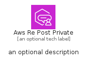

# AwsRePostPrivate


```text
aws-q2-2024/Architecture/CustomerEnablement/AwsRePostPrivate
```

```text
include('aws-q2-2024/Architecture/CustomerEnablement/AwsRePostPrivate')
```


| Illustration | AwsRePostPrivate | AwsRePostPrivateCard | AwsRePostPrivateGroup |
| :---: | :---: | :---: | :---: |
|  |  |  |  |


## Sprites
The item provides the following sriptes:

- `<$AwsRePostPrivateXs>`
- `<$AwsRePostPrivateSm>`
- `<$AwsRePostPrivateMd>`
- `<$AwsRePostPrivateLg>`


## AwsRePostPrivate

### Load remotely
```plantuml
@startuml
' configures the library
!global $LIB_BASE_LOCATION="https://raw.githubusercontent.com/tmorin/plantuml-libs/master/distribution"

' loads the library's bootstrap
!include $LIB_BASE_LOCATION/bootstrap.puml

' loads the package bootstrap
include('aws-q2-2024/bootstrap')

' loads the Item which embeds the element AwsRePostPrivate
include('aws-q2-2024/Architecture/CustomerEnablement/AwsRePostPrivate')

' renders the element
AwsRePostPrivate('AwsRePostPrivate', 'Aws Re Post Private', 'an optional tech label', 'an optional description')
@enduml
```

### Load locally
```plantuml
@startuml
' configures the library
!global $INCLUSION_MODE="local"
!global $LIB_BASE_LOCATION="../../.."

' loads the library's bootstrap
!include $LIB_BASE_LOCATION/bootstrap.puml

' loads the package bootstrap
include('aws-q2-2024/bootstrap')

' loads the Item which embeds the element AwsRePostPrivate
include('aws-q2-2024/Architecture/CustomerEnablement/AwsRePostPrivate')

' renders the element
AwsRePostPrivate('AwsRePostPrivate', 'Aws Re Post Private', 'an optional tech label', 'an optional description')
@enduml
```

## AwsRePostPrivateCard

### Load remotely
```plantuml
@startuml
' configures the library
!global $LIB_BASE_LOCATION="https://raw.githubusercontent.com/tmorin/plantuml-libs/master/distribution"

' loads the library's bootstrap
!include $LIB_BASE_LOCATION/bootstrap.puml

' loads the package bootstrap
include('aws-q2-2024/bootstrap')

' loads the Item which embeds the element AwsRePostPrivateCard
include('aws-q2-2024/Architecture/CustomerEnablement/AwsRePostPrivate')

' renders the element
AwsRePostPrivateCard('AwsRePostPrivateCard', 'Aws Re Post Private Card', 'an optional description')
@enduml
```

### Load locally
```plantuml
@startuml
' configures the library
!global $INCLUSION_MODE="local"
!global $LIB_BASE_LOCATION="../../.."

' loads the library's bootstrap
!include $LIB_BASE_LOCATION/bootstrap.puml

' loads the package bootstrap
include('aws-q2-2024/bootstrap')

' loads the Item which embeds the element AwsRePostPrivateCard
include('aws-q2-2024/Architecture/CustomerEnablement/AwsRePostPrivate')

' renders the element
AwsRePostPrivateCard('AwsRePostPrivateCard', 'Aws Re Post Private Card', 'an optional description')
@enduml
```

## AwsRePostPrivateGroup

### Load remotely
```plantuml
@startuml
' configures the library
!global $LIB_BASE_LOCATION="https://raw.githubusercontent.com/tmorin/plantuml-libs/master/distribution"

' loads the library's bootstrap
!include $LIB_BASE_LOCATION/bootstrap.puml

' loads the package bootstrap
include('aws-q2-2024/bootstrap')

' loads the Item which embeds the element AwsRePostPrivateGroup
include('aws-q2-2024/Architecture/CustomerEnablement/AwsRePostPrivate')

' renders the element
AwsRePostPrivateGroup('AwsRePostPrivateGroup', 'Aws Re Post Private Group', 'an optional tech label') {
    note as note
        the content of the group
    end note
}
@enduml
```

### Load locally
```plantuml
@startuml
' configures the library
!global $INCLUSION_MODE="local"
!global $LIB_BASE_LOCATION="../../.."

' loads the library's bootstrap
!include $LIB_BASE_LOCATION/bootstrap.puml

' loads the package bootstrap
include('aws-q2-2024/bootstrap')

' loads the Item which embeds the element AwsRePostPrivateGroup
include('aws-q2-2024/Architecture/CustomerEnablement/AwsRePostPrivate')

' renders the element
AwsRePostPrivateGroup('AwsRePostPrivateGroup', 'Aws Re Post Private Group', 'an optional tech label') {
    note as note
        the content of the group
    end note
}
@enduml
```

