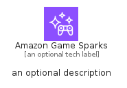
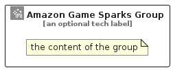

# AmazonGameSparks


```text
aws-q2-2024/Architecture/Games/AmazonGameSparks
```

```text
include('aws-q2-2024/Architecture/Games/AmazonGameSparks')
```


| Illustration | AmazonGameSparks | AmazonGameSparksCard | AmazonGameSparksGroup |
| :---: | :---: | :---: | :---: |
|  |  |  |  |


## Sprites
The item provides the following sriptes:

- `<$AmazonGameSparksXs>`
- `<$AmazonGameSparksSm>`
- `<$AmazonGameSparksMd>`
- `<$AmazonGameSparksLg>`


## AmazonGameSparks

### Load remotely
```plantuml
@startuml
' configures the library
!global $LIB_BASE_LOCATION="https://raw.githubusercontent.com/tmorin/plantuml-libs/master/distribution"

' loads the library's bootstrap
!include $LIB_BASE_LOCATION/bootstrap.puml

' loads the package bootstrap
include('aws-q2-2024/bootstrap')

' loads the Item which embeds the element AmazonGameSparks
include('aws-q2-2024/Architecture/Games/AmazonGameSparks')

' renders the element
AmazonGameSparks('AmazonGameSparks', 'Amazon Game Sparks', 'an optional tech label', 'an optional description')
@enduml
```

### Load locally
```plantuml
@startuml
' configures the library
!global $INCLUSION_MODE="local"
!global $LIB_BASE_LOCATION="../../.."

' loads the library's bootstrap
!include $LIB_BASE_LOCATION/bootstrap.puml

' loads the package bootstrap
include('aws-q2-2024/bootstrap')

' loads the Item which embeds the element AmazonGameSparks
include('aws-q2-2024/Architecture/Games/AmazonGameSparks')

' renders the element
AmazonGameSparks('AmazonGameSparks', 'Amazon Game Sparks', 'an optional tech label', 'an optional description')
@enduml
```

## AmazonGameSparksCard

### Load remotely
```plantuml
@startuml
' configures the library
!global $LIB_BASE_LOCATION="https://raw.githubusercontent.com/tmorin/plantuml-libs/master/distribution"

' loads the library's bootstrap
!include $LIB_BASE_LOCATION/bootstrap.puml

' loads the package bootstrap
include('aws-q2-2024/bootstrap')

' loads the Item which embeds the element AmazonGameSparksCard
include('aws-q2-2024/Architecture/Games/AmazonGameSparks')

' renders the element
AmazonGameSparksCard('AmazonGameSparksCard', 'Amazon Game Sparks Card', 'an optional description')
@enduml
```

### Load locally
```plantuml
@startuml
' configures the library
!global $INCLUSION_MODE="local"
!global $LIB_BASE_LOCATION="../../.."

' loads the library's bootstrap
!include $LIB_BASE_LOCATION/bootstrap.puml

' loads the package bootstrap
include('aws-q2-2024/bootstrap')

' loads the Item which embeds the element AmazonGameSparksCard
include('aws-q2-2024/Architecture/Games/AmazonGameSparks')

' renders the element
AmazonGameSparksCard('AmazonGameSparksCard', 'Amazon Game Sparks Card', 'an optional description')
@enduml
```

## AmazonGameSparksGroup

### Load remotely
```plantuml
@startuml
' configures the library
!global $LIB_BASE_LOCATION="https://raw.githubusercontent.com/tmorin/plantuml-libs/master/distribution"

' loads the library's bootstrap
!include $LIB_BASE_LOCATION/bootstrap.puml

' loads the package bootstrap
include('aws-q2-2024/bootstrap')

' loads the Item which embeds the element AmazonGameSparksGroup
include('aws-q2-2024/Architecture/Games/AmazonGameSparks')

' renders the element
AmazonGameSparksGroup('AmazonGameSparksGroup', 'Amazon Game Sparks Group', 'an optional tech label') {
    note as note
        the content of the group
    end note
}
@enduml
```

### Load locally
```plantuml
@startuml
' configures the library
!global $INCLUSION_MODE="local"
!global $LIB_BASE_LOCATION="../../.."

' loads the library's bootstrap
!include $LIB_BASE_LOCATION/bootstrap.puml

' loads the package bootstrap
include('aws-q2-2024/bootstrap')

' loads the Item which embeds the element AmazonGameSparksGroup
include('aws-q2-2024/Architecture/Games/AmazonGameSparks')

' renders the element
AmazonGameSparksGroup('AmazonGameSparksGroup', 'Amazon Game Sparks Group', 'an optional tech label') {
    note as note
        the content of the group
    end note
}
@enduml
```

