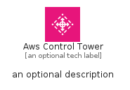
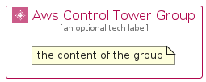

# AwsControlTower


```text
aws-q2-2024/Architecture/ManagementGovernance/AwsControlTower
```

```text
include('aws-q2-2024/Architecture/ManagementGovernance/AwsControlTower')
```


| Illustration | AwsControlTower | AwsControlTowerCard | AwsControlTowerGroup |
| :---: | :---: | :---: | :---: |
|  |  |  |  |


## Sprites
The item provides the following sriptes:

- `<$AwsControlTowerXs>`
- `<$AwsControlTowerSm>`
- `<$AwsControlTowerMd>`
- `<$AwsControlTowerLg>`


## AwsControlTower

### Load remotely
```plantuml
@startuml
' configures the library
!global $LIB_BASE_LOCATION="https://raw.githubusercontent.com/tmorin/plantuml-libs/master/distribution"

' loads the library's bootstrap
!include $LIB_BASE_LOCATION/bootstrap.puml

' loads the package bootstrap
include('aws-q2-2024/bootstrap')

' loads the Item which embeds the element AwsControlTower
include('aws-q2-2024/Architecture/ManagementGovernance/AwsControlTower')

' renders the element
AwsControlTower('AwsControlTower', 'Aws Control Tower', 'an optional tech label', 'an optional description')
@enduml
```

### Load locally
```plantuml
@startuml
' configures the library
!global $INCLUSION_MODE="local"
!global $LIB_BASE_LOCATION="../../.."

' loads the library's bootstrap
!include $LIB_BASE_LOCATION/bootstrap.puml

' loads the package bootstrap
include('aws-q2-2024/bootstrap')

' loads the Item which embeds the element AwsControlTower
include('aws-q2-2024/Architecture/ManagementGovernance/AwsControlTower')

' renders the element
AwsControlTower('AwsControlTower', 'Aws Control Tower', 'an optional tech label', 'an optional description')
@enduml
```

## AwsControlTowerCard

### Load remotely
```plantuml
@startuml
' configures the library
!global $LIB_BASE_LOCATION="https://raw.githubusercontent.com/tmorin/plantuml-libs/master/distribution"

' loads the library's bootstrap
!include $LIB_BASE_LOCATION/bootstrap.puml

' loads the package bootstrap
include('aws-q2-2024/bootstrap')

' loads the Item which embeds the element AwsControlTowerCard
include('aws-q2-2024/Architecture/ManagementGovernance/AwsControlTower')

' renders the element
AwsControlTowerCard('AwsControlTowerCard', 'Aws Control Tower Card', 'an optional description')
@enduml
```

### Load locally
```plantuml
@startuml
' configures the library
!global $INCLUSION_MODE="local"
!global $LIB_BASE_LOCATION="../../.."

' loads the library's bootstrap
!include $LIB_BASE_LOCATION/bootstrap.puml

' loads the package bootstrap
include('aws-q2-2024/bootstrap')

' loads the Item which embeds the element AwsControlTowerCard
include('aws-q2-2024/Architecture/ManagementGovernance/AwsControlTower')

' renders the element
AwsControlTowerCard('AwsControlTowerCard', 'Aws Control Tower Card', 'an optional description')
@enduml
```

## AwsControlTowerGroup

### Load remotely
```plantuml
@startuml
' configures the library
!global $LIB_BASE_LOCATION="https://raw.githubusercontent.com/tmorin/plantuml-libs/master/distribution"

' loads the library's bootstrap
!include $LIB_BASE_LOCATION/bootstrap.puml

' loads the package bootstrap
include('aws-q2-2024/bootstrap')

' loads the Item which embeds the element AwsControlTowerGroup
include('aws-q2-2024/Architecture/ManagementGovernance/AwsControlTower')

' renders the element
AwsControlTowerGroup('AwsControlTowerGroup', 'Aws Control Tower Group', 'an optional tech label') {
    note as note
        the content of the group
    end note
}
@enduml
```

### Load locally
```plantuml
@startuml
' configures the library
!global $INCLUSION_MODE="local"
!global $LIB_BASE_LOCATION="../../.."

' loads the library's bootstrap
!include $LIB_BASE_LOCATION/bootstrap.puml

' loads the package bootstrap
include('aws-q2-2024/bootstrap')

' loads the Item which embeds the element AwsControlTowerGroup
include('aws-q2-2024/Architecture/ManagementGovernance/AwsControlTower')

' renders the element
AwsControlTowerGroup('AwsControlTowerGroup', 'Aws Control Tower Group', 'an optional tech label') {
    note as note
        the content of the group
    end note
}
@enduml
```

