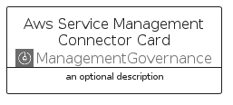

# AwsServiceManagementConnector


```text
aws-q2-2024/Architecture/ManagementGovernance/AwsServiceManagementConnector
```

```text
include('aws-q2-2024/Architecture/ManagementGovernance/AwsServiceManagementConnector')
```


| Illustration | AwsServiceManagementConnector | AwsServiceManagementConnectorCard | AwsServiceManagementConnectorGroup |
| :---: | :---: | :---: | :---: |
|  |  |  |  |


## Sprites
The item provides the following sriptes:

- `<$AwsServiceManagementConnectorXs>`
- `<$AwsServiceManagementConnectorSm>`
- `<$AwsServiceManagementConnectorMd>`
- `<$AwsServiceManagementConnectorLg>`


## AwsServiceManagementConnector

### Load remotely
```plantuml
@startuml
' configures the library
!global $LIB_BASE_LOCATION="https://raw.githubusercontent.com/tmorin/plantuml-libs/master/distribution"

' loads the library's bootstrap
!include $LIB_BASE_LOCATION/bootstrap.puml

' loads the package bootstrap
include('aws-q2-2024/bootstrap')

' loads the Item which embeds the element AwsServiceManagementConnector
include('aws-q2-2024/Architecture/ManagementGovernance/AwsServiceManagementConnector')

' renders the element
AwsServiceManagementConnector('AwsServiceManagementConnector', 'Aws Service Management Connector', 'an optional tech label', 'an optional description')
@enduml
```

### Load locally
```plantuml
@startuml
' configures the library
!global $INCLUSION_MODE="local"
!global $LIB_BASE_LOCATION="../../.."

' loads the library's bootstrap
!include $LIB_BASE_LOCATION/bootstrap.puml

' loads the package bootstrap
include('aws-q2-2024/bootstrap')

' loads the Item which embeds the element AwsServiceManagementConnector
include('aws-q2-2024/Architecture/ManagementGovernance/AwsServiceManagementConnector')

' renders the element
AwsServiceManagementConnector('AwsServiceManagementConnector', 'Aws Service Management Connector', 'an optional tech label', 'an optional description')
@enduml
```

## AwsServiceManagementConnectorCard

### Load remotely
```plantuml
@startuml
' configures the library
!global $LIB_BASE_LOCATION="https://raw.githubusercontent.com/tmorin/plantuml-libs/master/distribution"

' loads the library's bootstrap
!include $LIB_BASE_LOCATION/bootstrap.puml

' loads the package bootstrap
include('aws-q2-2024/bootstrap')

' loads the Item which embeds the element AwsServiceManagementConnectorCard
include('aws-q2-2024/Architecture/ManagementGovernance/AwsServiceManagementConnector')

' renders the element
AwsServiceManagementConnectorCard('AwsServiceManagementConnectorCard', 'Aws Service Management Connector Card', 'an optional description')
@enduml
```

### Load locally
```plantuml
@startuml
' configures the library
!global $INCLUSION_MODE="local"
!global $LIB_BASE_LOCATION="../../.."

' loads the library's bootstrap
!include $LIB_BASE_LOCATION/bootstrap.puml

' loads the package bootstrap
include('aws-q2-2024/bootstrap')

' loads the Item which embeds the element AwsServiceManagementConnectorCard
include('aws-q2-2024/Architecture/ManagementGovernance/AwsServiceManagementConnector')

' renders the element
AwsServiceManagementConnectorCard('AwsServiceManagementConnectorCard', 'Aws Service Management Connector Card', 'an optional description')
@enduml
```

## AwsServiceManagementConnectorGroup

### Load remotely
```plantuml
@startuml
' configures the library
!global $LIB_BASE_LOCATION="https://raw.githubusercontent.com/tmorin/plantuml-libs/master/distribution"

' loads the library's bootstrap
!include $LIB_BASE_LOCATION/bootstrap.puml

' loads the package bootstrap
include('aws-q2-2024/bootstrap')

' loads the Item which embeds the element AwsServiceManagementConnectorGroup
include('aws-q2-2024/Architecture/ManagementGovernance/AwsServiceManagementConnector')

' renders the element
AwsServiceManagementConnectorGroup('AwsServiceManagementConnectorGroup', 'Aws Service Management Connector Group', 'an optional tech label') {
    note as note
        the content of the group
    end note
}
@enduml
```

### Load locally
```plantuml
@startuml
' configures the library
!global $INCLUSION_MODE="local"
!global $LIB_BASE_LOCATION="../../.."

' loads the library's bootstrap
!include $LIB_BASE_LOCATION/bootstrap.puml

' loads the package bootstrap
include('aws-q2-2024/bootstrap')

' loads the Item which embeds the element AwsServiceManagementConnectorGroup
include('aws-q2-2024/Architecture/ManagementGovernance/AwsServiceManagementConnector')

' renders the element
AwsServiceManagementConnectorGroup('AwsServiceManagementConnectorGroup', 'Aws Service Management Connector Group', 'an optional tech label') {
    note as note
        the content of the group
    end note
}
@enduml
```

