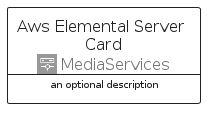

# AwsElementalServer


```text
aws-q2-2024/Architecture/MediaServices/AwsElementalServer
```

```text
include('aws-q2-2024/Architecture/MediaServices/AwsElementalServer')
```


| Illustration | AwsElementalServer | AwsElementalServerCard | AwsElementalServerGroup |
| :---: | :---: | :---: | :---: |
|  |  |  |  |


## Sprites
The item provides the following sriptes:

- `<$AwsElementalServerXs>`
- `<$AwsElementalServerSm>`
- `<$AwsElementalServerMd>`
- `<$AwsElementalServerLg>`


## AwsElementalServer

### Load remotely
```plantuml
@startuml
' configures the library
!global $LIB_BASE_LOCATION="https://raw.githubusercontent.com/tmorin/plantuml-libs/master/distribution"

' loads the library's bootstrap
!include $LIB_BASE_LOCATION/bootstrap.puml

' loads the package bootstrap
include('aws-q2-2024/bootstrap')

' loads the Item which embeds the element AwsElementalServer
include('aws-q2-2024/Architecture/MediaServices/AwsElementalServer')

' renders the element
AwsElementalServer('AwsElementalServer', 'Aws Elemental Server', 'an optional tech label', 'an optional description')
@enduml
```

### Load locally
```plantuml
@startuml
' configures the library
!global $INCLUSION_MODE="local"
!global $LIB_BASE_LOCATION="../../.."

' loads the library's bootstrap
!include $LIB_BASE_LOCATION/bootstrap.puml

' loads the package bootstrap
include('aws-q2-2024/bootstrap')

' loads the Item which embeds the element AwsElementalServer
include('aws-q2-2024/Architecture/MediaServices/AwsElementalServer')

' renders the element
AwsElementalServer('AwsElementalServer', 'Aws Elemental Server', 'an optional tech label', 'an optional description')
@enduml
```

## AwsElementalServerCard

### Load remotely
```plantuml
@startuml
' configures the library
!global $LIB_BASE_LOCATION="https://raw.githubusercontent.com/tmorin/plantuml-libs/master/distribution"

' loads the library's bootstrap
!include $LIB_BASE_LOCATION/bootstrap.puml

' loads the package bootstrap
include('aws-q2-2024/bootstrap')

' loads the Item which embeds the element AwsElementalServerCard
include('aws-q2-2024/Architecture/MediaServices/AwsElementalServer')

' renders the element
AwsElementalServerCard('AwsElementalServerCard', 'Aws Elemental Server Card', 'an optional description')
@enduml
```

### Load locally
```plantuml
@startuml
' configures the library
!global $INCLUSION_MODE="local"
!global $LIB_BASE_LOCATION="../../.."

' loads the library's bootstrap
!include $LIB_BASE_LOCATION/bootstrap.puml

' loads the package bootstrap
include('aws-q2-2024/bootstrap')

' loads the Item which embeds the element AwsElementalServerCard
include('aws-q2-2024/Architecture/MediaServices/AwsElementalServer')

' renders the element
AwsElementalServerCard('AwsElementalServerCard', 'Aws Elemental Server Card', 'an optional description')
@enduml
```

## AwsElementalServerGroup

### Load remotely
```plantuml
@startuml
' configures the library
!global $LIB_BASE_LOCATION="https://raw.githubusercontent.com/tmorin/plantuml-libs/master/distribution"

' loads the library's bootstrap
!include $LIB_BASE_LOCATION/bootstrap.puml

' loads the package bootstrap
include('aws-q2-2024/bootstrap')

' loads the Item which embeds the element AwsElementalServerGroup
include('aws-q2-2024/Architecture/MediaServices/AwsElementalServer')

' renders the element
AwsElementalServerGroup('AwsElementalServerGroup', 'Aws Elemental Server Group', 'an optional tech label') {
    note as note
        the content of the group
    end note
}
@enduml
```

### Load locally
```plantuml
@startuml
' configures the library
!global $INCLUSION_MODE="local"
!global $LIB_BASE_LOCATION="../../.."

' loads the library's bootstrap
!include $LIB_BASE_LOCATION/bootstrap.puml

' loads the package bootstrap
include('aws-q2-2024/bootstrap')

' loads the Item which embeds the element AwsElementalServerGroup
include('aws-q2-2024/Architecture/MediaServices/AwsElementalServer')

' renders the element
AwsElementalServerGroup('AwsElementalServerGroup', 'Aws Elemental Server Group', 'an optional tech label') {
    note as note
        the content of the group
    end note
}
@enduml
```

