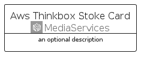
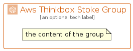

# AwsThinkboxStoke


```text
aws-q2-2024/Architecture/MediaServices/AwsThinkboxStoke
```

```text
include('aws-q2-2024/Architecture/MediaServices/AwsThinkboxStoke')
```


| Illustration | AwsThinkboxStoke | AwsThinkboxStokeCard | AwsThinkboxStokeGroup |
| :---: | :---: | :---: | :---: |
|  |  |  |  |


## Sprites
The item provides the following sriptes:

- `<$AwsThinkboxStokeXs>`
- `<$AwsThinkboxStokeSm>`
- `<$AwsThinkboxStokeMd>`
- `<$AwsThinkboxStokeLg>`


## AwsThinkboxStoke

### Load remotely
```plantuml
@startuml
' configures the library
!global $LIB_BASE_LOCATION="https://raw.githubusercontent.com/tmorin/plantuml-libs/master/distribution"

' loads the library's bootstrap
!include $LIB_BASE_LOCATION/bootstrap.puml

' loads the package bootstrap
include('aws-q2-2024/bootstrap')

' loads the Item which embeds the element AwsThinkboxStoke
include('aws-q2-2024/Architecture/MediaServices/AwsThinkboxStoke')

' renders the element
AwsThinkboxStoke('AwsThinkboxStoke', 'Aws Thinkbox Stoke', 'an optional tech label', 'an optional description')
@enduml
```

### Load locally
```plantuml
@startuml
' configures the library
!global $INCLUSION_MODE="local"
!global $LIB_BASE_LOCATION="../../.."

' loads the library's bootstrap
!include $LIB_BASE_LOCATION/bootstrap.puml

' loads the package bootstrap
include('aws-q2-2024/bootstrap')

' loads the Item which embeds the element AwsThinkboxStoke
include('aws-q2-2024/Architecture/MediaServices/AwsThinkboxStoke')

' renders the element
AwsThinkboxStoke('AwsThinkboxStoke', 'Aws Thinkbox Stoke', 'an optional tech label', 'an optional description')
@enduml
```

## AwsThinkboxStokeCard

### Load remotely
```plantuml
@startuml
' configures the library
!global $LIB_BASE_LOCATION="https://raw.githubusercontent.com/tmorin/plantuml-libs/master/distribution"

' loads the library's bootstrap
!include $LIB_BASE_LOCATION/bootstrap.puml

' loads the package bootstrap
include('aws-q2-2024/bootstrap')

' loads the Item which embeds the element AwsThinkboxStokeCard
include('aws-q2-2024/Architecture/MediaServices/AwsThinkboxStoke')

' renders the element
AwsThinkboxStokeCard('AwsThinkboxStokeCard', 'Aws Thinkbox Stoke Card', 'an optional description')
@enduml
```

### Load locally
```plantuml
@startuml
' configures the library
!global $INCLUSION_MODE="local"
!global $LIB_BASE_LOCATION="../../.."

' loads the library's bootstrap
!include $LIB_BASE_LOCATION/bootstrap.puml

' loads the package bootstrap
include('aws-q2-2024/bootstrap')

' loads the Item which embeds the element AwsThinkboxStokeCard
include('aws-q2-2024/Architecture/MediaServices/AwsThinkboxStoke')

' renders the element
AwsThinkboxStokeCard('AwsThinkboxStokeCard', 'Aws Thinkbox Stoke Card', 'an optional description')
@enduml
```

## AwsThinkboxStokeGroup

### Load remotely
```plantuml
@startuml
' configures the library
!global $LIB_BASE_LOCATION="https://raw.githubusercontent.com/tmorin/plantuml-libs/master/distribution"

' loads the library's bootstrap
!include $LIB_BASE_LOCATION/bootstrap.puml

' loads the package bootstrap
include('aws-q2-2024/bootstrap')

' loads the Item which embeds the element AwsThinkboxStokeGroup
include('aws-q2-2024/Architecture/MediaServices/AwsThinkboxStoke')

' renders the element
AwsThinkboxStokeGroup('AwsThinkboxStokeGroup', 'Aws Thinkbox Stoke Group', 'an optional tech label') {
    note as note
        the content of the group
    end note
}
@enduml
```

### Load locally
```plantuml
@startuml
' configures the library
!global $INCLUSION_MODE="local"
!global $LIB_BASE_LOCATION="../../.."

' loads the library's bootstrap
!include $LIB_BASE_LOCATION/bootstrap.puml

' loads the package bootstrap
include('aws-q2-2024/bootstrap')

' loads the Item which embeds the element AwsThinkboxStokeGroup
include('aws-q2-2024/Architecture/MediaServices/AwsThinkboxStoke')

' renders the element
AwsThinkboxStokeGroup('AwsThinkboxStokeGroup', 'Aws Thinkbox Stoke Group', 'an optional tech label') {
    note as note
        the content of the group
    end note
}
@enduml
```

