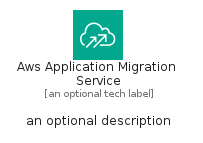
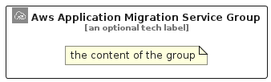

# AwsApplicationMigrationService


```text
aws-q2-2024/Architecture/MigrationModernization/AwsApplicationMigrationService
```

```text
include('aws-q2-2024/Architecture/MigrationModernization/AwsApplicationMigrationService')
```


| Illustration | AwsApplicationMigrationService | AwsApplicationMigrationServiceCard | AwsApplicationMigrationServiceGroup |
| :---: | :---: | :---: | :---: |
|  |  |  |  |


## Sprites
The item provides the following sriptes:

- `<$AwsApplicationMigrationServiceXs>`
- `<$AwsApplicationMigrationServiceSm>`
- `<$AwsApplicationMigrationServiceMd>`
- `<$AwsApplicationMigrationServiceLg>`


## AwsApplicationMigrationService

### Load remotely
```plantuml
@startuml
' configures the library
!global $LIB_BASE_LOCATION="https://raw.githubusercontent.com/tmorin/plantuml-libs/master/distribution"

' loads the library's bootstrap
!include $LIB_BASE_LOCATION/bootstrap.puml

' loads the package bootstrap
include('aws-q2-2024/bootstrap')

' loads the Item which embeds the element AwsApplicationMigrationService
include('aws-q2-2024/Architecture/MigrationModernization/AwsApplicationMigrationService')

' renders the element
AwsApplicationMigrationService('AwsApplicationMigrationService', 'Aws Application Migration Service', 'an optional tech label', 'an optional description')
@enduml
```

### Load locally
```plantuml
@startuml
' configures the library
!global $INCLUSION_MODE="local"
!global $LIB_BASE_LOCATION="../../.."

' loads the library's bootstrap
!include $LIB_BASE_LOCATION/bootstrap.puml

' loads the package bootstrap
include('aws-q2-2024/bootstrap')

' loads the Item which embeds the element AwsApplicationMigrationService
include('aws-q2-2024/Architecture/MigrationModernization/AwsApplicationMigrationService')

' renders the element
AwsApplicationMigrationService('AwsApplicationMigrationService', 'Aws Application Migration Service', 'an optional tech label', 'an optional description')
@enduml
```

## AwsApplicationMigrationServiceCard

### Load remotely
```plantuml
@startuml
' configures the library
!global $LIB_BASE_LOCATION="https://raw.githubusercontent.com/tmorin/plantuml-libs/master/distribution"

' loads the library's bootstrap
!include $LIB_BASE_LOCATION/bootstrap.puml

' loads the package bootstrap
include('aws-q2-2024/bootstrap')

' loads the Item which embeds the element AwsApplicationMigrationServiceCard
include('aws-q2-2024/Architecture/MigrationModernization/AwsApplicationMigrationService')

' renders the element
AwsApplicationMigrationServiceCard('AwsApplicationMigrationServiceCard', 'Aws Application Migration Service Card', 'an optional description')
@enduml
```

### Load locally
```plantuml
@startuml
' configures the library
!global $INCLUSION_MODE="local"
!global $LIB_BASE_LOCATION="../../.."

' loads the library's bootstrap
!include $LIB_BASE_LOCATION/bootstrap.puml

' loads the package bootstrap
include('aws-q2-2024/bootstrap')

' loads the Item which embeds the element AwsApplicationMigrationServiceCard
include('aws-q2-2024/Architecture/MigrationModernization/AwsApplicationMigrationService')

' renders the element
AwsApplicationMigrationServiceCard('AwsApplicationMigrationServiceCard', 'Aws Application Migration Service Card', 'an optional description')
@enduml
```

## AwsApplicationMigrationServiceGroup

### Load remotely
```plantuml
@startuml
' configures the library
!global $LIB_BASE_LOCATION="https://raw.githubusercontent.com/tmorin/plantuml-libs/master/distribution"

' loads the library's bootstrap
!include $LIB_BASE_LOCATION/bootstrap.puml

' loads the package bootstrap
include('aws-q2-2024/bootstrap')

' loads the Item which embeds the element AwsApplicationMigrationServiceGroup
include('aws-q2-2024/Architecture/MigrationModernization/AwsApplicationMigrationService')

' renders the element
AwsApplicationMigrationServiceGroup('AwsApplicationMigrationServiceGroup', 'Aws Application Migration Service Group', 'an optional tech label') {
    note as note
        the content of the group
    end note
}
@enduml
```

### Load locally
```plantuml
@startuml
' configures the library
!global $INCLUSION_MODE="local"
!global $LIB_BASE_LOCATION="../../.."

' loads the library's bootstrap
!include $LIB_BASE_LOCATION/bootstrap.puml

' loads the package bootstrap
include('aws-q2-2024/bootstrap')

' loads the Item which embeds the element AwsApplicationMigrationServiceGroup
include('aws-q2-2024/Architecture/MigrationModernization/AwsApplicationMigrationService')

' renders the element
AwsApplicationMigrationServiceGroup('AwsApplicationMigrationServiceGroup', 'Aws Application Migration Service Group', 'an optional tech label') {
    note as note
        the content of the group
    end note
}
@enduml
```

