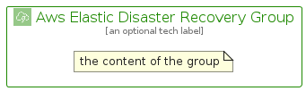

# AwsElasticDisasterRecovery


```text
aws-q2-2024/Architecture/Storage/AwsElasticDisasterRecovery
```

```text
include('aws-q2-2024/Architecture/Storage/AwsElasticDisasterRecovery')
```


| Illustration | AwsElasticDisasterRecovery | AwsElasticDisasterRecoveryCard | AwsElasticDisasterRecoveryGroup |
| :---: | :---: | :---: | :---: |
|  |  |  |  |


## Sprites
The item provides the following sriptes:

- `<$AwsElasticDisasterRecoveryXs>`
- `<$AwsElasticDisasterRecoverySm>`
- `<$AwsElasticDisasterRecoveryMd>`
- `<$AwsElasticDisasterRecoveryLg>`


## AwsElasticDisasterRecovery

### Load remotely
```plantuml
@startuml
' configures the library
!global $LIB_BASE_LOCATION="https://raw.githubusercontent.com/tmorin/plantuml-libs/master/distribution"

' loads the library's bootstrap
!include $LIB_BASE_LOCATION/bootstrap.puml

' loads the package bootstrap
include('aws-q2-2024/bootstrap')

' loads the Item which embeds the element AwsElasticDisasterRecovery
include('aws-q2-2024/Architecture/Storage/AwsElasticDisasterRecovery')

' renders the element
AwsElasticDisasterRecovery('AwsElasticDisasterRecovery', 'Aws Elastic Disaster Recovery', 'an optional tech label', 'an optional description')
@enduml
```

### Load locally
```plantuml
@startuml
' configures the library
!global $INCLUSION_MODE="local"
!global $LIB_BASE_LOCATION="../../.."

' loads the library's bootstrap
!include $LIB_BASE_LOCATION/bootstrap.puml

' loads the package bootstrap
include('aws-q2-2024/bootstrap')

' loads the Item which embeds the element AwsElasticDisasterRecovery
include('aws-q2-2024/Architecture/Storage/AwsElasticDisasterRecovery')

' renders the element
AwsElasticDisasterRecovery('AwsElasticDisasterRecovery', 'Aws Elastic Disaster Recovery', 'an optional tech label', 'an optional description')
@enduml
```

## AwsElasticDisasterRecoveryCard

### Load remotely
```plantuml
@startuml
' configures the library
!global $LIB_BASE_LOCATION="https://raw.githubusercontent.com/tmorin/plantuml-libs/master/distribution"

' loads the library's bootstrap
!include $LIB_BASE_LOCATION/bootstrap.puml

' loads the package bootstrap
include('aws-q2-2024/bootstrap')

' loads the Item which embeds the element AwsElasticDisasterRecoveryCard
include('aws-q2-2024/Architecture/Storage/AwsElasticDisasterRecovery')

' renders the element
AwsElasticDisasterRecoveryCard('AwsElasticDisasterRecoveryCard', 'Aws Elastic Disaster Recovery Card', 'an optional description')
@enduml
```

### Load locally
```plantuml
@startuml
' configures the library
!global $INCLUSION_MODE="local"
!global $LIB_BASE_LOCATION="../../.."

' loads the library's bootstrap
!include $LIB_BASE_LOCATION/bootstrap.puml

' loads the package bootstrap
include('aws-q2-2024/bootstrap')

' loads the Item which embeds the element AwsElasticDisasterRecoveryCard
include('aws-q2-2024/Architecture/Storage/AwsElasticDisasterRecovery')

' renders the element
AwsElasticDisasterRecoveryCard('AwsElasticDisasterRecoveryCard', 'Aws Elastic Disaster Recovery Card', 'an optional description')
@enduml
```

## AwsElasticDisasterRecoveryGroup

### Load remotely
```plantuml
@startuml
' configures the library
!global $LIB_BASE_LOCATION="https://raw.githubusercontent.com/tmorin/plantuml-libs/master/distribution"

' loads the library's bootstrap
!include $LIB_BASE_LOCATION/bootstrap.puml

' loads the package bootstrap
include('aws-q2-2024/bootstrap')

' loads the Item which embeds the element AwsElasticDisasterRecoveryGroup
include('aws-q2-2024/Architecture/Storage/AwsElasticDisasterRecovery')

' renders the element
AwsElasticDisasterRecoveryGroup('AwsElasticDisasterRecoveryGroup', 'Aws Elastic Disaster Recovery Group', 'an optional tech label') {
    note as note
        the content of the group
    end note
}
@enduml
```

### Load locally
```plantuml
@startuml
' configures the library
!global $INCLUSION_MODE="local"
!global $LIB_BASE_LOCATION="../../.."

' loads the library's bootstrap
!include $LIB_BASE_LOCATION/bootstrap.puml

' loads the package bootstrap
include('aws-q2-2024/bootstrap')

' loads the Item which embeds the element AwsElasticDisasterRecoveryGroup
include('aws-q2-2024/Architecture/Storage/AwsElasticDisasterRecovery')

' renders the element
AwsElasticDisasterRecoveryGroup('AwsElasticDisasterRecoveryGroup', 'Aws Elastic Disaster Recovery Group', 'an optional tech label') {
    note as note
        the content of the group
    end note
}
@enduml
```

