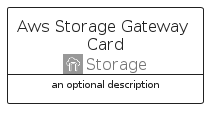

# AwsStorageGateway


```text
aws-q2-2024/Architecture/Storage/AwsStorageGateway
```

```text
include('aws-q2-2024/Architecture/Storage/AwsStorageGateway')
```


| Illustration | AwsStorageGateway | AwsStorageGatewayCard | AwsStorageGatewayGroup |
| :---: | :---: | :---: | :---: |
|  |  |  |  |


## Sprites
The item provides the following sriptes:

- `<$AwsStorageGatewayXs>`
- `<$AwsStorageGatewaySm>`
- `<$AwsStorageGatewayMd>`
- `<$AwsStorageGatewayLg>`


## AwsStorageGateway

### Load remotely
```plantuml
@startuml
' configures the library
!global $LIB_BASE_LOCATION="https://raw.githubusercontent.com/tmorin/plantuml-libs/master/distribution"

' loads the library's bootstrap
!include $LIB_BASE_LOCATION/bootstrap.puml

' loads the package bootstrap
include('aws-q2-2024/bootstrap')

' loads the Item which embeds the element AwsStorageGateway
include('aws-q2-2024/Architecture/Storage/AwsStorageGateway')

' renders the element
AwsStorageGateway('AwsStorageGateway', 'Aws Storage Gateway', 'an optional tech label', 'an optional description')
@enduml
```

### Load locally
```plantuml
@startuml
' configures the library
!global $INCLUSION_MODE="local"
!global $LIB_BASE_LOCATION="../../.."

' loads the library's bootstrap
!include $LIB_BASE_LOCATION/bootstrap.puml

' loads the package bootstrap
include('aws-q2-2024/bootstrap')

' loads the Item which embeds the element AwsStorageGateway
include('aws-q2-2024/Architecture/Storage/AwsStorageGateway')

' renders the element
AwsStorageGateway('AwsStorageGateway', 'Aws Storage Gateway', 'an optional tech label', 'an optional description')
@enduml
```

## AwsStorageGatewayCard

### Load remotely
```plantuml
@startuml
' configures the library
!global $LIB_BASE_LOCATION="https://raw.githubusercontent.com/tmorin/plantuml-libs/master/distribution"

' loads the library's bootstrap
!include $LIB_BASE_LOCATION/bootstrap.puml

' loads the package bootstrap
include('aws-q2-2024/bootstrap')

' loads the Item which embeds the element AwsStorageGatewayCard
include('aws-q2-2024/Architecture/Storage/AwsStorageGateway')

' renders the element
AwsStorageGatewayCard('AwsStorageGatewayCard', 'Aws Storage Gateway Card', 'an optional description')
@enduml
```

### Load locally
```plantuml
@startuml
' configures the library
!global $INCLUSION_MODE="local"
!global $LIB_BASE_LOCATION="../../.."

' loads the library's bootstrap
!include $LIB_BASE_LOCATION/bootstrap.puml

' loads the package bootstrap
include('aws-q2-2024/bootstrap')

' loads the Item which embeds the element AwsStorageGatewayCard
include('aws-q2-2024/Architecture/Storage/AwsStorageGateway')

' renders the element
AwsStorageGatewayCard('AwsStorageGatewayCard', 'Aws Storage Gateway Card', 'an optional description')
@enduml
```

## AwsStorageGatewayGroup

### Load remotely
```plantuml
@startuml
' configures the library
!global $LIB_BASE_LOCATION="https://raw.githubusercontent.com/tmorin/plantuml-libs/master/distribution"

' loads the library's bootstrap
!include $LIB_BASE_LOCATION/bootstrap.puml

' loads the package bootstrap
include('aws-q2-2024/bootstrap')

' loads the Item which embeds the element AwsStorageGatewayGroup
include('aws-q2-2024/Architecture/Storage/AwsStorageGateway')

' renders the element
AwsStorageGatewayGroup('AwsStorageGatewayGroup', 'Aws Storage Gateway Group', 'an optional tech label') {
    note as note
        the content of the group
    end note
}
@enduml
```

### Load locally
```plantuml
@startuml
' configures the library
!global $INCLUSION_MODE="local"
!global $LIB_BASE_LOCATION="../../.."

' loads the library's bootstrap
!include $LIB_BASE_LOCATION/bootstrap.puml

' loads the package bootstrap
include('aws-q2-2024/bootstrap')

' loads the Item which embeds the element AwsStorageGatewayGroup
include('aws-q2-2024/Architecture/Storage/AwsStorageGateway')

' renders the element
AwsStorageGatewayGroup('AwsStorageGatewayGroup', 'Aws Storage Gateway Group', 'an optional tech label') {
    note as note
        the content of the group
    end note
}
@enduml
```

