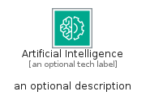
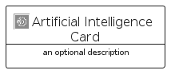

# ArtificialIntelligence


```text
aws-q2-2024/Category/ArtificialIntelligence
```

```text
include('aws-q2-2024/Category/ArtificialIntelligence')
```


| Illustration | ArtificialIntelligence | ArtificialIntelligenceCard | ArtificialIntelligenceGroup |
| :---: | :---: | :---: | :---: |
|  |  |  |  |


## Sprites
The item provides the following sriptes:

- `<$ArtificialIntelligenceXs>`
- `<$ArtificialIntelligenceSm>`
- `<$ArtificialIntelligenceMd>`
- `<$ArtificialIntelligenceLg>`


## ArtificialIntelligence

### Load remotely
```plantuml
@startuml
' configures the library
!global $LIB_BASE_LOCATION="https://raw.githubusercontent.com/tmorin/plantuml-libs/master/distribution"

' loads the library's bootstrap
!include $LIB_BASE_LOCATION/bootstrap.puml

' loads the package bootstrap
include('aws-q2-2024/bootstrap')

' loads the Item which embeds the element ArtificialIntelligence
include('aws-q2-2024/Category/ArtificialIntelligence')

' renders the element
ArtificialIntelligence('ArtificialIntelligence', 'Artificial Intelligence', 'an optional tech label', 'an optional description')
@enduml
```

### Load locally
```plantuml
@startuml
' configures the library
!global $INCLUSION_MODE="local"
!global $LIB_BASE_LOCATION="../.."

' loads the library's bootstrap
!include $LIB_BASE_LOCATION/bootstrap.puml

' loads the package bootstrap
include('aws-q2-2024/bootstrap')

' loads the Item which embeds the element ArtificialIntelligence
include('aws-q2-2024/Category/ArtificialIntelligence')

' renders the element
ArtificialIntelligence('ArtificialIntelligence', 'Artificial Intelligence', 'an optional tech label', 'an optional description')
@enduml
```

## ArtificialIntelligenceCard

### Load remotely
```plantuml
@startuml
' configures the library
!global $LIB_BASE_LOCATION="https://raw.githubusercontent.com/tmorin/plantuml-libs/master/distribution"

' loads the library's bootstrap
!include $LIB_BASE_LOCATION/bootstrap.puml

' loads the package bootstrap
include('aws-q2-2024/bootstrap')

' loads the Item which embeds the element ArtificialIntelligenceCard
include('aws-q2-2024/Category/ArtificialIntelligence')

' renders the element
ArtificialIntelligenceCard('ArtificialIntelligenceCard', 'Artificial Intelligence Card', 'an optional description')
@enduml
```

### Load locally
```plantuml
@startuml
' configures the library
!global $INCLUSION_MODE="local"
!global $LIB_BASE_LOCATION="../.."

' loads the library's bootstrap
!include $LIB_BASE_LOCATION/bootstrap.puml

' loads the package bootstrap
include('aws-q2-2024/bootstrap')

' loads the Item which embeds the element ArtificialIntelligenceCard
include('aws-q2-2024/Category/ArtificialIntelligence')

' renders the element
ArtificialIntelligenceCard('ArtificialIntelligenceCard', 'Artificial Intelligence Card', 'an optional description')
@enduml
```

## ArtificialIntelligenceGroup

### Load remotely
```plantuml
@startuml
' configures the library
!global $LIB_BASE_LOCATION="https://raw.githubusercontent.com/tmorin/plantuml-libs/master/distribution"

' loads the library's bootstrap
!include $LIB_BASE_LOCATION/bootstrap.puml

' loads the package bootstrap
include('aws-q2-2024/bootstrap')

' loads the Item which embeds the element ArtificialIntelligenceGroup
include('aws-q2-2024/Category/ArtificialIntelligence')

' renders the element
ArtificialIntelligenceGroup('ArtificialIntelligenceGroup', 'Artificial Intelligence Group', 'an optional tech label') {
    note as note
        the content of the group
    end note
}
@enduml
```

### Load locally
```plantuml
@startuml
' configures the library
!global $INCLUSION_MODE="local"
!global $LIB_BASE_LOCATION="../.."

' loads the library's bootstrap
!include $LIB_BASE_LOCATION/bootstrap.puml

' loads the package bootstrap
include('aws-q2-2024/bootstrap')

' loads the Item which embeds the element ArtificialIntelligenceGroup
include('aws-q2-2024/Category/ArtificialIntelligence')

' renders the element
ArtificialIntelligenceGroup('ArtificialIntelligenceGroup', 'Artificial Intelligence Group', 'an optional tech label') {
    note as note
        the content of the group
    end note
}
@enduml
```

