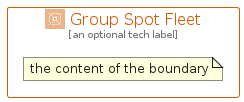

# GroupSpotFleet


```text
aws-q2-2024/Group/GroupSpotFleet
```

```text
include('aws-q2-2024/Group/GroupSpotFleet')
```


| Illustration | GroupSpotFleet |
| :---: | :---: |
|  |  |


## Sprites
The item provides the following sriptes:

- `<$GroupSpotFleetXs>`
- `<$GroupSpotFleetSm>`
- `<$GroupSpotFleetMd>`
- `<$GroupSpotFleetLg>`


## GroupSpotFleet

### Load remotely
```plantuml
@startuml
' configures the library
!global $LIB_BASE_LOCATION="https://raw.githubusercontent.com/tmorin/plantuml-libs/master/distribution"

' loads the library's bootstrap
!include $LIB_BASE_LOCATION/bootstrap.puml

' loads the package bootstrap
include('aws-q2-2024/bootstrap')

' loads the Item which embeds the element GroupSpotFleet
include('aws-q2-2024/Group/GroupSpotFleet')

GroupSpotFleet('GroupSpotFleet', 'Group Spot Fleet', 'an optional tech label') {
  note as note
  the content of the boundary
  end note
}
@enduml
```

### Load locally
```plantuml
@startuml
' configures the library
!global $INCLUSION_MODE="local"
!global $LIB_BASE_LOCATION="../.."

' loads the library's bootstrap
!include $LIB_BASE_LOCATION/bootstrap.puml

' loads the package bootstrap
include('aws-q2-2024/bootstrap')

' loads the Item which embeds the element GroupSpotFleet
include('aws-q2-2024/Group/GroupSpotFleet')

GroupSpotFleet('GroupSpotFleet', 'Group Spot Fleet', 'an optional tech label') {
  note as note
  the content of the boundary
  end note
}
@enduml
```

