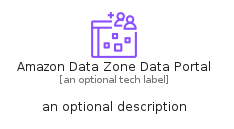
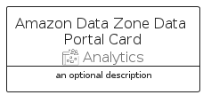
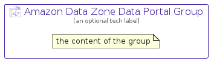

# AmazonDataZoneDataPortal


```text
aws-q2-2024/Resource/Analytics/AmazonDataZoneDataPortal
```

```text
include('aws-q2-2024/Resource/Analytics/AmazonDataZoneDataPortal')
```


| Illustration | AmazonDataZoneDataPortal | AmazonDataZoneDataPortalCard | AmazonDataZoneDataPortalGroup |
| :---: | :---: | :---: | :---: |
|  |  |  |  |


## Sprites
The item provides the following sriptes:

- `<$AmazonDataZoneDataPortalXs>`
- `<$AmazonDataZoneDataPortalSm>`
- `<$AmazonDataZoneDataPortalMd>`
- `<$AmazonDataZoneDataPortalLg>`


## AmazonDataZoneDataPortal

### Load remotely
```plantuml
@startuml
' configures the library
!global $LIB_BASE_LOCATION="https://raw.githubusercontent.com/tmorin/plantuml-libs/master/distribution"

' loads the library's bootstrap
!include $LIB_BASE_LOCATION/bootstrap.puml

' loads the package bootstrap
include('aws-q2-2024/bootstrap')

' loads the Item which embeds the element AmazonDataZoneDataPortal
include('aws-q2-2024/Resource/Analytics/AmazonDataZoneDataPortal')

' renders the element
AmazonDataZoneDataPortal('AmazonDataZoneDataPortal', 'Amazon Data Zone Data Portal', 'an optional tech label', 'an optional description')
@enduml
```

### Load locally
```plantuml
@startuml
' configures the library
!global $INCLUSION_MODE="local"
!global $LIB_BASE_LOCATION="../../.."

' loads the library's bootstrap
!include $LIB_BASE_LOCATION/bootstrap.puml

' loads the package bootstrap
include('aws-q2-2024/bootstrap')

' loads the Item which embeds the element AmazonDataZoneDataPortal
include('aws-q2-2024/Resource/Analytics/AmazonDataZoneDataPortal')

' renders the element
AmazonDataZoneDataPortal('AmazonDataZoneDataPortal', 'Amazon Data Zone Data Portal', 'an optional tech label', 'an optional description')
@enduml
```

## AmazonDataZoneDataPortalCard

### Load remotely
```plantuml
@startuml
' configures the library
!global $LIB_BASE_LOCATION="https://raw.githubusercontent.com/tmorin/plantuml-libs/master/distribution"

' loads the library's bootstrap
!include $LIB_BASE_LOCATION/bootstrap.puml

' loads the package bootstrap
include('aws-q2-2024/bootstrap')

' loads the Item which embeds the element AmazonDataZoneDataPortalCard
include('aws-q2-2024/Resource/Analytics/AmazonDataZoneDataPortal')

' renders the element
AmazonDataZoneDataPortalCard('AmazonDataZoneDataPortalCard', 'Amazon Data Zone Data Portal Card', 'an optional description')
@enduml
```

### Load locally
```plantuml
@startuml
' configures the library
!global $INCLUSION_MODE="local"
!global $LIB_BASE_LOCATION="../../.."

' loads the library's bootstrap
!include $LIB_BASE_LOCATION/bootstrap.puml

' loads the package bootstrap
include('aws-q2-2024/bootstrap')

' loads the Item which embeds the element AmazonDataZoneDataPortalCard
include('aws-q2-2024/Resource/Analytics/AmazonDataZoneDataPortal')

' renders the element
AmazonDataZoneDataPortalCard('AmazonDataZoneDataPortalCard', 'Amazon Data Zone Data Portal Card', 'an optional description')
@enduml
```

## AmazonDataZoneDataPortalGroup

### Load remotely
```plantuml
@startuml
' configures the library
!global $LIB_BASE_LOCATION="https://raw.githubusercontent.com/tmorin/plantuml-libs/master/distribution"

' loads the library's bootstrap
!include $LIB_BASE_LOCATION/bootstrap.puml

' loads the package bootstrap
include('aws-q2-2024/bootstrap')

' loads the Item which embeds the element AmazonDataZoneDataPortalGroup
include('aws-q2-2024/Resource/Analytics/AmazonDataZoneDataPortal')

' renders the element
AmazonDataZoneDataPortalGroup('AmazonDataZoneDataPortalGroup', 'Amazon Data Zone Data Portal Group', 'an optional tech label') {
    note as note
        the content of the group
    end note
}
@enduml
```

### Load locally
```plantuml
@startuml
' configures the library
!global $INCLUSION_MODE="local"
!global $LIB_BASE_LOCATION="../../.."

' loads the library's bootstrap
!include $LIB_BASE_LOCATION/bootstrap.puml

' loads the package bootstrap
include('aws-q2-2024/bootstrap')

' loads the Item which embeds the element AmazonDataZoneDataPortalGroup
include('aws-q2-2024/Resource/Analytics/AmazonDataZoneDataPortal')

' renders the element
AmazonDataZoneDataPortalGroup('AmazonDataZoneDataPortalGroup', 'Amazon Data Zone Data Portal Group', 'an optional tech label') {
    note as note
        the content of the group
    end note
}
@enduml
```

