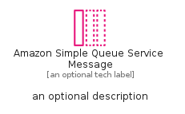

# AmazonSimpleQueueServiceMessage


```text
aws-q2-2024/Resource/ApplicationIntegration/AmazonSimpleQueueServiceMessage
```

```text
include('aws-q2-2024/Resource/ApplicationIntegration/AmazonSimpleQueueServiceMessage')
```


| Illustration | AmazonSimpleQueueServiceMessage | AmazonSimpleQueueServiceMessageCard | AmazonSimpleQueueServiceMessageGroup |
| :---: | :---: | :---: | :---: |
|  |  |  |  |


## Sprites
The item provides the following sriptes:

- `<$AmazonSimpleQueueServiceMessageXs>`
- `<$AmazonSimpleQueueServiceMessageSm>`
- `<$AmazonSimpleQueueServiceMessageMd>`
- `<$AmazonSimpleQueueServiceMessageLg>`


## AmazonSimpleQueueServiceMessage

### Load remotely
```plantuml
@startuml
' configures the library
!global $LIB_BASE_LOCATION="https://raw.githubusercontent.com/tmorin/plantuml-libs/master/distribution"

' loads the library's bootstrap
!include $LIB_BASE_LOCATION/bootstrap.puml

' loads the package bootstrap
include('aws-q2-2024/bootstrap')

' loads the Item which embeds the element AmazonSimpleQueueServiceMessage
include('aws-q2-2024/Resource/ApplicationIntegration/AmazonSimpleQueueServiceMessage')

' renders the element
AmazonSimpleQueueServiceMessage('AmazonSimpleQueueServiceMessage', 'Amazon Simple Queue Service Message', 'an optional tech label', 'an optional description')
@enduml
```

### Load locally
```plantuml
@startuml
' configures the library
!global $INCLUSION_MODE="local"
!global $LIB_BASE_LOCATION="../../.."

' loads the library's bootstrap
!include $LIB_BASE_LOCATION/bootstrap.puml

' loads the package bootstrap
include('aws-q2-2024/bootstrap')

' loads the Item which embeds the element AmazonSimpleQueueServiceMessage
include('aws-q2-2024/Resource/ApplicationIntegration/AmazonSimpleQueueServiceMessage')

' renders the element
AmazonSimpleQueueServiceMessage('AmazonSimpleQueueServiceMessage', 'Amazon Simple Queue Service Message', 'an optional tech label', 'an optional description')
@enduml
```

## AmazonSimpleQueueServiceMessageCard

### Load remotely
```plantuml
@startuml
' configures the library
!global $LIB_BASE_LOCATION="https://raw.githubusercontent.com/tmorin/plantuml-libs/master/distribution"

' loads the library's bootstrap
!include $LIB_BASE_LOCATION/bootstrap.puml

' loads the package bootstrap
include('aws-q2-2024/bootstrap')

' loads the Item which embeds the element AmazonSimpleQueueServiceMessageCard
include('aws-q2-2024/Resource/ApplicationIntegration/AmazonSimpleQueueServiceMessage')

' renders the element
AmazonSimpleQueueServiceMessageCard('AmazonSimpleQueueServiceMessageCard', 'Amazon Simple Queue Service Message Card', 'an optional description')
@enduml
```

### Load locally
```plantuml
@startuml
' configures the library
!global $INCLUSION_MODE="local"
!global $LIB_BASE_LOCATION="../../.."

' loads the library's bootstrap
!include $LIB_BASE_LOCATION/bootstrap.puml

' loads the package bootstrap
include('aws-q2-2024/bootstrap')

' loads the Item which embeds the element AmazonSimpleQueueServiceMessageCard
include('aws-q2-2024/Resource/ApplicationIntegration/AmazonSimpleQueueServiceMessage')

' renders the element
AmazonSimpleQueueServiceMessageCard('AmazonSimpleQueueServiceMessageCard', 'Amazon Simple Queue Service Message Card', 'an optional description')
@enduml
```

## AmazonSimpleQueueServiceMessageGroup

### Load remotely
```plantuml
@startuml
' configures the library
!global $LIB_BASE_LOCATION="https://raw.githubusercontent.com/tmorin/plantuml-libs/master/distribution"

' loads the library's bootstrap
!include $LIB_BASE_LOCATION/bootstrap.puml

' loads the package bootstrap
include('aws-q2-2024/bootstrap')

' loads the Item which embeds the element AmazonSimpleQueueServiceMessageGroup
include('aws-q2-2024/Resource/ApplicationIntegration/AmazonSimpleQueueServiceMessage')

' renders the element
AmazonSimpleQueueServiceMessageGroup('AmazonSimpleQueueServiceMessageGroup', 'Amazon Simple Queue Service Message Group', 'an optional tech label') {
    note as note
        the content of the group
    end note
}
@enduml
```

### Load locally
```plantuml
@startuml
' configures the library
!global $INCLUSION_MODE="local"
!global $LIB_BASE_LOCATION="../../.."

' loads the library's bootstrap
!include $LIB_BASE_LOCATION/bootstrap.puml

' loads the package bootstrap
include('aws-q2-2024/bootstrap')

' loads the Item which embeds the element AmazonSimpleQueueServiceMessageGroup
include('aws-q2-2024/Resource/ApplicationIntegration/AmazonSimpleQueueServiceMessage')

' renders the element
AmazonSimpleQueueServiceMessageGroup('AmazonSimpleQueueServiceMessageGroup', 'Amazon Simple Queue Service Message Group', 'an optional tech label') {
    note as note
        the content of the group
    end note
}
@enduml
```

