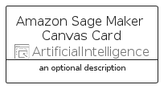

# AmazonSageMakerCanvas


```text
aws-q2-2024/Resource/ArtificialIntelligence/AmazonSageMakerCanvas
```

```text
include('aws-q2-2024/Resource/ArtificialIntelligence/AmazonSageMakerCanvas')
```


| Illustration | AmazonSageMakerCanvas | AmazonSageMakerCanvasCard | AmazonSageMakerCanvasGroup |
| :---: | :---: | :---: | :---: |
|  |  |  |  |


## Sprites
The item provides the following sriptes:

- `<$AmazonSageMakerCanvasXs>`
- `<$AmazonSageMakerCanvasSm>`
- `<$AmazonSageMakerCanvasMd>`
- `<$AmazonSageMakerCanvasLg>`


## AmazonSageMakerCanvas

### Load remotely
```plantuml
@startuml
' configures the library
!global $LIB_BASE_LOCATION="https://raw.githubusercontent.com/tmorin/plantuml-libs/master/distribution"

' loads the library's bootstrap
!include $LIB_BASE_LOCATION/bootstrap.puml

' loads the package bootstrap
include('aws-q2-2024/bootstrap')

' loads the Item which embeds the element AmazonSageMakerCanvas
include('aws-q2-2024/Resource/ArtificialIntelligence/AmazonSageMakerCanvas')

' renders the element
AmazonSageMakerCanvas('AmazonSageMakerCanvas', 'Amazon Sage Maker Canvas', 'an optional tech label', 'an optional description')
@enduml
```

### Load locally
```plantuml
@startuml
' configures the library
!global $INCLUSION_MODE="local"
!global $LIB_BASE_LOCATION="../../.."

' loads the library's bootstrap
!include $LIB_BASE_LOCATION/bootstrap.puml

' loads the package bootstrap
include('aws-q2-2024/bootstrap')

' loads the Item which embeds the element AmazonSageMakerCanvas
include('aws-q2-2024/Resource/ArtificialIntelligence/AmazonSageMakerCanvas')

' renders the element
AmazonSageMakerCanvas('AmazonSageMakerCanvas', 'Amazon Sage Maker Canvas', 'an optional tech label', 'an optional description')
@enduml
```

## AmazonSageMakerCanvasCard

### Load remotely
```plantuml
@startuml
' configures the library
!global $LIB_BASE_LOCATION="https://raw.githubusercontent.com/tmorin/plantuml-libs/master/distribution"

' loads the library's bootstrap
!include $LIB_BASE_LOCATION/bootstrap.puml

' loads the package bootstrap
include('aws-q2-2024/bootstrap')

' loads the Item which embeds the element AmazonSageMakerCanvasCard
include('aws-q2-2024/Resource/ArtificialIntelligence/AmazonSageMakerCanvas')

' renders the element
AmazonSageMakerCanvasCard('AmazonSageMakerCanvasCard', 'Amazon Sage Maker Canvas Card', 'an optional description')
@enduml
```

### Load locally
```plantuml
@startuml
' configures the library
!global $INCLUSION_MODE="local"
!global $LIB_BASE_LOCATION="../../.."

' loads the library's bootstrap
!include $LIB_BASE_LOCATION/bootstrap.puml

' loads the package bootstrap
include('aws-q2-2024/bootstrap')

' loads the Item which embeds the element AmazonSageMakerCanvasCard
include('aws-q2-2024/Resource/ArtificialIntelligence/AmazonSageMakerCanvas')

' renders the element
AmazonSageMakerCanvasCard('AmazonSageMakerCanvasCard', 'Amazon Sage Maker Canvas Card', 'an optional description')
@enduml
```

## AmazonSageMakerCanvasGroup

### Load remotely
```plantuml
@startuml
' configures the library
!global $LIB_BASE_LOCATION="https://raw.githubusercontent.com/tmorin/plantuml-libs/master/distribution"

' loads the library's bootstrap
!include $LIB_BASE_LOCATION/bootstrap.puml

' loads the package bootstrap
include('aws-q2-2024/bootstrap')

' loads the Item which embeds the element AmazonSageMakerCanvasGroup
include('aws-q2-2024/Resource/ArtificialIntelligence/AmazonSageMakerCanvas')

' renders the element
AmazonSageMakerCanvasGroup('AmazonSageMakerCanvasGroup', 'Amazon Sage Maker Canvas Group', 'an optional tech label') {
    note as note
        the content of the group
    end note
}
@enduml
```

### Load locally
```plantuml
@startuml
' configures the library
!global $INCLUSION_MODE="local"
!global $LIB_BASE_LOCATION="../../.."

' loads the library's bootstrap
!include $LIB_BASE_LOCATION/bootstrap.puml

' loads the package bootstrap
include('aws-q2-2024/bootstrap')

' loads the Item which embeds the element AmazonSageMakerCanvasGroup
include('aws-q2-2024/Resource/ArtificialIntelligence/AmazonSageMakerCanvas')

' renders the element
AmazonSageMakerCanvasGroup('AmazonSageMakerCanvasGroup', 'Amazon Sage Maker Canvas Group', 'an optional tech label') {
    note as note
        the content of the group
    end note
}
@enduml
```

