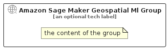

# AmazonSageMakerGeospatialMl


```text
aws-q2-2024/Resource/ArtificialIntelligence/AmazonSageMakerGeospatialMl
```

```text
include('aws-q2-2024/Resource/ArtificialIntelligence/AmazonSageMakerGeospatialMl')
```


| Illustration | AmazonSageMakerGeospatialMl | AmazonSageMakerGeospatialMlCard | AmazonSageMakerGeospatialMlGroup |
| :---: | :---: | :---: | :---: |
|  |  |  |  |


## Sprites
The item provides the following sriptes:

- `<$AmazonSageMakerGeospatialMlXs>`
- `<$AmazonSageMakerGeospatialMlSm>`
- `<$AmazonSageMakerGeospatialMlMd>`
- `<$AmazonSageMakerGeospatialMlLg>`


## AmazonSageMakerGeospatialMl

### Load remotely
```plantuml
@startuml
' configures the library
!global $LIB_BASE_LOCATION="https://raw.githubusercontent.com/tmorin/plantuml-libs/master/distribution"

' loads the library's bootstrap
!include $LIB_BASE_LOCATION/bootstrap.puml

' loads the package bootstrap
include('aws-q2-2024/bootstrap')

' loads the Item which embeds the element AmazonSageMakerGeospatialMl
include('aws-q2-2024/Resource/ArtificialIntelligence/AmazonSageMakerGeospatialMl')

' renders the element
AmazonSageMakerGeospatialMl('AmazonSageMakerGeospatialMl', 'Amazon Sage Maker Geospatial Ml', 'an optional tech label', 'an optional description')
@enduml
```

### Load locally
```plantuml
@startuml
' configures the library
!global $INCLUSION_MODE="local"
!global $LIB_BASE_LOCATION="../../.."

' loads the library's bootstrap
!include $LIB_BASE_LOCATION/bootstrap.puml

' loads the package bootstrap
include('aws-q2-2024/bootstrap')

' loads the Item which embeds the element AmazonSageMakerGeospatialMl
include('aws-q2-2024/Resource/ArtificialIntelligence/AmazonSageMakerGeospatialMl')

' renders the element
AmazonSageMakerGeospatialMl('AmazonSageMakerGeospatialMl', 'Amazon Sage Maker Geospatial Ml', 'an optional tech label', 'an optional description')
@enduml
```

## AmazonSageMakerGeospatialMlCard

### Load remotely
```plantuml
@startuml
' configures the library
!global $LIB_BASE_LOCATION="https://raw.githubusercontent.com/tmorin/plantuml-libs/master/distribution"

' loads the library's bootstrap
!include $LIB_BASE_LOCATION/bootstrap.puml

' loads the package bootstrap
include('aws-q2-2024/bootstrap')

' loads the Item which embeds the element AmazonSageMakerGeospatialMlCard
include('aws-q2-2024/Resource/ArtificialIntelligence/AmazonSageMakerGeospatialMl')

' renders the element
AmazonSageMakerGeospatialMlCard('AmazonSageMakerGeospatialMlCard', 'Amazon Sage Maker Geospatial Ml Card', 'an optional description')
@enduml
```

### Load locally
```plantuml
@startuml
' configures the library
!global $INCLUSION_MODE="local"
!global $LIB_BASE_LOCATION="../../.."

' loads the library's bootstrap
!include $LIB_BASE_LOCATION/bootstrap.puml

' loads the package bootstrap
include('aws-q2-2024/bootstrap')

' loads the Item which embeds the element AmazonSageMakerGeospatialMlCard
include('aws-q2-2024/Resource/ArtificialIntelligence/AmazonSageMakerGeospatialMl')

' renders the element
AmazonSageMakerGeospatialMlCard('AmazonSageMakerGeospatialMlCard', 'Amazon Sage Maker Geospatial Ml Card', 'an optional description')
@enduml
```

## AmazonSageMakerGeospatialMlGroup

### Load remotely
```plantuml
@startuml
' configures the library
!global $LIB_BASE_LOCATION="https://raw.githubusercontent.com/tmorin/plantuml-libs/master/distribution"

' loads the library's bootstrap
!include $LIB_BASE_LOCATION/bootstrap.puml

' loads the package bootstrap
include('aws-q2-2024/bootstrap')

' loads the Item which embeds the element AmazonSageMakerGeospatialMlGroup
include('aws-q2-2024/Resource/ArtificialIntelligence/AmazonSageMakerGeospatialMl')

' renders the element
AmazonSageMakerGeospatialMlGroup('AmazonSageMakerGeospatialMlGroup', 'Amazon Sage Maker Geospatial Ml Group', 'an optional tech label') {
    note as note
        the content of the group
    end note
}
@enduml
```

### Load locally
```plantuml
@startuml
' configures the library
!global $INCLUSION_MODE="local"
!global $LIB_BASE_LOCATION="../../.."

' loads the library's bootstrap
!include $LIB_BASE_LOCATION/bootstrap.puml

' loads the package bootstrap
include('aws-q2-2024/bootstrap')

' loads the Item which embeds the element AmazonSageMakerGeospatialMlGroup
include('aws-q2-2024/Resource/ArtificialIntelligence/AmazonSageMakerGeospatialMl')

' renders the element
AmazonSageMakerGeospatialMlGroup('AmazonSageMakerGeospatialMlGroup', 'Amazon Sage Maker Geospatial Ml Group', 'an optional tech label') {
    note as note
        the content of the group
    end note
}
@enduml
```

