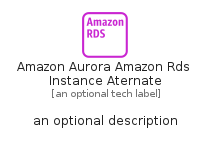

# AmazonAuroraAmazonRdsInstanceAternate


```text
aws-q2-2024/Resource/Database/AmazonAuroraAmazonRdsInstanceAternate
```

```text
include('aws-q2-2024/Resource/Database/AmazonAuroraAmazonRdsInstanceAternate')
```


| Illustration | AmazonAuroraAmazonRdsInstanceAternate | AmazonAuroraAmazonRdsInstanceAternateCard | AmazonAuroraAmazonRdsInstanceAternateGroup |
| :---: | :---: | :---: | :---: |
|  |  |  |  |


## Sprites
The item provides the following sriptes:

- `<$AmazonAuroraAmazonRdsInstanceAternateXs>`
- `<$AmazonAuroraAmazonRdsInstanceAternateSm>`
- `<$AmazonAuroraAmazonRdsInstanceAternateMd>`
- `<$AmazonAuroraAmazonRdsInstanceAternateLg>`


## AmazonAuroraAmazonRdsInstanceAternate

### Load remotely
```plantuml
@startuml
' configures the library
!global $LIB_BASE_LOCATION="https://raw.githubusercontent.com/tmorin/plantuml-libs/master/distribution"

' loads the library's bootstrap
!include $LIB_BASE_LOCATION/bootstrap.puml

' loads the package bootstrap
include('aws-q2-2024/bootstrap')

' loads the Item which embeds the element AmazonAuroraAmazonRdsInstanceAternate
include('aws-q2-2024/Resource/Database/AmazonAuroraAmazonRdsInstanceAternate')

' renders the element
AmazonAuroraAmazonRdsInstanceAternate('AmazonAuroraAmazonRdsInstanceAternate', 'Amazon Aurora Amazon Rds Instance Aternate', 'an optional tech label', 'an optional description')
@enduml
```

### Load locally
```plantuml
@startuml
' configures the library
!global $INCLUSION_MODE="local"
!global $LIB_BASE_LOCATION="../../.."

' loads the library's bootstrap
!include $LIB_BASE_LOCATION/bootstrap.puml

' loads the package bootstrap
include('aws-q2-2024/bootstrap')

' loads the Item which embeds the element AmazonAuroraAmazonRdsInstanceAternate
include('aws-q2-2024/Resource/Database/AmazonAuroraAmazonRdsInstanceAternate')

' renders the element
AmazonAuroraAmazonRdsInstanceAternate('AmazonAuroraAmazonRdsInstanceAternate', 'Amazon Aurora Amazon Rds Instance Aternate', 'an optional tech label', 'an optional description')
@enduml
```

## AmazonAuroraAmazonRdsInstanceAternateCard

### Load remotely
```plantuml
@startuml
' configures the library
!global $LIB_BASE_LOCATION="https://raw.githubusercontent.com/tmorin/plantuml-libs/master/distribution"

' loads the library's bootstrap
!include $LIB_BASE_LOCATION/bootstrap.puml

' loads the package bootstrap
include('aws-q2-2024/bootstrap')

' loads the Item which embeds the element AmazonAuroraAmazonRdsInstanceAternateCard
include('aws-q2-2024/Resource/Database/AmazonAuroraAmazonRdsInstanceAternate')

' renders the element
AmazonAuroraAmazonRdsInstanceAternateCard('AmazonAuroraAmazonRdsInstanceAternateCard', 'Amazon Aurora Amazon Rds Instance Aternate Card', 'an optional description')
@enduml
```

### Load locally
```plantuml
@startuml
' configures the library
!global $INCLUSION_MODE="local"
!global $LIB_BASE_LOCATION="../../.."

' loads the library's bootstrap
!include $LIB_BASE_LOCATION/bootstrap.puml

' loads the package bootstrap
include('aws-q2-2024/bootstrap')

' loads the Item which embeds the element AmazonAuroraAmazonRdsInstanceAternateCard
include('aws-q2-2024/Resource/Database/AmazonAuroraAmazonRdsInstanceAternate')

' renders the element
AmazonAuroraAmazonRdsInstanceAternateCard('AmazonAuroraAmazonRdsInstanceAternateCard', 'Amazon Aurora Amazon Rds Instance Aternate Card', 'an optional description')
@enduml
```

## AmazonAuroraAmazonRdsInstanceAternateGroup

### Load remotely
```plantuml
@startuml
' configures the library
!global $LIB_BASE_LOCATION="https://raw.githubusercontent.com/tmorin/plantuml-libs/master/distribution"

' loads the library's bootstrap
!include $LIB_BASE_LOCATION/bootstrap.puml

' loads the package bootstrap
include('aws-q2-2024/bootstrap')

' loads the Item which embeds the element AmazonAuroraAmazonRdsInstanceAternateGroup
include('aws-q2-2024/Resource/Database/AmazonAuroraAmazonRdsInstanceAternate')

' renders the element
AmazonAuroraAmazonRdsInstanceAternateGroup('AmazonAuroraAmazonRdsInstanceAternateGroup', 'Amazon Aurora Amazon Rds Instance Aternate Group', 'an optional tech label') {
    note as note
        the content of the group
    end note
}
@enduml
```

### Load locally
```plantuml
@startuml
' configures the library
!global $INCLUSION_MODE="local"
!global $LIB_BASE_LOCATION="../../.."

' loads the library's bootstrap
!include $LIB_BASE_LOCATION/bootstrap.puml

' loads the package bootstrap
include('aws-q2-2024/bootstrap')

' loads the Item which embeds the element AmazonAuroraAmazonRdsInstanceAternateGroup
include('aws-q2-2024/Resource/Database/AmazonAuroraAmazonRdsInstanceAternate')

' renders the element
AmazonAuroraAmazonRdsInstanceAternateGroup('AmazonAuroraAmazonRdsInstanceAternateGroup', 'Amazon Aurora Amazon Rds Instance Aternate Group', 'an optional tech label') {
    note as note
        the content of the group
    end note
}
@enduml
```

