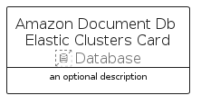

# AmazonDocumentDbElasticClusters


```text
aws-q2-2024/Resource/Database/AmazonDocumentDbElasticClusters
```

```text
include('aws-q2-2024/Resource/Database/AmazonDocumentDbElasticClusters')
```


| Illustration | AmazonDocumentDbElasticClusters | AmazonDocumentDbElasticClustersCard | AmazonDocumentDbElasticClustersGroup |
| :---: | :---: | :---: | :---: |
|  |  |  |  |


## Sprites
The item provides the following sriptes:

- `<$AmazonDocumentDbElasticClustersXs>`
- `<$AmazonDocumentDbElasticClustersSm>`
- `<$AmazonDocumentDbElasticClustersMd>`
- `<$AmazonDocumentDbElasticClustersLg>`


## AmazonDocumentDbElasticClusters

### Load remotely
```plantuml
@startuml
' configures the library
!global $LIB_BASE_LOCATION="https://raw.githubusercontent.com/tmorin/plantuml-libs/master/distribution"

' loads the library's bootstrap
!include $LIB_BASE_LOCATION/bootstrap.puml

' loads the package bootstrap
include('aws-q2-2024/bootstrap')

' loads the Item which embeds the element AmazonDocumentDbElasticClusters
include('aws-q2-2024/Resource/Database/AmazonDocumentDbElasticClusters')

' renders the element
AmazonDocumentDbElasticClusters('AmazonDocumentDbElasticClusters', 'Amazon Document Db Elastic Clusters', 'an optional tech label', 'an optional description')
@enduml
```

### Load locally
```plantuml
@startuml
' configures the library
!global $INCLUSION_MODE="local"
!global $LIB_BASE_LOCATION="../../.."

' loads the library's bootstrap
!include $LIB_BASE_LOCATION/bootstrap.puml

' loads the package bootstrap
include('aws-q2-2024/bootstrap')

' loads the Item which embeds the element AmazonDocumentDbElasticClusters
include('aws-q2-2024/Resource/Database/AmazonDocumentDbElasticClusters')

' renders the element
AmazonDocumentDbElasticClusters('AmazonDocumentDbElasticClusters', 'Amazon Document Db Elastic Clusters', 'an optional tech label', 'an optional description')
@enduml
```

## AmazonDocumentDbElasticClustersCard

### Load remotely
```plantuml
@startuml
' configures the library
!global $LIB_BASE_LOCATION="https://raw.githubusercontent.com/tmorin/plantuml-libs/master/distribution"

' loads the library's bootstrap
!include $LIB_BASE_LOCATION/bootstrap.puml

' loads the package bootstrap
include('aws-q2-2024/bootstrap')

' loads the Item which embeds the element AmazonDocumentDbElasticClustersCard
include('aws-q2-2024/Resource/Database/AmazonDocumentDbElasticClusters')

' renders the element
AmazonDocumentDbElasticClustersCard('AmazonDocumentDbElasticClustersCard', 'Amazon Document Db Elastic Clusters Card', 'an optional description')
@enduml
```

### Load locally
```plantuml
@startuml
' configures the library
!global $INCLUSION_MODE="local"
!global $LIB_BASE_LOCATION="../../.."

' loads the library's bootstrap
!include $LIB_BASE_LOCATION/bootstrap.puml

' loads the package bootstrap
include('aws-q2-2024/bootstrap')

' loads the Item which embeds the element AmazonDocumentDbElasticClustersCard
include('aws-q2-2024/Resource/Database/AmazonDocumentDbElasticClusters')

' renders the element
AmazonDocumentDbElasticClustersCard('AmazonDocumentDbElasticClustersCard', 'Amazon Document Db Elastic Clusters Card', 'an optional description')
@enduml
```

## AmazonDocumentDbElasticClustersGroup

### Load remotely
```plantuml
@startuml
' configures the library
!global $LIB_BASE_LOCATION="https://raw.githubusercontent.com/tmorin/plantuml-libs/master/distribution"

' loads the library's bootstrap
!include $LIB_BASE_LOCATION/bootstrap.puml

' loads the package bootstrap
include('aws-q2-2024/bootstrap')

' loads the Item which embeds the element AmazonDocumentDbElasticClustersGroup
include('aws-q2-2024/Resource/Database/AmazonDocumentDbElasticClusters')

' renders the element
AmazonDocumentDbElasticClustersGroup('AmazonDocumentDbElasticClustersGroup', 'Amazon Document Db Elastic Clusters Group', 'an optional tech label') {
    note as note
        the content of the group
    end note
}
@enduml
```

### Load locally
```plantuml
@startuml
' configures the library
!global $INCLUSION_MODE="local"
!global $LIB_BASE_LOCATION="../../.."

' loads the library's bootstrap
!include $LIB_BASE_LOCATION/bootstrap.puml

' loads the package bootstrap
include('aws-q2-2024/bootstrap')

' loads the Item which embeds the element AmazonDocumentDbElasticClustersGroup
include('aws-q2-2024/Resource/Database/AmazonDocumentDbElasticClusters')

' renders the element
AmazonDocumentDbElasticClustersGroup('AmazonDocumentDbElasticClustersGroup', 'Amazon Document Db Elastic Clusters Group', 'an optional tech label') {
    note as note
        the content of the group
    end note
}
@enduml
```

