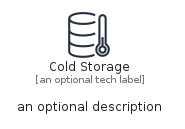
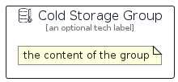

# ColdStorage


```text
aws-q2-2024/Resource/GeneralIcons/ColdStorage
```

```text
include('aws-q2-2024/Resource/GeneralIcons/ColdStorage')
```


| Illustration | ColdStorage | ColdStorageCard | ColdStorageGroup |
| :---: | :---: | :---: | :---: |
|  |  |  |  |


## Sprites
The item provides the following sriptes:

- `<$ColdStorageXs>`
- `<$ColdStorageSm>`
- `<$ColdStorageMd>`
- `<$ColdStorageLg>`


## ColdStorage

### Load remotely
```plantuml
@startuml
' configures the library
!global $LIB_BASE_LOCATION="https://raw.githubusercontent.com/tmorin/plantuml-libs/master/distribution"

' loads the library's bootstrap
!include $LIB_BASE_LOCATION/bootstrap.puml

' loads the package bootstrap
include('aws-q2-2024/bootstrap')

' loads the Item which embeds the element ColdStorage
include('aws-q2-2024/Resource/GeneralIcons/ColdStorage')

' renders the element
ColdStorage('ColdStorage', 'Cold Storage', 'an optional tech label', 'an optional description')
@enduml
```

### Load locally
```plantuml
@startuml
' configures the library
!global $INCLUSION_MODE="local"
!global $LIB_BASE_LOCATION="../../.."

' loads the library's bootstrap
!include $LIB_BASE_LOCATION/bootstrap.puml

' loads the package bootstrap
include('aws-q2-2024/bootstrap')

' loads the Item which embeds the element ColdStorage
include('aws-q2-2024/Resource/GeneralIcons/ColdStorage')

' renders the element
ColdStorage('ColdStorage', 'Cold Storage', 'an optional tech label', 'an optional description')
@enduml
```

## ColdStorageCard

### Load remotely
```plantuml
@startuml
' configures the library
!global $LIB_BASE_LOCATION="https://raw.githubusercontent.com/tmorin/plantuml-libs/master/distribution"

' loads the library's bootstrap
!include $LIB_BASE_LOCATION/bootstrap.puml

' loads the package bootstrap
include('aws-q2-2024/bootstrap')

' loads the Item which embeds the element ColdStorageCard
include('aws-q2-2024/Resource/GeneralIcons/ColdStorage')

' renders the element
ColdStorageCard('ColdStorageCard', 'Cold Storage Card', 'an optional description')
@enduml
```

### Load locally
```plantuml
@startuml
' configures the library
!global $INCLUSION_MODE="local"
!global $LIB_BASE_LOCATION="../../.."

' loads the library's bootstrap
!include $LIB_BASE_LOCATION/bootstrap.puml

' loads the package bootstrap
include('aws-q2-2024/bootstrap')

' loads the Item which embeds the element ColdStorageCard
include('aws-q2-2024/Resource/GeneralIcons/ColdStorage')

' renders the element
ColdStorageCard('ColdStorageCard', 'Cold Storage Card', 'an optional description')
@enduml
```

## ColdStorageGroup

### Load remotely
```plantuml
@startuml
' configures the library
!global $LIB_BASE_LOCATION="https://raw.githubusercontent.com/tmorin/plantuml-libs/master/distribution"

' loads the library's bootstrap
!include $LIB_BASE_LOCATION/bootstrap.puml

' loads the package bootstrap
include('aws-q2-2024/bootstrap')

' loads the Item which embeds the element ColdStorageGroup
include('aws-q2-2024/Resource/GeneralIcons/ColdStorage')

' renders the element
ColdStorageGroup('ColdStorageGroup', 'Cold Storage Group', 'an optional tech label') {
    note as note
        the content of the group
    end note
}
@enduml
```

### Load locally
```plantuml
@startuml
' configures the library
!global $INCLUSION_MODE="local"
!global $LIB_BASE_LOCATION="../../.."

' loads the library's bootstrap
!include $LIB_BASE_LOCATION/bootstrap.puml

' loads the package bootstrap
include('aws-q2-2024/bootstrap')

' loads the Item which embeds the element ColdStorageGroup
include('aws-q2-2024/Resource/GeneralIcons/ColdStorage')

' renders the element
ColdStorageGroup('ColdStorageGroup', 'Cold Storage Group', 'an optional tech label') {
    note as note
        the content of the group
    end note
}
@enduml
```

