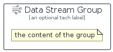

# DataStream


```text
aws-q2-2024/Resource/GeneralIcons/DataStream
```

```text
include('aws-q2-2024/Resource/GeneralIcons/DataStream')
```


| Illustration | DataStream | DataStreamCard | DataStreamGroup |
| :---: | :---: | :---: | :---: |
|  |  |  |  |


## Sprites
The item provides the following sriptes:

- `<$DataStreamXs>`
- `<$DataStreamSm>`
- `<$DataStreamMd>`
- `<$DataStreamLg>`


## DataStream

### Load remotely
```plantuml
@startuml
' configures the library
!global $LIB_BASE_LOCATION="https://raw.githubusercontent.com/tmorin/plantuml-libs/master/distribution"

' loads the library's bootstrap
!include $LIB_BASE_LOCATION/bootstrap.puml

' loads the package bootstrap
include('aws-q2-2024/bootstrap')

' loads the Item which embeds the element DataStream
include('aws-q2-2024/Resource/GeneralIcons/DataStream')

' renders the element
DataStream('DataStream', 'Data Stream', 'an optional tech label', 'an optional description')
@enduml
```

### Load locally
```plantuml
@startuml
' configures the library
!global $INCLUSION_MODE="local"
!global $LIB_BASE_LOCATION="../../.."

' loads the library's bootstrap
!include $LIB_BASE_LOCATION/bootstrap.puml

' loads the package bootstrap
include('aws-q2-2024/bootstrap')

' loads the Item which embeds the element DataStream
include('aws-q2-2024/Resource/GeneralIcons/DataStream')

' renders the element
DataStream('DataStream', 'Data Stream', 'an optional tech label', 'an optional description')
@enduml
```

## DataStreamCard

### Load remotely
```plantuml
@startuml
' configures the library
!global $LIB_BASE_LOCATION="https://raw.githubusercontent.com/tmorin/plantuml-libs/master/distribution"

' loads the library's bootstrap
!include $LIB_BASE_LOCATION/bootstrap.puml

' loads the package bootstrap
include('aws-q2-2024/bootstrap')

' loads the Item which embeds the element DataStreamCard
include('aws-q2-2024/Resource/GeneralIcons/DataStream')

' renders the element
DataStreamCard('DataStreamCard', 'Data Stream Card', 'an optional description')
@enduml
```

### Load locally
```plantuml
@startuml
' configures the library
!global $INCLUSION_MODE="local"
!global $LIB_BASE_LOCATION="../../.."

' loads the library's bootstrap
!include $LIB_BASE_LOCATION/bootstrap.puml

' loads the package bootstrap
include('aws-q2-2024/bootstrap')

' loads the Item which embeds the element DataStreamCard
include('aws-q2-2024/Resource/GeneralIcons/DataStream')

' renders the element
DataStreamCard('DataStreamCard', 'Data Stream Card', 'an optional description')
@enduml
```

## DataStreamGroup

### Load remotely
```plantuml
@startuml
' configures the library
!global $LIB_BASE_LOCATION="https://raw.githubusercontent.com/tmorin/plantuml-libs/master/distribution"

' loads the library's bootstrap
!include $LIB_BASE_LOCATION/bootstrap.puml

' loads the package bootstrap
include('aws-q2-2024/bootstrap')

' loads the Item which embeds the element DataStreamGroup
include('aws-q2-2024/Resource/GeneralIcons/DataStream')

' renders the element
DataStreamGroup('DataStreamGroup', 'Data Stream Group', 'an optional tech label') {
    note as note
        the content of the group
    end note
}
@enduml
```

### Load locally
```plantuml
@startuml
' configures the library
!global $INCLUSION_MODE="local"
!global $LIB_BASE_LOCATION="../../.."

' loads the library's bootstrap
!include $LIB_BASE_LOCATION/bootstrap.puml

' loads the package bootstrap
include('aws-q2-2024/bootstrap')

' loads the Item which embeds the element DataStreamGroup
include('aws-q2-2024/Resource/GeneralIcons/DataStream')

' renders the element
DataStreamGroup('DataStreamGroup', 'Data Stream Group', 'an optional tech label') {
    note as note
        the content of the group
    end note
}
@enduml
```

