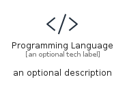
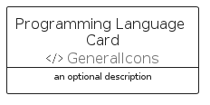

# ProgrammingLanguage


```text
aws-q2-2024/Resource/GeneralIcons/ProgrammingLanguage
```

```text
include('aws-q2-2024/Resource/GeneralIcons/ProgrammingLanguage')
```


| Illustration | ProgrammingLanguage | ProgrammingLanguageCard | ProgrammingLanguageGroup |
| :---: | :---: | :---: | :---: |
|  |  |  |  |


## Sprites
The item provides the following sriptes:

- `<$ProgrammingLanguageXs>`
- `<$ProgrammingLanguageSm>`
- `<$ProgrammingLanguageMd>`
- `<$ProgrammingLanguageLg>`


## ProgrammingLanguage

### Load remotely
```plantuml
@startuml
' configures the library
!global $LIB_BASE_LOCATION="https://raw.githubusercontent.com/tmorin/plantuml-libs/master/distribution"

' loads the library's bootstrap
!include $LIB_BASE_LOCATION/bootstrap.puml

' loads the package bootstrap
include('aws-q2-2024/bootstrap')

' loads the Item which embeds the element ProgrammingLanguage
include('aws-q2-2024/Resource/GeneralIcons/ProgrammingLanguage')

' renders the element
ProgrammingLanguage('ProgrammingLanguage', 'Programming Language', 'an optional tech label', 'an optional description')
@enduml
```

### Load locally
```plantuml
@startuml
' configures the library
!global $INCLUSION_MODE="local"
!global $LIB_BASE_LOCATION="../../.."

' loads the library's bootstrap
!include $LIB_BASE_LOCATION/bootstrap.puml

' loads the package bootstrap
include('aws-q2-2024/bootstrap')

' loads the Item which embeds the element ProgrammingLanguage
include('aws-q2-2024/Resource/GeneralIcons/ProgrammingLanguage')

' renders the element
ProgrammingLanguage('ProgrammingLanguage', 'Programming Language', 'an optional tech label', 'an optional description')
@enduml
```

## ProgrammingLanguageCard

### Load remotely
```plantuml
@startuml
' configures the library
!global $LIB_BASE_LOCATION="https://raw.githubusercontent.com/tmorin/plantuml-libs/master/distribution"

' loads the library's bootstrap
!include $LIB_BASE_LOCATION/bootstrap.puml

' loads the package bootstrap
include('aws-q2-2024/bootstrap')

' loads the Item which embeds the element ProgrammingLanguageCard
include('aws-q2-2024/Resource/GeneralIcons/ProgrammingLanguage')

' renders the element
ProgrammingLanguageCard('ProgrammingLanguageCard', 'Programming Language Card', 'an optional description')
@enduml
```

### Load locally
```plantuml
@startuml
' configures the library
!global $INCLUSION_MODE="local"
!global $LIB_BASE_LOCATION="../../.."

' loads the library's bootstrap
!include $LIB_BASE_LOCATION/bootstrap.puml

' loads the package bootstrap
include('aws-q2-2024/bootstrap')

' loads the Item which embeds the element ProgrammingLanguageCard
include('aws-q2-2024/Resource/GeneralIcons/ProgrammingLanguage')

' renders the element
ProgrammingLanguageCard('ProgrammingLanguageCard', 'Programming Language Card', 'an optional description')
@enduml
```

## ProgrammingLanguageGroup

### Load remotely
```plantuml
@startuml
' configures the library
!global $LIB_BASE_LOCATION="https://raw.githubusercontent.com/tmorin/plantuml-libs/master/distribution"

' loads the library's bootstrap
!include $LIB_BASE_LOCATION/bootstrap.puml

' loads the package bootstrap
include('aws-q2-2024/bootstrap')

' loads the Item which embeds the element ProgrammingLanguageGroup
include('aws-q2-2024/Resource/GeneralIcons/ProgrammingLanguage')

' renders the element
ProgrammingLanguageGroup('ProgrammingLanguageGroup', 'Programming Language Group', 'an optional tech label') {
    note as note
        the content of the group
    end note
}
@enduml
```

### Load locally
```plantuml
@startuml
' configures the library
!global $INCLUSION_MODE="local"
!global $LIB_BASE_LOCATION="../../.."

' loads the library's bootstrap
!include $LIB_BASE_LOCATION/bootstrap.puml

' loads the package bootstrap
include('aws-q2-2024/bootstrap')

' loads the Item which embeds the element ProgrammingLanguageGroup
include('aws-q2-2024/Resource/GeneralIcons/ProgrammingLanguage')

' renders the element
ProgrammingLanguageGroup('ProgrammingLanguageGroup', 'Programming Language Group', 'an optional tech label') {
    note as note
        the content of the group
    end note
}
@enduml
```

