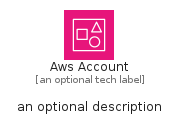
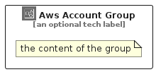

# AwsAccount


```text
aws-q2-2024/Resource/GroupIcons/AwsAccount
```

```text
include('aws-q2-2024/Resource/GroupIcons/AwsAccount')
```


| Illustration | AwsAccount | AwsAccountCard | AwsAccountGroup |
| :---: | :---: | :---: | :---: |
|  |  |  |  |


## Sprites
The item provides the following sriptes:

- `<$AwsAccountXs>`
- `<$AwsAccountSm>`
- `<$AwsAccountMd>`
- `<$AwsAccountLg>`


## AwsAccount

### Load remotely
```plantuml
@startuml
' configures the library
!global $LIB_BASE_LOCATION="https://raw.githubusercontent.com/tmorin/plantuml-libs/master/distribution"

' loads the library's bootstrap
!include $LIB_BASE_LOCATION/bootstrap.puml

' loads the package bootstrap
include('aws-q2-2024/bootstrap')

' loads the Item which embeds the element AwsAccount
include('aws-q2-2024/Resource/GroupIcons/AwsAccount')

' renders the element
AwsAccount('AwsAccount', 'Aws Account', 'an optional tech label', 'an optional description')
@enduml
```

### Load locally
```plantuml
@startuml
' configures the library
!global $INCLUSION_MODE="local"
!global $LIB_BASE_LOCATION="../../.."

' loads the library's bootstrap
!include $LIB_BASE_LOCATION/bootstrap.puml

' loads the package bootstrap
include('aws-q2-2024/bootstrap')

' loads the Item which embeds the element AwsAccount
include('aws-q2-2024/Resource/GroupIcons/AwsAccount')

' renders the element
AwsAccount('AwsAccount', 'Aws Account', 'an optional tech label', 'an optional description')
@enduml
```

## AwsAccountCard

### Load remotely
```plantuml
@startuml
' configures the library
!global $LIB_BASE_LOCATION="https://raw.githubusercontent.com/tmorin/plantuml-libs/master/distribution"

' loads the library's bootstrap
!include $LIB_BASE_LOCATION/bootstrap.puml

' loads the package bootstrap
include('aws-q2-2024/bootstrap')

' loads the Item which embeds the element AwsAccountCard
include('aws-q2-2024/Resource/GroupIcons/AwsAccount')

' renders the element
AwsAccountCard('AwsAccountCard', 'Aws Account Card', 'an optional description')
@enduml
```

### Load locally
```plantuml
@startuml
' configures the library
!global $INCLUSION_MODE="local"
!global $LIB_BASE_LOCATION="../../.."

' loads the library's bootstrap
!include $LIB_BASE_LOCATION/bootstrap.puml

' loads the package bootstrap
include('aws-q2-2024/bootstrap')

' loads the Item which embeds the element AwsAccountCard
include('aws-q2-2024/Resource/GroupIcons/AwsAccount')

' renders the element
AwsAccountCard('AwsAccountCard', 'Aws Account Card', 'an optional description')
@enduml
```

## AwsAccountGroup

### Load remotely
```plantuml
@startuml
' configures the library
!global $LIB_BASE_LOCATION="https://raw.githubusercontent.com/tmorin/plantuml-libs/master/distribution"

' loads the library's bootstrap
!include $LIB_BASE_LOCATION/bootstrap.puml

' loads the package bootstrap
include('aws-q2-2024/bootstrap')

' loads the Item which embeds the element AwsAccountGroup
include('aws-q2-2024/Resource/GroupIcons/AwsAccount')

' renders the element
AwsAccountGroup('AwsAccountGroup', 'Aws Account Group', 'an optional tech label') {
    note as note
        the content of the group
    end note
}
@enduml
```

### Load locally
```plantuml
@startuml
' configures the library
!global $INCLUSION_MODE="local"
!global $LIB_BASE_LOCATION="../../.."

' loads the library's bootstrap
!include $LIB_BASE_LOCATION/bootstrap.puml

' loads the package bootstrap
include('aws-q2-2024/bootstrap')

' loads the Item which embeds the element AwsAccountGroup
include('aws-q2-2024/Resource/GroupIcons/AwsAccount')

' renders the element
AwsAccountGroup('AwsAccountGroup', 'Aws Account Group', 'an optional tech label') {
    note as note
        the content of the group
    end note
}
@enduml
```

