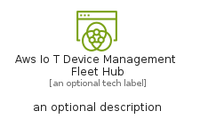
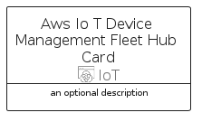
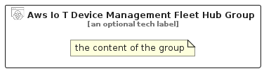

# AwsIoTDeviceManagementFleetHub


```text
aws-q2-2024/Resource/IoT/AwsIoTDeviceManagementFleetHub
```

```text
include('aws-q2-2024/Resource/IoT/AwsIoTDeviceManagementFleetHub')
```


| Illustration | AwsIoTDeviceManagementFleetHub | AwsIoTDeviceManagementFleetHubCard | AwsIoTDeviceManagementFleetHubGroup |
| :---: | :---: | :---: | :---: |
|  |  |  |  |


## Sprites
The item provides the following sriptes:

- `<$AwsIoTDeviceManagementFleetHubXs>`
- `<$AwsIoTDeviceManagementFleetHubSm>`
- `<$AwsIoTDeviceManagementFleetHubMd>`
- `<$AwsIoTDeviceManagementFleetHubLg>`


## AwsIoTDeviceManagementFleetHub

### Load remotely
```plantuml
@startuml
' configures the library
!global $LIB_BASE_LOCATION="https://raw.githubusercontent.com/tmorin/plantuml-libs/master/distribution"

' loads the library's bootstrap
!include $LIB_BASE_LOCATION/bootstrap.puml

' loads the package bootstrap
include('aws-q2-2024/bootstrap')

' loads the Item which embeds the element AwsIoTDeviceManagementFleetHub
include('aws-q2-2024/Resource/IoT/AwsIoTDeviceManagementFleetHub')

' renders the element
AwsIoTDeviceManagementFleetHub('AwsIoTDeviceManagementFleetHub', 'Aws Io T Device Management Fleet Hub', 'an optional tech label', 'an optional description')
@enduml
```

### Load locally
```plantuml
@startuml
' configures the library
!global $INCLUSION_MODE="local"
!global $LIB_BASE_LOCATION="../../.."

' loads the library's bootstrap
!include $LIB_BASE_LOCATION/bootstrap.puml

' loads the package bootstrap
include('aws-q2-2024/bootstrap')

' loads the Item which embeds the element AwsIoTDeviceManagementFleetHub
include('aws-q2-2024/Resource/IoT/AwsIoTDeviceManagementFleetHub')

' renders the element
AwsIoTDeviceManagementFleetHub('AwsIoTDeviceManagementFleetHub', 'Aws Io T Device Management Fleet Hub', 'an optional tech label', 'an optional description')
@enduml
```

## AwsIoTDeviceManagementFleetHubCard

### Load remotely
```plantuml
@startuml
' configures the library
!global $LIB_BASE_LOCATION="https://raw.githubusercontent.com/tmorin/plantuml-libs/master/distribution"

' loads the library's bootstrap
!include $LIB_BASE_LOCATION/bootstrap.puml

' loads the package bootstrap
include('aws-q2-2024/bootstrap')

' loads the Item which embeds the element AwsIoTDeviceManagementFleetHubCard
include('aws-q2-2024/Resource/IoT/AwsIoTDeviceManagementFleetHub')

' renders the element
AwsIoTDeviceManagementFleetHubCard('AwsIoTDeviceManagementFleetHubCard', 'Aws Io T Device Management Fleet Hub Card', 'an optional description')
@enduml
```

### Load locally
```plantuml
@startuml
' configures the library
!global $INCLUSION_MODE="local"
!global $LIB_BASE_LOCATION="../../.."

' loads the library's bootstrap
!include $LIB_BASE_LOCATION/bootstrap.puml

' loads the package bootstrap
include('aws-q2-2024/bootstrap')

' loads the Item which embeds the element AwsIoTDeviceManagementFleetHubCard
include('aws-q2-2024/Resource/IoT/AwsIoTDeviceManagementFleetHub')

' renders the element
AwsIoTDeviceManagementFleetHubCard('AwsIoTDeviceManagementFleetHubCard', 'Aws Io T Device Management Fleet Hub Card', 'an optional description')
@enduml
```

## AwsIoTDeviceManagementFleetHubGroup

### Load remotely
```plantuml
@startuml
' configures the library
!global $LIB_BASE_LOCATION="https://raw.githubusercontent.com/tmorin/plantuml-libs/master/distribution"

' loads the library's bootstrap
!include $LIB_BASE_LOCATION/bootstrap.puml

' loads the package bootstrap
include('aws-q2-2024/bootstrap')

' loads the Item which embeds the element AwsIoTDeviceManagementFleetHubGroup
include('aws-q2-2024/Resource/IoT/AwsIoTDeviceManagementFleetHub')

' renders the element
AwsIoTDeviceManagementFleetHubGroup('AwsIoTDeviceManagementFleetHubGroup', 'Aws Io T Device Management Fleet Hub Group', 'an optional tech label') {
    note as note
        the content of the group
    end note
}
@enduml
```

### Load locally
```plantuml
@startuml
' configures the library
!global $INCLUSION_MODE="local"
!global $LIB_BASE_LOCATION="../../.."

' loads the library's bootstrap
!include $LIB_BASE_LOCATION/bootstrap.puml

' loads the package bootstrap
include('aws-q2-2024/bootstrap')

' loads the Item which embeds the element AwsIoTDeviceManagementFleetHubGroup
include('aws-q2-2024/Resource/IoT/AwsIoTDeviceManagementFleetHub')

' renders the element
AwsIoTDeviceManagementFleetHubGroup('AwsIoTDeviceManagementFleetHubGroup', 'Aws Io T Device Management Fleet Hub Group', 'an optional tech label') {
    note as note
        the content of the group
    end note
}
@enduml
```

