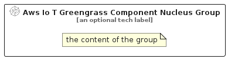

# AwsIoTGreengrassComponentNucleus


```text
aws-q2-2024/Resource/IoT/AwsIoTGreengrassComponentNucleus
```

```text
include('aws-q2-2024/Resource/IoT/AwsIoTGreengrassComponentNucleus')
```


| Illustration | AwsIoTGreengrassComponentNucleus | AwsIoTGreengrassComponentNucleusCard | AwsIoTGreengrassComponentNucleusGroup |
| :---: | :---: | :---: | :---: |
|  |  |  |  |


## Sprites
The item provides the following sriptes:

- `<$AwsIoTGreengrassComponentNucleusXs>`
- `<$AwsIoTGreengrassComponentNucleusSm>`
- `<$AwsIoTGreengrassComponentNucleusMd>`
- `<$AwsIoTGreengrassComponentNucleusLg>`


## AwsIoTGreengrassComponentNucleus

### Load remotely
```plantuml
@startuml
' configures the library
!global $LIB_BASE_LOCATION="https://raw.githubusercontent.com/tmorin/plantuml-libs/master/distribution"

' loads the library's bootstrap
!include $LIB_BASE_LOCATION/bootstrap.puml

' loads the package bootstrap
include('aws-q2-2024/bootstrap')

' loads the Item which embeds the element AwsIoTGreengrassComponentNucleus
include('aws-q2-2024/Resource/IoT/AwsIoTGreengrassComponentNucleus')

' renders the element
AwsIoTGreengrassComponentNucleus('AwsIoTGreengrassComponentNucleus', 'Aws Io T Greengrass Component Nucleus', 'an optional tech label', 'an optional description')
@enduml
```

### Load locally
```plantuml
@startuml
' configures the library
!global $INCLUSION_MODE="local"
!global $LIB_BASE_LOCATION="../../.."

' loads the library's bootstrap
!include $LIB_BASE_LOCATION/bootstrap.puml

' loads the package bootstrap
include('aws-q2-2024/bootstrap')

' loads the Item which embeds the element AwsIoTGreengrassComponentNucleus
include('aws-q2-2024/Resource/IoT/AwsIoTGreengrassComponentNucleus')

' renders the element
AwsIoTGreengrassComponentNucleus('AwsIoTGreengrassComponentNucleus', 'Aws Io T Greengrass Component Nucleus', 'an optional tech label', 'an optional description')
@enduml
```

## AwsIoTGreengrassComponentNucleusCard

### Load remotely
```plantuml
@startuml
' configures the library
!global $LIB_BASE_LOCATION="https://raw.githubusercontent.com/tmorin/plantuml-libs/master/distribution"

' loads the library's bootstrap
!include $LIB_BASE_LOCATION/bootstrap.puml

' loads the package bootstrap
include('aws-q2-2024/bootstrap')

' loads the Item which embeds the element AwsIoTGreengrassComponentNucleusCard
include('aws-q2-2024/Resource/IoT/AwsIoTGreengrassComponentNucleus')

' renders the element
AwsIoTGreengrassComponentNucleusCard('AwsIoTGreengrassComponentNucleusCard', 'Aws Io T Greengrass Component Nucleus Card', 'an optional description')
@enduml
```

### Load locally
```plantuml
@startuml
' configures the library
!global $INCLUSION_MODE="local"
!global $LIB_BASE_LOCATION="../../.."

' loads the library's bootstrap
!include $LIB_BASE_LOCATION/bootstrap.puml

' loads the package bootstrap
include('aws-q2-2024/bootstrap')

' loads the Item which embeds the element AwsIoTGreengrassComponentNucleusCard
include('aws-q2-2024/Resource/IoT/AwsIoTGreengrassComponentNucleus')

' renders the element
AwsIoTGreengrassComponentNucleusCard('AwsIoTGreengrassComponentNucleusCard', 'Aws Io T Greengrass Component Nucleus Card', 'an optional description')
@enduml
```

## AwsIoTGreengrassComponentNucleusGroup

### Load remotely
```plantuml
@startuml
' configures the library
!global $LIB_BASE_LOCATION="https://raw.githubusercontent.com/tmorin/plantuml-libs/master/distribution"

' loads the library's bootstrap
!include $LIB_BASE_LOCATION/bootstrap.puml

' loads the package bootstrap
include('aws-q2-2024/bootstrap')

' loads the Item which embeds the element AwsIoTGreengrassComponentNucleusGroup
include('aws-q2-2024/Resource/IoT/AwsIoTGreengrassComponentNucleus')

' renders the element
AwsIoTGreengrassComponentNucleusGroup('AwsIoTGreengrassComponentNucleusGroup', 'Aws Io T Greengrass Component Nucleus Group', 'an optional tech label') {
    note as note
        the content of the group
    end note
}
@enduml
```

### Load locally
```plantuml
@startuml
' configures the library
!global $INCLUSION_MODE="local"
!global $LIB_BASE_LOCATION="../../.."

' loads the library's bootstrap
!include $LIB_BASE_LOCATION/bootstrap.puml

' loads the package bootstrap
include('aws-q2-2024/bootstrap')

' loads the Item which embeds the element AwsIoTGreengrassComponentNucleusGroup
include('aws-q2-2024/Resource/IoT/AwsIoTGreengrassComponentNucleus')

' renders the element
AwsIoTGreengrassComponentNucleusGroup('AwsIoTGreengrassComponentNucleusGroup', 'Aws Io T Greengrass Component Nucleus Group', 'an optional tech label') {
    note as note
        the content of the group
    end note
}
@enduml
```

