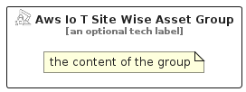

# AwsIoTSiteWiseAsset


```text
aws-q2-2024/Resource/IoT/AwsIoTSiteWiseAsset
```

```text
include('aws-q2-2024/Resource/IoT/AwsIoTSiteWiseAsset')
```


| Illustration | AwsIoTSiteWiseAsset | AwsIoTSiteWiseAssetCard | AwsIoTSiteWiseAssetGroup |
| :---: | :---: | :---: | :---: |
|  |  |  |  |


## Sprites
The item provides the following sriptes:

- `<$AwsIoTSiteWiseAssetXs>`
- `<$AwsIoTSiteWiseAssetSm>`
- `<$AwsIoTSiteWiseAssetMd>`
- `<$AwsIoTSiteWiseAssetLg>`


## AwsIoTSiteWiseAsset

### Load remotely
```plantuml
@startuml
' configures the library
!global $LIB_BASE_LOCATION="https://raw.githubusercontent.com/tmorin/plantuml-libs/master/distribution"

' loads the library's bootstrap
!include $LIB_BASE_LOCATION/bootstrap.puml

' loads the package bootstrap
include('aws-q2-2024/bootstrap')

' loads the Item which embeds the element AwsIoTSiteWiseAsset
include('aws-q2-2024/Resource/IoT/AwsIoTSiteWiseAsset')

' renders the element
AwsIoTSiteWiseAsset('AwsIoTSiteWiseAsset', 'Aws Io T Site Wise Asset', 'an optional tech label', 'an optional description')
@enduml
```

### Load locally
```plantuml
@startuml
' configures the library
!global $INCLUSION_MODE="local"
!global $LIB_BASE_LOCATION="../../.."

' loads the library's bootstrap
!include $LIB_BASE_LOCATION/bootstrap.puml

' loads the package bootstrap
include('aws-q2-2024/bootstrap')

' loads the Item which embeds the element AwsIoTSiteWiseAsset
include('aws-q2-2024/Resource/IoT/AwsIoTSiteWiseAsset')

' renders the element
AwsIoTSiteWiseAsset('AwsIoTSiteWiseAsset', 'Aws Io T Site Wise Asset', 'an optional tech label', 'an optional description')
@enduml
```

## AwsIoTSiteWiseAssetCard

### Load remotely
```plantuml
@startuml
' configures the library
!global $LIB_BASE_LOCATION="https://raw.githubusercontent.com/tmorin/plantuml-libs/master/distribution"

' loads the library's bootstrap
!include $LIB_BASE_LOCATION/bootstrap.puml

' loads the package bootstrap
include('aws-q2-2024/bootstrap')

' loads the Item which embeds the element AwsIoTSiteWiseAssetCard
include('aws-q2-2024/Resource/IoT/AwsIoTSiteWiseAsset')

' renders the element
AwsIoTSiteWiseAssetCard('AwsIoTSiteWiseAssetCard', 'Aws Io T Site Wise Asset Card', 'an optional description')
@enduml
```

### Load locally
```plantuml
@startuml
' configures the library
!global $INCLUSION_MODE="local"
!global $LIB_BASE_LOCATION="../../.."

' loads the library's bootstrap
!include $LIB_BASE_LOCATION/bootstrap.puml

' loads the package bootstrap
include('aws-q2-2024/bootstrap')

' loads the Item which embeds the element AwsIoTSiteWiseAssetCard
include('aws-q2-2024/Resource/IoT/AwsIoTSiteWiseAsset')

' renders the element
AwsIoTSiteWiseAssetCard('AwsIoTSiteWiseAssetCard', 'Aws Io T Site Wise Asset Card', 'an optional description')
@enduml
```

## AwsIoTSiteWiseAssetGroup

### Load remotely
```plantuml
@startuml
' configures the library
!global $LIB_BASE_LOCATION="https://raw.githubusercontent.com/tmorin/plantuml-libs/master/distribution"

' loads the library's bootstrap
!include $LIB_BASE_LOCATION/bootstrap.puml

' loads the package bootstrap
include('aws-q2-2024/bootstrap')

' loads the Item which embeds the element AwsIoTSiteWiseAssetGroup
include('aws-q2-2024/Resource/IoT/AwsIoTSiteWiseAsset')

' renders the element
AwsIoTSiteWiseAssetGroup('AwsIoTSiteWiseAssetGroup', 'Aws Io T Site Wise Asset Group', 'an optional tech label') {
    note as note
        the content of the group
    end note
}
@enduml
```

### Load locally
```plantuml
@startuml
' configures the library
!global $INCLUSION_MODE="local"
!global $LIB_BASE_LOCATION="../../.."

' loads the library's bootstrap
!include $LIB_BASE_LOCATION/bootstrap.puml

' loads the package bootstrap
include('aws-q2-2024/bootstrap')

' loads the Item which embeds the element AwsIoTSiteWiseAssetGroup
include('aws-q2-2024/Resource/IoT/AwsIoTSiteWiseAsset')

' renders the element
AwsIoTSiteWiseAssetGroup('AwsIoTSiteWiseAssetGroup', 'Aws Io T Site Wise Asset Group', 'an optional tech label') {
    note as note
        the content of the group
    end note
}
@enduml
```

