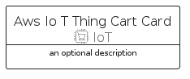

# AwsIoTThingCart


```text
aws-q2-2024/Resource/IoT/AwsIoTThingCart
```

```text
include('aws-q2-2024/Resource/IoT/AwsIoTThingCart')
```


| Illustration | AwsIoTThingCart | AwsIoTThingCartCard | AwsIoTThingCartGroup |
| :---: | :---: | :---: | :---: |
|  |  |  |  |


## Sprites
The item provides the following sriptes:

- `<$AwsIoTThingCartXs>`
- `<$AwsIoTThingCartSm>`
- `<$AwsIoTThingCartMd>`
- `<$AwsIoTThingCartLg>`


## AwsIoTThingCart

### Load remotely
```plantuml
@startuml
' configures the library
!global $LIB_BASE_LOCATION="https://raw.githubusercontent.com/tmorin/plantuml-libs/master/distribution"

' loads the library's bootstrap
!include $LIB_BASE_LOCATION/bootstrap.puml

' loads the package bootstrap
include('aws-q2-2024/bootstrap')

' loads the Item which embeds the element AwsIoTThingCart
include('aws-q2-2024/Resource/IoT/AwsIoTThingCart')

' renders the element
AwsIoTThingCart('AwsIoTThingCart', 'Aws Io T Thing Cart', 'an optional tech label', 'an optional description')
@enduml
```

### Load locally
```plantuml
@startuml
' configures the library
!global $INCLUSION_MODE="local"
!global $LIB_BASE_LOCATION="../../.."

' loads the library's bootstrap
!include $LIB_BASE_LOCATION/bootstrap.puml

' loads the package bootstrap
include('aws-q2-2024/bootstrap')

' loads the Item which embeds the element AwsIoTThingCart
include('aws-q2-2024/Resource/IoT/AwsIoTThingCart')

' renders the element
AwsIoTThingCart('AwsIoTThingCart', 'Aws Io T Thing Cart', 'an optional tech label', 'an optional description')
@enduml
```

## AwsIoTThingCartCard

### Load remotely
```plantuml
@startuml
' configures the library
!global $LIB_BASE_LOCATION="https://raw.githubusercontent.com/tmorin/plantuml-libs/master/distribution"

' loads the library's bootstrap
!include $LIB_BASE_LOCATION/bootstrap.puml

' loads the package bootstrap
include('aws-q2-2024/bootstrap')

' loads the Item which embeds the element AwsIoTThingCartCard
include('aws-q2-2024/Resource/IoT/AwsIoTThingCart')

' renders the element
AwsIoTThingCartCard('AwsIoTThingCartCard', 'Aws Io T Thing Cart Card', 'an optional description')
@enduml
```

### Load locally
```plantuml
@startuml
' configures the library
!global $INCLUSION_MODE="local"
!global $LIB_BASE_LOCATION="../../.."

' loads the library's bootstrap
!include $LIB_BASE_LOCATION/bootstrap.puml

' loads the package bootstrap
include('aws-q2-2024/bootstrap')

' loads the Item which embeds the element AwsIoTThingCartCard
include('aws-q2-2024/Resource/IoT/AwsIoTThingCart')

' renders the element
AwsIoTThingCartCard('AwsIoTThingCartCard', 'Aws Io T Thing Cart Card', 'an optional description')
@enduml
```

## AwsIoTThingCartGroup

### Load remotely
```plantuml
@startuml
' configures the library
!global $LIB_BASE_LOCATION="https://raw.githubusercontent.com/tmorin/plantuml-libs/master/distribution"

' loads the library's bootstrap
!include $LIB_BASE_LOCATION/bootstrap.puml

' loads the package bootstrap
include('aws-q2-2024/bootstrap')

' loads the Item which embeds the element AwsIoTThingCartGroup
include('aws-q2-2024/Resource/IoT/AwsIoTThingCart')

' renders the element
AwsIoTThingCartGroup('AwsIoTThingCartGroup', 'Aws Io T Thing Cart Group', 'an optional tech label') {
    note as note
        the content of the group
    end note
}
@enduml
```

### Load locally
```plantuml
@startuml
' configures the library
!global $INCLUSION_MODE="local"
!global $LIB_BASE_LOCATION="../../.."

' loads the library's bootstrap
!include $LIB_BASE_LOCATION/bootstrap.puml

' loads the package bootstrap
include('aws-q2-2024/bootstrap')

' loads the Item which embeds the element AwsIoTThingCartGroup
include('aws-q2-2024/Resource/IoT/AwsIoTThingCart')

' renders the element
AwsIoTThingCartGroup('AwsIoTThingCartGroup', 'Aws Io T Thing Cart Group', 'an optional tech label') {
    note as note
        the content of the group
    end note
}
@enduml
```

