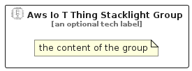

# AwsIoTThingStacklight


```text
aws-q2-2024/Resource/IoT/AwsIoTThingStacklight
```

```text
include('aws-q2-2024/Resource/IoT/AwsIoTThingStacklight')
```


| Illustration | AwsIoTThingStacklight | AwsIoTThingStacklightCard | AwsIoTThingStacklightGroup |
| :---: | :---: | :---: | :---: |
|  |  |  |  |


## Sprites
The item provides the following sriptes:

- `<$AwsIoTThingStacklightXs>`
- `<$AwsIoTThingStacklightSm>`
- `<$AwsIoTThingStacklightMd>`
- `<$AwsIoTThingStacklightLg>`


## AwsIoTThingStacklight

### Load remotely
```plantuml
@startuml
' configures the library
!global $LIB_BASE_LOCATION="https://raw.githubusercontent.com/tmorin/plantuml-libs/master/distribution"

' loads the library's bootstrap
!include $LIB_BASE_LOCATION/bootstrap.puml

' loads the package bootstrap
include('aws-q2-2024/bootstrap')

' loads the Item which embeds the element AwsIoTThingStacklight
include('aws-q2-2024/Resource/IoT/AwsIoTThingStacklight')

' renders the element
AwsIoTThingStacklight('AwsIoTThingStacklight', 'Aws Io T Thing Stacklight', 'an optional tech label', 'an optional description')
@enduml
```

### Load locally
```plantuml
@startuml
' configures the library
!global $INCLUSION_MODE="local"
!global $LIB_BASE_LOCATION="../../.."

' loads the library's bootstrap
!include $LIB_BASE_LOCATION/bootstrap.puml

' loads the package bootstrap
include('aws-q2-2024/bootstrap')

' loads the Item which embeds the element AwsIoTThingStacklight
include('aws-q2-2024/Resource/IoT/AwsIoTThingStacklight')

' renders the element
AwsIoTThingStacklight('AwsIoTThingStacklight', 'Aws Io T Thing Stacklight', 'an optional tech label', 'an optional description')
@enduml
```

## AwsIoTThingStacklightCard

### Load remotely
```plantuml
@startuml
' configures the library
!global $LIB_BASE_LOCATION="https://raw.githubusercontent.com/tmorin/plantuml-libs/master/distribution"

' loads the library's bootstrap
!include $LIB_BASE_LOCATION/bootstrap.puml

' loads the package bootstrap
include('aws-q2-2024/bootstrap')

' loads the Item which embeds the element AwsIoTThingStacklightCard
include('aws-q2-2024/Resource/IoT/AwsIoTThingStacklight')

' renders the element
AwsIoTThingStacklightCard('AwsIoTThingStacklightCard', 'Aws Io T Thing Stacklight Card', 'an optional description')
@enduml
```

### Load locally
```plantuml
@startuml
' configures the library
!global $INCLUSION_MODE="local"
!global $LIB_BASE_LOCATION="../../.."

' loads the library's bootstrap
!include $LIB_BASE_LOCATION/bootstrap.puml

' loads the package bootstrap
include('aws-q2-2024/bootstrap')

' loads the Item which embeds the element AwsIoTThingStacklightCard
include('aws-q2-2024/Resource/IoT/AwsIoTThingStacklight')

' renders the element
AwsIoTThingStacklightCard('AwsIoTThingStacklightCard', 'Aws Io T Thing Stacklight Card', 'an optional description')
@enduml
```

## AwsIoTThingStacklightGroup

### Load remotely
```plantuml
@startuml
' configures the library
!global $LIB_BASE_LOCATION="https://raw.githubusercontent.com/tmorin/plantuml-libs/master/distribution"

' loads the library's bootstrap
!include $LIB_BASE_LOCATION/bootstrap.puml

' loads the package bootstrap
include('aws-q2-2024/bootstrap')

' loads the Item which embeds the element AwsIoTThingStacklightGroup
include('aws-q2-2024/Resource/IoT/AwsIoTThingStacklight')

' renders the element
AwsIoTThingStacklightGroup('AwsIoTThingStacklightGroup', 'Aws Io T Thing Stacklight Group', 'an optional tech label') {
    note as note
        the content of the group
    end note
}
@enduml
```

### Load locally
```plantuml
@startuml
' configures the library
!global $INCLUSION_MODE="local"
!global $LIB_BASE_LOCATION="../../.."

' loads the library's bootstrap
!include $LIB_BASE_LOCATION/bootstrap.puml

' loads the package bootstrap
include('aws-q2-2024/bootstrap')

' loads the Item which embeds the element AwsIoTThingStacklightGroup
include('aws-q2-2024/Resource/IoT/AwsIoTThingStacklight')

' renders the element
AwsIoTThingStacklightGroup('AwsIoTThingStacklightGroup', 'Aws Io T Thing Stacklight Group', 'an optional tech label') {
    note as note
        the content of the group
    end note
}
@enduml
```

