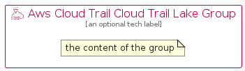

# AwsCloudTrailCloudTrailLake


```text
aws-q2-2024/Resource/ManagementGovernance/AwsCloudTrailCloudTrailLake
```

```text
include('aws-q2-2024/Resource/ManagementGovernance/AwsCloudTrailCloudTrailLake')
```


| Illustration | AwsCloudTrailCloudTrailLake | AwsCloudTrailCloudTrailLakeCard | AwsCloudTrailCloudTrailLakeGroup |
| :---: | :---: | :---: | :---: |
|  |  |  |  |


## Sprites
The item provides the following sriptes:

- `<$AwsCloudTrailCloudTrailLakeXs>`
- `<$AwsCloudTrailCloudTrailLakeSm>`
- `<$AwsCloudTrailCloudTrailLakeMd>`
- `<$AwsCloudTrailCloudTrailLakeLg>`


## AwsCloudTrailCloudTrailLake

### Load remotely
```plantuml
@startuml
' configures the library
!global $LIB_BASE_LOCATION="https://raw.githubusercontent.com/tmorin/plantuml-libs/master/distribution"

' loads the library's bootstrap
!include $LIB_BASE_LOCATION/bootstrap.puml

' loads the package bootstrap
include('aws-q2-2024/bootstrap')

' loads the Item which embeds the element AwsCloudTrailCloudTrailLake
include('aws-q2-2024/Resource/ManagementGovernance/AwsCloudTrailCloudTrailLake')

' renders the element
AwsCloudTrailCloudTrailLake('AwsCloudTrailCloudTrailLake', 'Aws Cloud Trail Cloud Trail Lake', 'an optional tech label', 'an optional description')
@enduml
```

### Load locally
```plantuml
@startuml
' configures the library
!global $INCLUSION_MODE="local"
!global $LIB_BASE_LOCATION="../../.."

' loads the library's bootstrap
!include $LIB_BASE_LOCATION/bootstrap.puml

' loads the package bootstrap
include('aws-q2-2024/bootstrap')

' loads the Item which embeds the element AwsCloudTrailCloudTrailLake
include('aws-q2-2024/Resource/ManagementGovernance/AwsCloudTrailCloudTrailLake')

' renders the element
AwsCloudTrailCloudTrailLake('AwsCloudTrailCloudTrailLake', 'Aws Cloud Trail Cloud Trail Lake', 'an optional tech label', 'an optional description')
@enduml
```

## AwsCloudTrailCloudTrailLakeCard

### Load remotely
```plantuml
@startuml
' configures the library
!global $LIB_BASE_LOCATION="https://raw.githubusercontent.com/tmorin/plantuml-libs/master/distribution"

' loads the library's bootstrap
!include $LIB_BASE_LOCATION/bootstrap.puml

' loads the package bootstrap
include('aws-q2-2024/bootstrap')

' loads the Item which embeds the element AwsCloudTrailCloudTrailLakeCard
include('aws-q2-2024/Resource/ManagementGovernance/AwsCloudTrailCloudTrailLake')

' renders the element
AwsCloudTrailCloudTrailLakeCard('AwsCloudTrailCloudTrailLakeCard', 'Aws Cloud Trail Cloud Trail Lake Card', 'an optional description')
@enduml
```

### Load locally
```plantuml
@startuml
' configures the library
!global $INCLUSION_MODE="local"
!global $LIB_BASE_LOCATION="../../.."

' loads the library's bootstrap
!include $LIB_BASE_LOCATION/bootstrap.puml

' loads the package bootstrap
include('aws-q2-2024/bootstrap')

' loads the Item which embeds the element AwsCloudTrailCloudTrailLakeCard
include('aws-q2-2024/Resource/ManagementGovernance/AwsCloudTrailCloudTrailLake')

' renders the element
AwsCloudTrailCloudTrailLakeCard('AwsCloudTrailCloudTrailLakeCard', 'Aws Cloud Trail Cloud Trail Lake Card', 'an optional description')
@enduml
```

## AwsCloudTrailCloudTrailLakeGroup

### Load remotely
```plantuml
@startuml
' configures the library
!global $LIB_BASE_LOCATION="https://raw.githubusercontent.com/tmorin/plantuml-libs/master/distribution"

' loads the library's bootstrap
!include $LIB_BASE_LOCATION/bootstrap.puml

' loads the package bootstrap
include('aws-q2-2024/bootstrap')

' loads the Item which embeds the element AwsCloudTrailCloudTrailLakeGroup
include('aws-q2-2024/Resource/ManagementGovernance/AwsCloudTrailCloudTrailLake')

' renders the element
AwsCloudTrailCloudTrailLakeGroup('AwsCloudTrailCloudTrailLakeGroup', 'Aws Cloud Trail Cloud Trail Lake Group', 'an optional tech label') {
    note as note
        the content of the group
    end note
}
@enduml
```

### Load locally
```plantuml
@startuml
' configures the library
!global $INCLUSION_MODE="local"
!global $LIB_BASE_LOCATION="../../.."

' loads the library's bootstrap
!include $LIB_BASE_LOCATION/bootstrap.puml

' loads the package bootstrap
include('aws-q2-2024/bootstrap')

' loads the Item which embeds the element AwsCloudTrailCloudTrailLakeGroup
include('aws-q2-2024/Resource/ManagementGovernance/AwsCloudTrailCloudTrailLake')

' renders the element
AwsCloudTrailCloudTrailLakeGroup('AwsCloudTrailCloudTrailLakeGroup', 'Aws Cloud Trail Cloud Trail Lake Group', 'an optional tech label') {
    note as note
        the content of the group
    end note
}
@enduml
```

