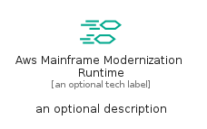
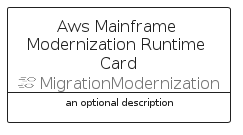

# AwsMainframeModernizationRuntime


```text
aws-q2-2024/Resource/MigrationModernization/AwsMainframeModernizationRuntime
```

```text
include('aws-q2-2024/Resource/MigrationModernization/AwsMainframeModernizationRuntime')
```


| Illustration | AwsMainframeModernizationRuntime | AwsMainframeModernizationRuntimeCard | AwsMainframeModernizationRuntimeGroup |
| :---: | :---: | :---: | :---: |
|  |  |  |  |


## Sprites
The item provides the following sriptes:

- `<$AwsMainframeModernizationRuntimeXs>`
- `<$AwsMainframeModernizationRuntimeSm>`
- `<$AwsMainframeModernizationRuntimeMd>`
- `<$AwsMainframeModernizationRuntimeLg>`


## AwsMainframeModernizationRuntime

### Load remotely
```plantuml
@startuml
' configures the library
!global $LIB_BASE_LOCATION="https://raw.githubusercontent.com/tmorin/plantuml-libs/master/distribution"

' loads the library's bootstrap
!include $LIB_BASE_LOCATION/bootstrap.puml

' loads the package bootstrap
include('aws-q2-2024/bootstrap')

' loads the Item which embeds the element AwsMainframeModernizationRuntime
include('aws-q2-2024/Resource/MigrationModernization/AwsMainframeModernizationRuntime')

' renders the element
AwsMainframeModernizationRuntime('AwsMainframeModernizationRuntime', 'Aws Mainframe Modernization Runtime', 'an optional tech label', 'an optional description')
@enduml
```

### Load locally
```plantuml
@startuml
' configures the library
!global $INCLUSION_MODE="local"
!global $LIB_BASE_LOCATION="../../.."

' loads the library's bootstrap
!include $LIB_BASE_LOCATION/bootstrap.puml

' loads the package bootstrap
include('aws-q2-2024/bootstrap')

' loads the Item which embeds the element AwsMainframeModernizationRuntime
include('aws-q2-2024/Resource/MigrationModernization/AwsMainframeModernizationRuntime')

' renders the element
AwsMainframeModernizationRuntime('AwsMainframeModernizationRuntime', 'Aws Mainframe Modernization Runtime', 'an optional tech label', 'an optional description')
@enduml
```

## AwsMainframeModernizationRuntimeCard

### Load remotely
```plantuml
@startuml
' configures the library
!global $LIB_BASE_LOCATION="https://raw.githubusercontent.com/tmorin/plantuml-libs/master/distribution"

' loads the library's bootstrap
!include $LIB_BASE_LOCATION/bootstrap.puml

' loads the package bootstrap
include('aws-q2-2024/bootstrap')

' loads the Item which embeds the element AwsMainframeModernizationRuntimeCard
include('aws-q2-2024/Resource/MigrationModernization/AwsMainframeModernizationRuntime')

' renders the element
AwsMainframeModernizationRuntimeCard('AwsMainframeModernizationRuntimeCard', 'Aws Mainframe Modernization Runtime Card', 'an optional description')
@enduml
```

### Load locally
```plantuml
@startuml
' configures the library
!global $INCLUSION_MODE="local"
!global $LIB_BASE_LOCATION="../../.."

' loads the library's bootstrap
!include $LIB_BASE_LOCATION/bootstrap.puml

' loads the package bootstrap
include('aws-q2-2024/bootstrap')

' loads the Item which embeds the element AwsMainframeModernizationRuntimeCard
include('aws-q2-2024/Resource/MigrationModernization/AwsMainframeModernizationRuntime')

' renders the element
AwsMainframeModernizationRuntimeCard('AwsMainframeModernizationRuntimeCard', 'Aws Mainframe Modernization Runtime Card', 'an optional description')
@enduml
```

## AwsMainframeModernizationRuntimeGroup

### Load remotely
```plantuml
@startuml
' configures the library
!global $LIB_BASE_LOCATION="https://raw.githubusercontent.com/tmorin/plantuml-libs/master/distribution"

' loads the library's bootstrap
!include $LIB_BASE_LOCATION/bootstrap.puml

' loads the package bootstrap
include('aws-q2-2024/bootstrap')

' loads the Item which embeds the element AwsMainframeModernizationRuntimeGroup
include('aws-q2-2024/Resource/MigrationModernization/AwsMainframeModernizationRuntime')

' renders the element
AwsMainframeModernizationRuntimeGroup('AwsMainframeModernizationRuntimeGroup', 'Aws Mainframe Modernization Runtime Group', 'an optional tech label') {
    note as note
        the content of the group
    end note
}
@enduml
```

### Load locally
```plantuml
@startuml
' configures the library
!global $INCLUSION_MODE="local"
!global $LIB_BASE_LOCATION="../../.."

' loads the library's bootstrap
!include $LIB_BASE_LOCATION/bootstrap.puml

' loads the package bootstrap
include('aws-q2-2024/bootstrap')

' loads the Item which embeds the element AwsMainframeModernizationRuntimeGroup
include('aws-q2-2024/Resource/MigrationModernization/AwsMainframeModernizationRuntime')

' renders the element
AwsMainframeModernizationRuntimeGroup('AwsMainframeModernizationRuntimeGroup', 'Aws Mainframe Modernization Runtime Group', 'an optional tech label') {
    note as note
        the content of the group
    end note
}
@enduml
```

