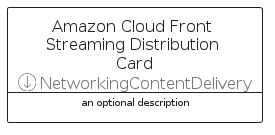

# AmazonCloudFrontStreamingDistribution


```text
aws-q2-2024/Resource/NetworkingContentDelivery/AmazonCloudFrontStreamingDistribution
```

```text
include('aws-q2-2024/Resource/NetworkingContentDelivery/AmazonCloudFrontStreamingDistribution')
```


| Illustration | AmazonCloudFrontStreamingDistribution | AmazonCloudFrontStreamingDistributionCard | AmazonCloudFrontStreamingDistributionGroup |
| :---: | :---: | :---: | :---: |
|  |  |  |  |


## Sprites
The item provides the following sriptes:

- `<$AmazonCloudFrontStreamingDistributionXs>`
- `<$AmazonCloudFrontStreamingDistributionSm>`
- `<$AmazonCloudFrontStreamingDistributionMd>`
- `<$AmazonCloudFrontStreamingDistributionLg>`


## AmazonCloudFrontStreamingDistribution

### Load remotely
```plantuml
@startuml
' configures the library
!global $LIB_BASE_LOCATION="https://raw.githubusercontent.com/tmorin/plantuml-libs/master/distribution"

' loads the library's bootstrap
!include $LIB_BASE_LOCATION/bootstrap.puml

' loads the package bootstrap
include('aws-q2-2024/bootstrap')

' loads the Item which embeds the element AmazonCloudFrontStreamingDistribution
include('aws-q2-2024/Resource/NetworkingContentDelivery/AmazonCloudFrontStreamingDistribution')

' renders the element
AmazonCloudFrontStreamingDistribution('AmazonCloudFrontStreamingDistribution', 'Amazon Cloud Front Streaming Distribution', 'an optional tech label', 'an optional description')
@enduml
```

### Load locally
```plantuml
@startuml
' configures the library
!global $INCLUSION_MODE="local"
!global $LIB_BASE_LOCATION="../../.."

' loads the library's bootstrap
!include $LIB_BASE_LOCATION/bootstrap.puml

' loads the package bootstrap
include('aws-q2-2024/bootstrap')

' loads the Item which embeds the element AmazonCloudFrontStreamingDistribution
include('aws-q2-2024/Resource/NetworkingContentDelivery/AmazonCloudFrontStreamingDistribution')

' renders the element
AmazonCloudFrontStreamingDistribution('AmazonCloudFrontStreamingDistribution', 'Amazon Cloud Front Streaming Distribution', 'an optional tech label', 'an optional description')
@enduml
```

## AmazonCloudFrontStreamingDistributionCard

### Load remotely
```plantuml
@startuml
' configures the library
!global $LIB_BASE_LOCATION="https://raw.githubusercontent.com/tmorin/plantuml-libs/master/distribution"

' loads the library's bootstrap
!include $LIB_BASE_LOCATION/bootstrap.puml

' loads the package bootstrap
include('aws-q2-2024/bootstrap')

' loads the Item which embeds the element AmazonCloudFrontStreamingDistributionCard
include('aws-q2-2024/Resource/NetworkingContentDelivery/AmazonCloudFrontStreamingDistribution')

' renders the element
AmazonCloudFrontStreamingDistributionCard('AmazonCloudFrontStreamingDistributionCard', 'Amazon Cloud Front Streaming Distribution Card', 'an optional description')
@enduml
```

### Load locally
```plantuml
@startuml
' configures the library
!global $INCLUSION_MODE="local"
!global $LIB_BASE_LOCATION="../../.."

' loads the library's bootstrap
!include $LIB_BASE_LOCATION/bootstrap.puml

' loads the package bootstrap
include('aws-q2-2024/bootstrap')

' loads the Item which embeds the element AmazonCloudFrontStreamingDistributionCard
include('aws-q2-2024/Resource/NetworkingContentDelivery/AmazonCloudFrontStreamingDistribution')

' renders the element
AmazonCloudFrontStreamingDistributionCard('AmazonCloudFrontStreamingDistributionCard', 'Amazon Cloud Front Streaming Distribution Card', 'an optional description')
@enduml
```

## AmazonCloudFrontStreamingDistributionGroup

### Load remotely
```plantuml
@startuml
' configures the library
!global $LIB_BASE_LOCATION="https://raw.githubusercontent.com/tmorin/plantuml-libs/master/distribution"

' loads the library's bootstrap
!include $LIB_BASE_LOCATION/bootstrap.puml

' loads the package bootstrap
include('aws-q2-2024/bootstrap')

' loads the Item which embeds the element AmazonCloudFrontStreamingDistributionGroup
include('aws-q2-2024/Resource/NetworkingContentDelivery/AmazonCloudFrontStreamingDistribution')

' renders the element
AmazonCloudFrontStreamingDistributionGroup('AmazonCloudFrontStreamingDistributionGroup', 'Amazon Cloud Front Streaming Distribution Group', 'an optional tech label') {
    note as note
        the content of the group
    end note
}
@enduml
```

### Load locally
```plantuml
@startuml
' configures the library
!global $INCLUSION_MODE="local"
!global $LIB_BASE_LOCATION="../../.."

' loads the library's bootstrap
!include $LIB_BASE_LOCATION/bootstrap.puml

' loads the package bootstrap
include('aws-q2-2024/bootstrap')

' loads the Item which embeds the element AmazonCloudFrontStreamingDistributionGroup
include('aws-q2-2024/Resource/NetworkingContentDelivery/AmazonCloudFrontStreamingDistribution')

' renders the element
AmazonCloudFrontStreamingDistributionGroup('AmazonCloudFrontStreamingDistributionGroup', 'Amazon Cloud Front Streaming Distribution Group', 'an optional tech label') {
    note as note
        the content of the group
    end note
}
@enduml
```

