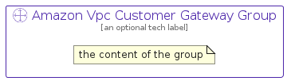

# AmazonVpcCustomerGateway


```text
aws-q2-2024/Resource/NetworkingContentDelivery/AmazonVpcCustomerGateway
```

```text
include('aws-q2-2024/Resource/NetworkingContentDelivery/AmazonVpcCustomerGateway')
```


| Illustration | AmazonVpcCustomerGateway | AmazonVpcCustomerGatewayCard | AmazonVpcCustomerGatewayGroup |
| :---: | :---: | :---: | :---: |
|  |  |  |  |


## Sprites
The item provides the following sriptes:

- `<$AmazonVpcCustomerGatewayXs>`
- `<$AmazonVpcCustomerGatewaySm>`
- `<$AmazonVpcCustomerGatewayMd>`
- `<$AmazonVpcCustomerGatewayLg>`


## AmazonVpcCustomerGateway

### Load remotely
```plantuml
@startuml
' configures the library
!global $LIB_BASE_LOCATION="https://raw.githubusercontent.com/tmorin/plantuml-libs/master/distribution"

' loads the library's bootstrap
!include $LIB_BASE_LOCATION/bootstrap.puml

' loads the package bootstrap
include('aws-q2-2024/bootstrap')

' loads the Item which embeds the element AmazonVpcCustomerGateway
include('aws-q2-2024/Resource/NetworkingContentDelivery/AmazonVpcCustomerGateway')

' renders the element
AmazonVpcCustomerGateway('AmazonVpcCustomerGateway', 'Amazon Vpc Customer Gateway', 'an optional tech label', 'an optional description')
@enduml
```

### Load locally
```plantuml
@startuml
' configures the library
!global $INCLUSION_MODE="local"
!global $LIB_BASE_LOCATION="../../.."

' loads the library's bootstrap
!include $LIB_BASE_LOCATION/bootstrap.puml

' loads the package bootstrap
include('aws-q2-2024/bootstrap')

' loads the Item which embeds the element AmazonVpcCustomerGateway
include('aws-q2-2024/Resource/NetworkingContentDelivery/AmazonVpcCustomerGateway')

' renders the element
AmazonVpcCustomerGateway('AmazonVpcCustomerGateway', 'Amazon Vpc Customer Gateway', 'an optional tech label', 'an optional description')
@enduml
```

## AmazonVpcCustomerGatewayCard

### Load remotely
```plantuml
@startuml
' configures the library
!global $LIB_BASE_LOCATION="https://raw.githubusercontent.com/tmorin/plantuml-libs/master/distribution"

' loads the library's bootstrap
!include $LIB_BASE_LOCATION/bootstrap.puml

' loads the package bootstrap
include('aws-q2-2024/bootstrap')

' loads the Item which embeds the element AmazonVpcCustomerGatewayCard
include('aws-q2-2024/Resource/NetworkingContentDelivery/AmazonVpcCustomerGateway')

' renders the element
AmazonVpcCustomerGatewayCard('AmazonVpcCustomerGatewayCard', 'Amazon Vpc Customer Gateway Card', 'an optional description')
@enduml
```

### Load locally
```plantuml
@startuml
' configures the library
!global $INCLUSION_MODE="local"
!global $LIB_BASE_LOCATION="../../.."

' loads the library's bootstrap
!include $LIB_BASE_LOCATION/bootstrap.puml

' loads the package bootstrap
include('aws-q2-2024/bootstrap')

' loads the Item which embeds the element AmazonVpcCustomerGatewayCard
include('aws-q2-2024/Resource/NetworkingContentDelivery/AmazonVpcCustomerGateway')

' renders the element
AmazonVpcCustomerGatewayCard('AmazonVpcCustomerGatewayCard', 'Amazon Vpc Customer Gateway Card', 'an optional description')
@enduml
```

## AmazonVpcCustomerGatewayGroup

### Load remotely
```plantuml
@startuml
' configures the library
!global $LIB_BASE_LOCATION="https://raw.githubusercontent.com/tmorin/plantuml-libs/master/distribution"

' loads the library's bootstrap
!include $LIB_BASE_LOCATION/bootstrap.puml

' loads the package bootstrap
include('aws-q2-2024/bootstrap')

' loads the Item which embeds the element AmazonVpcCustomerGatewayGroup
include('aws-q2-2024/Resource/NetworkingContentDelivery/AmazonVpcCustomerGateway')

' renders the element
AmazonVpcCustomerGatewayGroup('AmazonVpcCustomerGatewayGroup', 'Amazon Vpc Customer Gateway Group', 'an optional tech label') {
    note as note
        the content of the group
    end note
}
@enduml
```

### Load locally
```plantuml
@startuml
' configures the library
!global $INCLUSION_MODE="local"
!global $LIB_BASE_LOCATION="../../.."

' loads the library's bootstrap
!include $LIB_BASE_LOCATION/bootstrap.puml

' loads the package bootstrap
include('aws-q2-2024/bootstrap')

' loads the Item which embeds the element AmazonVpcCustomerGatewayGroup
include('aws-q2-2024/Resource/NetworkingContentDelivery/AmazonVpcCustomerGateway')

' renders the element
AmazonVpcCustomerGatewayGroup('AmazonVpcCustomerGatewayGroup', 'Amazon Vpc Customer Gateway Group', 'an optional tech label') {
    note as note
        the content of the group
    end note
}
@enduml
```

