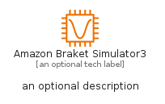
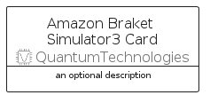

# AmazonBraketSimulator3


```text
aws-q2-2024/Resource/QuantumTechnologies/AmazonBraketSimulator3
```

```text
include('aws-q2-2024/Resource/QuantumTechnologies/AmazonBraketSimulator3')
```


| Illustration | AmazonBraketSimulator3 | AmazonBraketSimulator3Card | AmazonBraketSimulator3Group |
| :---: | :---: | :---: | :---: |
|  |  |  |  |


## Sprites
The item provides the following sriptes:

- `<$AmazonBraketSimulator3Xs>`
- `<$AmazonBraketSimulator3Sm>`
- `<$AmazonBraketSimulator3Md>`
- `<$AmazonBraketSimulator3Lg>`


## AmazonBraketSimulator3

### Load remotely
```plantuml
@startuml
' configures the library
!global $LIB_BASE_LOCATION="https://raw.githubusercontent.com/tmorin/plantuml-libs/master/distribution"

' loads the library's bootstrap
!include $LIB_BASE_LOCATION/bootstrap.puml

' loads the package bootstrap
include('aws-q2-2024/bootstrap')

' loads the Item which embeds the element AmazonBraketSimulator3
include('aws-q2-2024/Resource/QuantumTechnologies/AmazonBraketSimulator3')

' renders the element
AmazonBraketSimulator3('AmazonBraketSimulator3', 'Amazon Braket Simulator3', 'an optional tech label', 'an optional description')
@enduml
```

### Load locally
```plantuml
@startuml
' configures the library
!global $INCLUSION_MODE="local"
!global $LIB_BASE_LOCATION="../../.."

' loads the library's bootstrap
!include $LIB_BASE_LOCATION/bootstrap.puml

' loads the package bootstrap
include('aws-q2-2024/bootstrap')

' loads the Item which embeds the element AmazonBraketSimulator3
include('aws-q2-2024/Resource/QuantumTechnologies/AmazonBraketSimulator3')

' renders the element
AmazonBraketSimulator3('AmazonBraketSimulator3', 'Amazon Braket Simulator3', 'an optional tech label', 'an optional description')
@enduml
```

## AmazonBraketSimulator3Card

### Load remotely
```plantuml
@startuml
' configures the library
!global $LIB_BASE_LOCATION="https://raw.githubusercontent.com/tmorin/plantuml-libs/master/distribution"

' loads the library's bootstrap
!include $LIB_BASE_LOCATION/bootstrap.puml

' loads the package bootstrap
include('aws-q2-2024/bootstrap')

' loads the Item which embeds the element AmazonBraketSimulator3Card
include('aws-q2-2024/Resource/QuantumTechnologies/AmazonBraketSimulator3')

' renders the element
AmazonBraketSimulator3Card('AmazonBraketSimulator3Card', 'Amazon Braket Simulator3 Card', 'an optional description')
@enduml
```

### Load locally
```plantuml
@startuml
' configures the library
!global $INCLUSION_MODE="local"
!global $LIB_BASE_LOCATION="../../.."

' loads the library's bootstrap
!include $LIB_BASE_LOCATION/bootstrap.puml

' loads the package bootstrap
include('aws-q2-2024/bootstrap')

' loads the Item which embeds the element AmazonBraketSimulator3Card
include('aws-q2-2024/Resource/QuantumTechnologies/AmazonBraketSimulator3')

' renders the element
AmazonBraketSimulator3Card('AmazonBraketSimulator3Card', 'Amazon Braket Simulator3 Card', 'an optional description')
@enduml
```

## AmazonBraketSimulator3Group

### Load remotely
```plantuml
@startuml
' configures the library
!global $LIB_BASE_LOCATION="https://raw.githubusercontent.com/tmorin/plantuml-libs/master/distribution"

' loads the library's bootstrap
!include $LIB_BASE_LOCATION/bootstrap.puml

' loads the package bootstrap
include('aws-q2-2024/bootstrap')

' loads the Item which embeds the element AmazonBraketSimulator3Group
include('aws-q2-2024/Resource/QuantumTechnologies/AmazonBraketSimulator3')

' renders the element
AmazonBraketSimulator3Group('AmazonBraketSimulator3Group', 'Amazon Braket Simulator3 Group', 'an optional tech label') {
    note as note
        the content of the group
    end note
}
@enduml
```

### Load locally
```plantuml
@startuml
' configures the library
!global $INCLUSION_MODE="local"
!global $LIB_BASE_LOCATION="../../.."

' loads the library's bootstrap
!include $LIB_BASE_LOCATION/bootstrap.puml

' loads the package bootstrap
include('aws-q2-2024/bootstrap')

' loads the Item which embeds the element AmazonBraketSimulator3Group
include('aws-q2-2024/Resource/QuantumTechnologies/AmazonBraketSimulator3')

' renders the element
AmazonBraketSimulator3Group('AmazonBraketSimulator3Group', 'Amazon Braket Simulator3 Group', 'an optional tech label') {
    note as note
        the content of the group
    end note
}
@enduml
```

