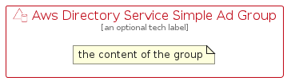

# AwsDirectoryServiceSimpleAd


```text
aws-q2-2024/Resource/SecurityIdentityCompliance/AwsDirectoryServiceSimpleAd
```

```text
include('aws-q2-2024/Resource/SecurityIdentityCompliance/AwsDirectoryServiceSimpleAd')
```


| Illustration | AwsDirectoryServiceSimpleAd | AwsDirectoryServiceSimpleAdCard | AwsDirectoryServiceSimpleAdGroup |
| :---: | :---: | :---: | :---: |
|  |  |  |  |


## Sprites
The item provides the following sriptes:

- `<$AwsDirectoryServiceSimpleAdXs>`
- `<$AwsDirectoryServiceSimpleAdSm>`
- `<$AwsDirectoryServiceSimpleAdMd>`
- `<$AwsDirectoryServiceSimpleAdLg>`


## AwsDirectoryServiceSimpleAd

### Load remotely
```plantuml
@startuml
' configures the library
!global $LIB_BASE_LOCATION="https://raw.githubusercontent.com/tmorin/plantuml-libs/master/distribution"

' loads the library's bootstrap
!include $LIB_BASE_LOCATION/bootstrap.puml

' loads the package bootstrap
include('aws-q2-2024/bootstrap')

' loads the Item which embeds the element AwsDirectoryServiceSimpleAd
include('aws-q2-2024/Resource/SecurityIdentityCompliance/AwsDirectoryServiceSimpleAd')

' renders the element
AwsDirectoryServiceSimpleAd('AwsDirectoryServiceSimpleAd', 'Aws Directory Service Simple Ad', 'an optional tech label', 'an optional description')
@enduml
```

### Load locally
```plantuml
@startuml
' configures the library
!global $INCLUSION_MODE="local"
!global $LIB_BASE_LOCATION="../../.."

' loads the library's bootstrap
!include $LIB_BASE_LOCATION/bootstrap.puml

' loads the package bootstrap
include('aws-q2-2024/bootstrap')

' loads the Item which embeds the element AwsDirectoryServiceSimpleAd
include('aws-q2-2024/Resource/SecurityIdentityCompliance/AwsDirectoryServiceSimpleAd')

' renders the element
AwsDirectoryServiceSimpleAd('AwsDirectoryServiceSimpleAd', 'Aws Directory Service Simple Ad', 'an optional tech label', 'an optional description')
@enduml
```

## AwsDirectoryServiceSimpleAdCard

### Load remotely
```plantuml
@startuml
' configures the library
!global $LIB_BASE_LOCATION="https://raw.githubusercontent.com/tmorin/plantuml-libs/master/distribution"

' loads the library's bootstrap
!include $LIB_BASE_LOCATION/bootstrap.puml

' loads the package bootstrap
include('aws-q2-2024/bootstrap')

' loads the Item which embeds the element AwsDirectoryServiceSimpleAdCard
include('aws-q2-2024/Resource/SecurityIdentityCompliance/AwsDirectoryServiceSimpleAd')

' renders the element
AwsDirectoryServiceSimpleAdCard('AwsDirectoryServiceSimpleAdCard', 'Aws Directory Service Simple Ad Card', 'an optional description')
@enduml
```

### Load locally
```plantuml
@startuml
' configures the library
!global $INCLUSION_MODE="local"
!global $LIB_BASE_LOCATION="../../.."

' loads the library's bootstrap
!include $LIB_BASE_LOCATION/bootstrap.puml

' loads the package bootstrap
include('aws-q2-2024/bootstrap')

' loads the Item which embeds the element AwsDirectoryServiceSimpleAdCard
include('aws-q2-2024/Resource/SecurityIdentityCompliance/AwsDirectoryServiceSimpleAd')

' renders the element
AwsDirectoryServiceSimpleAdCard('AwsDirectoryServiceSimpleAdCard', 'Aws Directory Service Simple Ad Card', 'an optional description')
@enduml
```

## AwsDirectoryServiceSimpleAdGroup

### Load remotely
```plantuml
@startuml
' configures the library
!global $LIB_BASE_LOCATION="https://raw.githubusercontent.com/tmorin/plantuml-libs/master/distribution"

' loads the library's bootstrap
!include $LIB_BASE_LOCATION/bootstrap.puml

' loads the package bootstrap
include('aws-q2-2024/bootstrap')

' loads the Item which embeds the element AwsDirectoryServiceSimpleAdGroup
include('aws-q2-2024/Resource/SecurityIdentityCompliance/AwsDirectoryServiceSimpleAd')

' renders the element
AwsDirectoryServiceSimpleAdGroup('AwsDirectoryServiceSimpleAdGroup', 'Aws Directory Service Simple Ad Group', 'an optional tech label') {
    note as note
        the content of the group
    end note
}
@enduml
```

### Load locally
```plantuml
@startuml
' configures the library
!global $INCLUSION_MODE="local"
!global $LIB_BASE_LOCATION="../../.."

' loads the library's bootstrap
!include $LIB_BASE_LOCATION/bootstrap.puml

' loads the package bootstrap
include('aws-q2-2024/bootstrap')

' loads the Item which embeds the element AwsDirectoryServiceSimpleAdGroup
include('aws-q2-2024/Resource/SecurityIdentityCompliance/AwsDirectoryServiceSimpleAd')

' renders the element
AwsDirectoryServiceSimpleAdGroup('AwsDirectoryServiceSimpleAdGroup', 'Aws Directory Service Simple Ad Group', 'an optional tech label') {
    note as note
        the content of the group
    end note
}
@enduml
```

