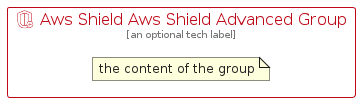

# AwsShieldAwsShieldAdvanced


```text
aws-q2-2024/Resource/SecurityIdentityCompliance/AwsShieldAwsShieldAdvanced
```

```text
include('aws-q2-2024/Resource/SecurityIdentityCompliance/AwsShieldAwsShieldAdvanced')
```


| Illustration | AwsShieldAwsShieldAdvanced | AwsShieldAwsShieldAdvancedCard | AwsShieldAwsShieldAdvancedGroup |
| :---: | :---: | :---: | :---: |
|  |  |  |  |


## Sprites
The item provides the following sriptes:

- `<$AwsShieldAwsShieldAdvancedXs>`
- `<$AwsShieldAwsShieldAdvancedSm>`
- `<$AwsShieldAwsShieldAdvancedMd>`
- `<$AwsShieldAwsShieldAdvancedLg>`


## AwsShieldAwsShieldAdvanced

### Load remotely
```plantuml
@startuml
' configures the library
!global $LIB_BASE_LOCATION="https://raw.githubusercontent.com/tmorin/plantuml-libs/master/distribution"

' loads the library's bootstrap
!include $LIB_BASE_LOCATION/bootstrap.puml

' loads the package bootstrap
include('aws-q2-2024/bootstrap')

' loads the Item which embeds the element AwsShieldAwsShieldAdvanced
include('aws-q2-2024/Resource/SecurityIdentityCompliance/AwsShieldAwsShieldAdvanced')

' renders the element
AwsShieldAwsShieldAdvanced('AwsShieldAwsShieldAdvanced', 'Aws Shield Aws Shield Advanced', 'an optional tech label', 'an optional description')
@enduml
```

### Load locally
```plantuml
@startuml
' configures the library
!global $INCLUSION_MODE="local"
!global $LIB_BASE_LOCATION="../../.."

' loads the library's bootstrap
!include $LIB_BASE_LOCATION/bootstrap.puml

' loads the package bootstrap
include('aws-q2-2024/bootstrap')

' loads the Item which embeds the element AwsShieldAwsShieldAdvanced
include('aws-q2-2024/Resource/SecurityIdentityCompliance/AwsShieldAwsShieldAdvanced')

' renders the element
AwsShieldAwsShieldAdvanced('AwsShieldAwsShieldAdvanced', 'Aws Shield Aws Shield Advanced', 'an optional tech label', 'an optional description')
@enduml
```

## AwsShieldAwsShieldAdvancedCard

### Load remotely
```plantuml
@startuml
' configures the library
!global $LIB_BASE_LOCATION="https://raw.githubusercontent.com/tmorin/plantuml-libs/master/distribution"

' loads the library's bootstrap
!include $LIB_BASE_LOCATION/bootstrap.puml

' loads the package bootstrap
include('aws-q2-2024/bootstrap')

' loads the Item which embeds the element AwsShieldAwsShieldAdvancedCard
include('aws-q2-2024/Resource/SecurityIdentityCompliance/AwsShieldAwsShieldAdvanced')

' renders the element
AwsShieldAwsShieldAdvancedCard('AwsShieldAwsShieldAdvancedCard', 'Aws Shield Aws Shield Advanced Card', 'an optional description')
@enduml
```

### Load locally
```plantuml
@startuml
' configures the library
!global $INCLUSION_MODE="local"
!global $LIB_BASE_LOCATION="../../.."

' loads the library's bootstrap
!include $LIB_BASE_LOCATION/bootstrap.puml

' loads the package bootstrap
include('aws-q2-2024/bootstrap')

' loads the Item which embeds the element AwsShieldAwsShieldAdvancedCard
include('aws-q2-2024/Resource/SecurityIdentityCompliance/AwsShieldAwsShieldAdvanced')

' renders the element
AwsShieldAwsShieldAdvancedCard('AwsShieldAwsShieldAdvancedCard', 'Aws Shield Aws Shield Advanced Card', 'an optional description')
@enduml
```

## AwsShieldAwsShieldAdvancedGroup

### Load remotely
```plantuml
@startuml
' configures the library
!global $LIB_BASE_LOCATION="https://raw.githubusercontent.com/tmorin/plantuml-libs/master/distribution"

' loads the library's bootstrap
!include $LIB_BASE_LOCATION/bootstrap.puml

' loads the package bootstrap
include('aws-q2-2024/bootstrap')

' loads the Item which embeds the element AwsShieldAwsShieldAdvancedGroup
include('aws-q2-2024/Resource/SecurityIdentityCompliance/AwsShieldAwsShieldAdvanced')

' renders the element
AwsShieldAwsShieldAdvancedGroup('AwsShieldAwsShieldAdvancedGroup', 'Aws Shield Aws Shield Advanced Group', 'an optional tech label') {
    note as note
        the content of the group
    end note
}
@enduml
```

### Load locally
```plantuml
@startuml
' configures the library
!global $INCLUSION_MODE="local"
!global $LIB_BASE_LOCATION="../../.."

' loads the library's bootstrap
!include $LIB_BASE_LOCATION/bootstrap.puml

' loads the package bootstrap
include('aws-q2-2024/bootstrap')

' loads the Item which embeds the element AwsShieldAwsShieldAdvancedGroup
include('aws-q2-2024/Resource/SecurityIdentityCompliance/AwsShieldAwsShieldAdvanced')

' renders the element
AwsShieldAwsShieldAdvancedGroup('AwsShieldAwsShieldAdvancedGroup', 'Aws Shield Aws Shield Advanced Group', 'an optional tech label') {
    note as note
        the content of the group
    end note
}
@enduml
```

