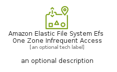
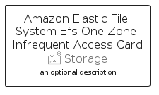

# AmazonElasticFileSystemEfsOneZoneInfrequentAccess


```text
aws-q2-2024/Resource/Storage/AmazonElasticFileSystemEfsOneZoneInfrequentAccess
```

```text
include('aws-q2-2024/Resource/Storage/AmazonElasticFileSystemEfsOneZoneInfrequentAccess')
```


| Illustration | AmazonElasticFileSystemEfsOneZoneInfrequentAccess | AmazonElasticFileSystemEfsOneZoneInfrequentAccessCard | AmazonElasticFileSystemEfsOneZoneInfrequentAccessGroup |
| :---: | :---: | :---: | :---: |
|  |  |  |  |


## Sprites
The item provides the following sriptes:

- `<$AmazonElasticFileSystemEfsOneZoneInfrequentAccessXs>`
- `<$AmazonElasticFileSystemEfsOneZoneInfrequentAccessSm>`
- `<$AmazonElasticFileSystemEfsOneZoneInfrequentAccessMd>`
- `<$AmazonElasticFileSystemEfsOneZoneInfrequentAccessLg>`


## AmazonElasticFileSystemEfsOneZoneInfrequentAccess

### Load remotely
```plantuml
@startuml
' configures the library
!global $LIB_BASE_LOCATION="https://raw.githubusercontent.com/tmorin/plantuml-libs/master/distribution"

' loads the library's bootstrap
!include $LIB_BASE_LOCATION/bootstrap.puml

' loads the package bootstrap
include('aws-q2-2024/bootstrap')

' loads the Item which embeds the element AmazonElasticFileSystemEfsOneZoneInfrequentAccess
include('aws-q2-2024/Resource/Storage/AmazonElasticFileSystemEfsOneZoneInfrequentAccess')

' renders the element
AmazonElasticFileSystemEfsOneZoneInfrequentAccess('AmazonElasticFileSystemEfsOneZoneInfrequentAccess', 'Amazon Elastic File System Efs One Zone Infrequent Access', 'an optional tech label', 'an optional description')
@enduml
```

### Load locally
```plantuml
@startuml
' configures the library
!global $INCLUSION_MODE="local"
!global $LIB_BASE_LOCATION="../../.."

' loads the library's bootstrap
!include $LIB_BASE_LOCATION/bootstrap.puml

' loads the package bootstrap
include('aws-q2-2024/bootstrap')

' loads the Item which embeds the element AmazonElasticFileSystemEfsOneZoneInfrequentAccess
include('aws-q2-2024/Resource/Storage/AmazonElasticFileSystemEfsOneZoneInfrequentAccess')

' renders the element
AmazonElasticFileSystemEfsOneZoneInfrequentAccess('AmazonElasticFileSystemEfsOneZoneInfrequentAccess', 'Amazon Elastic File System Efs One Zone Infrequent Access', 'an optional tech label', 'an optional description')
@enduml
```

## AmazonElasticFileSystemEfsOneZoneInfrequentAccessCard

### Load remotely
```plantuml
@startuml
' configures the library
!global $LIB_BASE_LOCATION="https://raw.githubusercontent.com/tmorin/plantuml-libs/master/distribution"

' loads the library's bootstrap
!include $LIB_BASE_LOCATION/bootstrap.puml

' loads the package bootstrap
include('aws-q2-2024/bootstrap')

' loads the Item which embeds the element AmazonElasticFileSystemEfsOneZoneInfrequentAccessCard
include('aws-q2-2024/Resource/Storage/AmazonElasticFileSystemEfsOneZoneInfrequentAccess')

' renders the element
AmazonElasticFileSystemEfsOneZoneInfrequentAccessCard('AmazonElasticFileSystemEfsOneZoneInfrequentAccessCard', 'Amazon Elastic File System Efs One Zone Infrequent Access Card', 'an optional description')
@enduml
```

### Load locally
```plantuml
@startuml
' configures the library
!global $INCLUSION_MODE="local"
!global $LIB_BASE_LOCATION="../../.."

' loads the library's bootstrap
!include $LIB_BASE_LOCATION/bootstrap.puml

' loads the package bootstrap
include('aws-q2-2024/bootstrap')

' loads the Item which embeds the element AmazonElasticFileSystemEfsOneZoneInfrequentAccessCard
include('aws-q2-2024/Resource/Storage/AmazonElasticFileSystemEfsOneZoneInfrequentAccess')

' renders the element
AmazonElasticFileSystemEfsOneZoneInfrequentAccessCard('AmazonElasticFileSystemEfsOneZoneInfrequentAccessCard', 'Amazon Elastic File System Efs One Zone Infrequent Access Card', 'an optional description')
@enduml
```

## AmazonElasticFileSystemEfsOneZoneInfrequentAccessGroup

### Load remotely
```plantuml
@startuml
' configures the library
!global $LIB_BASE_LOCATION="https://raw.githubusercontent.com/tmorin/plantuml-libs/master/distribution"

' loads the library's bootstrap
!include $LIB_BASE_LOCATION/bootstrap.puml

' loads the package bootstrap
include('aws-q2-2024/bootstrap')

' loads the Item which embeds the element AmazonElasticFileSystemEfsOneZoneInfrequentAccessGroup
include('aws-q2-2024/Resource/Storage/AmazonElasticFileSystemEfsOneZoneInfrequentAccess')

' renders the element
AmazonElasticFileSystemEfsOneZoneInfrequentAccessGroup('AmazonElasticFileSystemEfsOneZoneInfrequentAccessGroup', 'Amazon Elastic File System Efs One Zone Infrequent Access Group', 'an optional tech label') {
    note as note
        the content of the group
    end note
}
@enduml
```

### Load locally
```plantuml
@startuml
' configures the library
!global $INCLUSION_MODE="local"
!global $LIB_BASE_LOCATION="../../.."

' loads the library's bootstrap
!include $LIB_BASE_LOCATION/bootstrap.puml

' loads the package bootstrap
include('aws-q2-2024/bootstrap')

' loads the Item which embeds the element AmazonElasticFileSystemEfsOneZoneInfrequentAccessGroup
include('aws-q2-2024/Resource/Storage/AmazonElasticFileSystemEfsOneZoneInfrequentAccess')

' renders the element
AmazonElasticFileSystemEfsOneZoneInfrequentAccessGroup('AmazonElasticFileSystemEfsOneZoneInfrequentAccessGroup', 'Amazon Elastic File System Efs One Zone Infrequent Access Group', 'an optional tech label') {
    note as note
        the content of the group
    end note
}
@enduml
```

