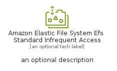
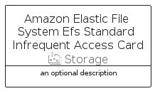

# AmazonElasticFileSystemEfsStandardInfrequentAccess


```text
aws-q2-2024/Resource/Storage/AmazonElasticFileSystemEfsStandardInfrequentAccess
```

```text
include('aws-q2-2024/Resource/Storage/AmazonElasticFileSystemEfsStandardInfrequentAccess')
```


| Illustration | AmazonElasticFileSystemEfsStandardInfrequentAccess | AmazonElasticFileSystemEfsStandardInfrequentAccessCard | AmazonElasticFileSystemEfsStandardInfrequentAccessGroup |
| :---: | :---: | :---: | :---: |
|  |  |  |  |


## Sprites
The item provides the following sriptes:

- `<$AmazonElasticFileSystemEfsStandardInfrequentAccessXs>`
- `<$AmazonElasticFileSystemEfsStandardInfrequentAccessSm>`
- `<$AmazonElasticFileSystemEfsStandardInfrequentAccessMd>`
- `<$AmazonElasticFileSystemEfsStandardInfrequentAccessLg>`


## AmazonElasticFileSystemEfsStandardInfrequentAccess

### Load remotely
```plantuml
@startuml
' configures the library
!global $LIB_BASE_LOCATION="https://raw.githubusercontent.com/tmorin/plantuml-libs/master/distribution"

' loads the library's bootstrap
!include $LIB_BASE_LOCATION/bootstrap.puml

' loads the package bootstrap
include('aws-q2-2024/bootstrap')

' loads the Item which embeds the element AmazonElasticFileSystemEfsStandardInfrequentAccess
include('aws-q2-2024/Resource/Storage/AmazonElasticFileSystemEfsStandardInfrequentAccess')

' renders the element
AmazonElasticFileSystemEfsStandardInfrequentAccess('AmazonElasticFileSystemEfsStandardInfrequentAccess', 'Amazon Elastic File System Efs Standard Infrequent Access', 'an optional tech label', 'an optional description')
@enduml
```

### Load locally
```plantuml
@startuml
' configures the library
!global $INCLUSION_MODE="local"
!global $LIB_BASE_LOCATION="../../.."

' loads the library's bootstrap
!include $LIB_BASE_LOCATION/bootstrap.puml

' loads the package bootstrap
include('aws-q2-2024/bootstrap')

' loads the Item which embeds the element AmazonElasticFileSystemEfsStandardInfrequentAccess
include('aws-q2-2024/Resource/Storage/AmazonElasticFileSystemEfsStandardInfrequentAccess')

' renders the element
AmazonElasticFileSystemEfsStandardInfrequentAccess('AmazonElasticFileSystemEfsStandardInfrequentAccess', 'Amazon Elastic File System Efs Standard Infrequent Access', 'an optional tech label', 'an optional description')
@enduml
```

## AmazonElasticFileSystemEfsStandardInfrequentAccessCard

### Load remotely
```plantuml
@startuml
' configures the library
!global $LIB_BASE_LOCATION="https://raw.githubusercontent.com/tmorin/plantuml-libs/master/distribution"

' loads the library's bootstrap
!include $LIB_BASE_LOCATION/bootstrap.puml

' loads the package bootstrap
include('aws-q2-2024/bootstrap')

' loads the Item which embeds the element AmazonElasticFileSystemEfsStandardInfrequentAccessCard
include('aws-q2-2024/Resource/Storage/AmazonElasticFileSystemEfsStandardInfrequentAccess')

' renders the element
AmazonElasticFileSystemEfsStandardInfrequentAccessCard('AmazonElasticFileSystemEfsStandardInfrequentAccessCard', 'Amazon Elastic File System Efs Standard Infrequent Access Card', 'an optional description')
@enduml
```

### Load locally
```plantuml
@startuml
' configures the library
!global $INCLUSION_MODE="local"
!global $LIB_BASE_LOCATION="../../.."

' loads the library's bootstrap
!include $LIB_BASE_LOCATION/bootstrap.puml

' loads the package bootstrap
include('aws-q2-2024/bootstrap')

' loads the Item which embeds the element AmazonElasticFileSystemEfsStandardInfrequentAccessCard
include('aws-q2-2024/Resource/Storage/AmazonElasticFileSystemEfsStandardInfrequentAccess')

' renders the element
AmazonElasticFileSystemEfsStandardInfrequentAccessCard('AmazonElasticFileSystemEfsStandardInfrequentAccessCard', 'Amazon Elastic File System Efs Standard Infrequent Access Card', 'an optional description')
@enduml
```

## AmazonElasticFileSystemEfsStandardInfrequentAccessGroup

### Load remotely
```plantuml
@startuml
' configures the library
!global $LIB_BASE_LOCATION="https://raw.githubusercontent.com/tmorin/plantuml-libs/master/distribution"

' loads the library's bootstrap
!include $LIB_BASE_LOCATION/bootstrap.puml

' loads the package bootstrap
include('aws-q2-2024/bootstrap')

' loads the Item which embeds the element AmazonElasticFileSystemEfsStandardInfrequentAccessGroup
include('aws-q2-2024/Resource/Storage/AmazonElasticFileSystemEfsStandardInfrequentAccess')

' renders the element
AmazonElasticFileSystemEfsStandardInfrequentAccessGroup('AmazonElasticFileSystemEfsStandardInfrequentAccessGroup', 'Amazon Elastic File System Efs Standard Infrequent Access Group', 'an optional tech label') {
    note as note
        the content of the group
    end note
}
@enduml
```

### Load locally
```plantuml
@startuml
' configures the library
!global $INCLUSION_MODE="local"
!global $LIB_BASE_LOCATION="../../.."

' loads the library's bootstrap
!include $LIB_BASE_LOCATION/bootstrap.puml

' loads the package bootstrap
include('aws-q2-2024/bootstrap')

' loads the Item which embeds the element AmazonElasticFileSystemEfsStandardInfrequentAccessGroup
include('aws-q2-2024/Resource/Storage/AmazonElasticFileSystemEfsStandardInfrequentAccess')

' renders the element
AmazonElasticFileSystemEfsStandardInfrequentAccessGroup('AmazonElasticFileSystemEfsStandardInfrequentAccessGroup', 'Amazon Elastic File System Efs Standard Infrequent Access Group', 'an optional tech label') {
    note as note
        the content of the group
    end note
}
@enduml
```

