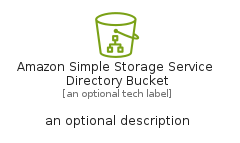
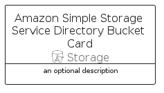

# AmazonSimpleStorageServiceDirectoryBucket


```text
aws-q2-2024/Resource/Storage/AmazonSimpleStorageServiceDirectoryBucket
```

```text
include('aws-q2-2024/Resource/Storage/AmazonSimpleStorageServiceDirectoryBucket')
```


| Illustration | AmazonSimpleStorageServiceDirectoryBucket | AmazonSimpleStorageServiceDirectoryBucketCard | AmazonSimpleStorageServiceDirectoryBucketGroup |
| :---: | :---: | :---: | :---: |
|  |  |  |  |


## Sprites
The item provides the following sriptes:

- `<$AmazonSimpleStorageServiceDirectoryBucketXs>`
- `<$AmazonSimpleStorageServiceDirectoryBucketSm>`
- `<$AmazonSimpleStorageServiceDirectoryBucketMd>`
- `<$AmazonSimpleStorageServiceDirectoryBucketLg>`


## AmazonSimpleStorageServiceDirectoryBucket

### Load remotely
```plantuml
@startuml
' configures the library
!global $LIB_BASE_LOCATION="https://raw.githubusercontent.com/tmorin/plantuml-libs/master/distribution"

' loads the library's bootstrap
!include $LIB_BASE_LOCATION/bootstrap.puml

' loads the package bootstrap
include('aws-q2-2024/bootstrap')

' loads the Item which embeds the element AmazonSimpleStorageServiceDirectoryBucket
include('aws-q2-2024/Resource/Storage/AmazonSimpleStorageServiceDirectoryBucket')

' renders the element
AmazonSimpleStorageServiceDirectoryBucket('AmazonSimpleStorageServiceDirectoryBucket', 'Amazon Simple Storage Service Directory Bucket', 'an optional tech label', 'an optional description')
@enduml
```

### Load locally
```plantuml
@startuml
' configures the library
!global $INCLUSION_MODE="local"
!global $LIB_BASE_LOCATION="../../.."

' loads the library's bootstrap
!include $LIB_BASE_LOCATION/bootstrap.puml

' loads the package bootstrap
include('aws-q2-2024/bootstrap')

' loads the Item which embeds the element AmazonSimpleStorageServiceDirectoryBucket
include('aws-q2-2024/Resource/Storage/AmazonSimpleStorageServiceDirectoryBucket')

' renders the element
AmazonSimpleStorageServiceDirectoryBucket('AmazonSimpleStorageServiceDirectoryBucket', 'Amazon Simple Storage Service Directory Bucket', 'an optional tech label', 'an optional description')
@enduml
```

## AmazonSimpleStorageServiceDirectoryBucketCard

### Load remotely
```plantuml
@startuml
' configures the library
!global $LIB_BASE_LOCATION="https://raw.githubusercontent.com/tmorin/plantuml-libs/master/distribution"

' loads the library's bootstrap
!include $LIB_BASE_LOCATION/bootstrap.puml

' loads the package bootstrap
include('aws-q2-2024/bootstrap')

' loads the Item which embeds the element AmazonSimpleStorageServiceDirectoryBucketCard
include('aws-q2-2024/Resource/Storage/AmazonSimpleStorageServiceDirectoryBucket')

' renders the element
AmazonSimpleStorageServiceDirectoryBucketCard('AmazonSimpleStorageServiceDirectoryBucketCard', 'Amazon Simple Storage Service Directory Bucket Card', 'an optional description')
@enduml
```

### Load locally
```plantuml
@startuml
' configures the library
!global $INCLUSION_MODE="local"
!global $LIB_BASE_LOCATION="../../.."

' loads the library's bootstrap
!include $LIB_BASE_LOCATION/bootstrap.puml

' loads the package bootstrap
include('aws-q2-2024/bootstrap')

' loads the Item which embeds the element AmazonSimpleStorageServiceDirectoryBucketCard
include('aws-q2-2024/Resource/Storage/AmazonSimpleStorageServiceDirectoryBucket')

' renders the element
AmazonSimpleStorageServiceDirectoryBucketCard('AmazonSimpleStorageServiceDirectoryBucketCard', 'Amazon Simple Storage Service Directory Bucket Card', 'an optional description')
@enduml
```

## AmazonSimpleStorageServiceDirectoryBucketGroup

### Load remotely
```plantuml
@startuml
' configures the library
!global $LIB_BASE_LOCATION="https://raw.githubusercontent.com/tmorin/plantuml-libs/master/distribution"

' loads the library's bootstrap
!include $LIB_BASE_LOCATION/bootstrap.puml

' loads the package bootstrap
include('aws-q2-2024/bootstrap')

' loads the Item which embeds the element AmazonSimpleStorageServiceDirectoryBucketGroup
include('aws-q2-2024/Resource/Storage/AmazonSimpleStorageServiceDirectoryBucket')

' renders the element
AmazonSimpleStorageServiceDirectoryBucketGroup('AmazonSimpleStorageServiceDirectoryBucketGroup', 'Amazon Simple Storage Service Directory Bucket Group', 'an optional tech label') {
    note as note
        the content of the group
    end note
}
@enduml
```

### Load locally
```plantuml
@startuml
' configures the library
!global $INCLUSION_MODE="local"
!global $LIB_BASE_LOCATION="../../.."

' loads the library's bootstrap
!include $LIB_BASE_LOCATION/bootstrap.puml

' loads the package bootstrap
include('aws-q2-2024/bootstrap')

' loads the Item which embeds the element AmazonSimpleStorageServiceDirectoryBucketGroup
include('aws-q2-2024/Resource/Storage/AmazonSimpleStorageServiceDirectoryBucket')

' renders the element
AmazonSimpleStorageServiceDirectoryBucketGroup('AmazonSimpleStorageServiceDirectoryBucketGroup', 'Amazon Simple Storage Service Directory Bucket Group', 'an optional tech label') {
    note as note
        the content of the group
    end note
}
@enduml
```

