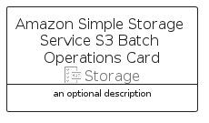

# AmazonSimpleStorageServiceS3BatchOperations


```text
aws-q2-2024/Resource/Storage/AmazonSimpleStorageServiceS3BatchOperations
```

```text
include('aws-q2-2024/Resource/Storage/AmazonSimpleStorageServiceS3BatchOperations')
```


| Illustration | AmazonSimpleStorageServiceS3BatchOperations | AmazonSimpleStorageServiceS3BatchOperationsCard | AmazonSimpleStorageServiceS3BatchOperationsGroup |
| :---: | :---: | :---: | :---: |
|  |  |  |  |


## Sprites
The item provides the following sriptes:

- `<$AmazonSimpleStorageServiceS3BatchOperationsXs>`
- `<$AmazonSimpleStorageServiceS3BatchOperationsSm>`
- `<$AmazonSimpleStorageServiceS3BatchOperationsMd>`
- `<$AmazonSimpleStorageServiceS3BatchOperationsLg>`


## AmazonSimpleStorageServiceS3BatchOperations

### Load remotely
```plantuml
@startuml
' configures the library
!global $LIB_BASE_LOCATION="https://raw.githubusercontent.com/tmorin/plantuml-libs/master/distribution"

' loads the library's bootstrap
!include $LIB_BASE_LOCATION/bootstrap.puml

' loads the package bootstrap
include('aws-q2-2024/bootstrap')

' loads the Item which embeds the element AmazonSimpleStorageServiceS3BatchOperations
include('aws-q2-2024/Resource/Storage/AmazonSimpleStorageServiceS3BatchOperations')

' renders the element
AmazonSimpleStorageServiceS3BatchOperations('AmazonSimpleStorageServiceS3BatchOperations', 'Amazon Simple Storage Service S3 Batch Operations', 'an optional tech label', 'an optional description')
@enduml
```

### Load locally
```plantuml
@startuml
' configures the library
!global $INCLUSION_MODE="local"
!global $LIB_BASE_LOCATION="../../.."

' loads the library's bootstrap
!include $LIB_BASE_LOCATION/bootstrap.puml

' loads the package bootstrap
include('aws-q2-2024/bootstrap')

' loads the Item which embeds the element AmazonSimpleStorageServiceS3BatchOperations
include('aws-q2-2024/Resource/Storage/AmazonSimpleStorageServiceS3BatchOperations')

' renders the element
AmazonSimpleStorageServiceS3BatchOperations('AmazonSimpleStorageServiceS3BatchOperations', 'Amazon Simple Storage Service S3 Batch Operations', 'an optional tech label', 'an optional description')
@enduml
```

## AmazonSimpleStorageServiceS3BatchOperationsCard

### Load remotely
```plantuml
@startuml
' configures the library
!global $LIB_BASE_LOCATION="https://raw.githubusercontent.com/tmorin/plantuml-libs/master/distribution"

' loads the library's bootstrap
!include $LIB_BASE_LOCATION/bootstrap.puml

' loads the package bootstrap
include('aws-q2-2024/bootstrap')

' loads the Item which embeds the element AmazonSimpleStorageServiceS3BatchOperationsCard
include('aws-q2-2024/Resource/Storage/AmazonSimpleStorageServiceS3BatchOperations')

' renders the element
AmazonSimpleStorageServiceS3BatchOperationsCard('AmazonSimpleStorageServiceS3BatchOperationsCard', 'Amazon Simple Storage Service S3 Batch Operations Card', 'an optional description')
@enduml
```

### Load locally
```plantuml
@startuml
' configures the library
!global $INCLUSION_MODE="local"
!global $LIB_BASE_LOCATION="../../.."

' loads the library's bootstrap
!include $LIB_BASE_LOCATION/bootstrap.puml

' loads the package bootstrap
include('aws-q2-2024/bootstrap')

' loads the Item which embeds the element AmazonSimpleStorageServiceS3BatchOperationsCard
include('aws-q2-2024/Resource/Storage/AmazonSimpleStorageServiceS3BatchOperations')

' renders the element
AmazonSimpleStorageServiceS3BatchOperationsCard('AmazonSimpleStorageServiceS3BatchOperationsCard', 'Amazon Simple Storage Service S3 Batch Operations Card', 'an optional description')
@enduml
```

## AmazonSimpleStorageServiceS3BatchOperationsGroup

### Load remotely
```plantuml
@startuml
' configures the library
!global $LIB_BASE_LOCATION="https://raw.githubusercontent.com/tmorin/plantuml-libs/master/distribution"

' loads the library's bootstrap
!include $LIB_BASE_LOCATION/bootstrap.puml

' loads the package bootstrap
include('aws-q2-2024/bootstrap')

' loads the Item which embeds the element AmazonSimpleStorageServiceS3BatchOperationsGroup
include('aws-q2-2024/Resource/Storage/AmazonSimpleStorageServiceS3BatchOperations')

' renders the element
AmazonSimpleStorageServiceS3BatchOperationsGroup('AmazonSimpleStorageServiceS3BatchOperationsGroup', 'Amazon Simple Storage Service S3 Batch Operations Group', 'an optional tech label') {
    note as note
        the content of the group
    end note
}
@enduml
```

### Load locally
```plantuml
@startuml
' configures the library
!global $INCLUSION_MODE="local"
!global $LIB_BASE_LOCATION="../../.."

' loads the library's bootstrap
!include $LIB_BASE_LOCATION/bootstrap.puml

' loads the package bootstrap
include('aws-q2-2024/bootstrap')

' loads the Item which embeds the element AmazonSimpleStorageServiceS3BatchOperationsGroup
include('aws-q2-2024/Resource/Storage/AmazonSimpleStorageServiceS3BatchOperations')

' renders the element
AmazonSimpleStorageServiceS3BatchOperationsGroup('AmazonSimpleStorageServiceS3BatchOperationsGroup', 'Amazon Simple Storage Service S3 Batch Operations Group', 'an optional tech label') {
    note as note
        the content of the group
    end note
}
@enduml
```

