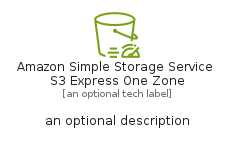

# AmazonSimpleStorageServiceS3ExpressOneZone


```text
aws-q2-2024/Resource/Storage/AmazonSimpleStorageServiceS3ExpressOneZone
```

```text
include('aws-q2-2024/Resource/Storage/AmazonSimpleStorageServiceS3ExpressOneZone')
```


| Illustration | AmazonSimpleStorageServiceS3ExpressOneZone | AmazonSimpleStorageServiceS3ExpressOneZoneCard | AmazonSimpleStorageServiceS3ExpressOneZoneGroup |
| :---: | :---: | :---: | :---: |
|  |  |  |  |


## Sprites
The item provides the following sriptes:

- `<$AmazonSimpleStorageServiceS3ExpressOneZoneXs>`
- `<$AmazonSimpleStorageServiceS3ExpressOneZoneSm>`
- `<$AmazonSimpleStorageServiceS3ExpressOneZoneMd>`
- `<$AmazonSimpleStorageServiceS3ExpressOneZoneLg>`


## AmazonSimpleStorageServiceS3ExpressOneZone

### Load remotely
```plantuml
@startuml
' configures the library
!global $LIB_BASE_LOCATION="https://raw.githubusercontent.com/tmorin/plantuml-libs/master/distribution"

' loads the library's bootstrap
!include $LIB_BASE_LOCATION/bootstrap.puml

' loads the package bootstrap
include('aws-q2-2024/bootstrap')

' loads the Item which embeds the element AmazonSimpleStorageServiceS3ExpressOneZone
include('aws-q2-2024/Resource/Storage/AmazonSimpleStorageServiceS3ExpressOneZone')

' renders the element
AmazonSimpleStorageServiceS3ExpressOneZone('AmazonSimpleStorageServiceS3ExpressOneZone', 'Amazon Simple Storage Service S3 Express One Zone', 'an optional tech label', 'an optional description')
@enduml
```

### Load locally
```plantuml
@startuml
' configures the library
!global $INCLUSION_MODE="local"
!global $LIB_BASE_LOCATION="../../.."

' loads the library's bootstrap
!include $LIB_BASE_LOCATION/bootstrap.puml

' loads the package bootstrap
include('aws-q2-2024/bootstrap')

' loads the Item which embeds the element AmazonSimpleStorageServiceS3ExpressOneZone
include('aws-q2-2024/Resource/Storage/AmazonSimpleStorageServiceS3ExpressOneZone')

' renders the element
AmazonSimpleStorageServiceS3ExpressOneZone('AmazonSimpleStorageServiceS3ExpressOneZone', 'Amazon Simple Storage Service S3 Express One Zone', 'an optional tech label', 'an optional description')
@enduml
```

## AmazonSimpleStorageServiceS3ExpressOneZoneCard

### Load remotely
```plantuml
@startuml
' configures the library
!global $LIB_BASE_LOCATION="https://raw.githubusercontent.com/tmorin/plantuml-libs/master/distribution"

' loads the library's bootstrap
!include $LIB_BASE_LOCATION/bootstrap.puml

' loads the package bootstrap
include('aws-q2-2024/bootstrap')

' loads the Item which embeds the element AmazonSimpleStorageServiceS3ExpressOneZoneCard
include('aws-q2-2024/Resource/Storage/AmazonSimpleStorageServiceS3ExpressOneZone')

' renders the element
AmazonSimpleStorageServiceS3ExpressOneZoneCard('AmazonSimpleStorageServiceS3ExpressOneZoneCard', 'Amazon Simple Storage Service S3 Express One Zone Card', 'an optional description')
@enduml
```

### Load locally
```plantuml
@startuml
' configures the library
!global $INCLUSION_MODE="local"
!global $LIB_BASE_LOCATION="../../.."

' loads the library's bootstrap
!include $LIB_BASE_LOCATION/bootstrap.puml

' loads the package bootstrap
include('aws-q2-2024/bootstrap')

' loads the Item which embeds the element AmazonSimpleStorageServiceS3ExpressOneZoneCard
include('aws-q2-2024/Resource/Storage/AmazonSimpleStorageServiceS3ExpressOneZone')

' renders the element
AmazonSimpleStorageServiceS3ExpressOneZoneCard('AmazonSimpleStorageServiceS3ExpressOneZoneCard', 'Amazon Simple Storage Service S3 Express One Zone Card', 'an optional description')
@enduml
```

## AmazonSimpleStorageServiceS3ExpressOneZoneGroup

### Load remotely
```plantuml
@startuml
' configures the library
!global $LIB_BASE_LOCATION="https://raw.githubusercontent.com/tmorin/plantuml-libs/master/distribution"

' loads the library's bootstrap
!include $LIB_BASE_LOCATION/bootstrap.puml

' loads the package bootstrap
include('aws-q2-2024/bootstrap')

' loads the Item which embeds the element AmazonSimpleStorageServiceS3ExpressOneZoneGroup
include('aws-q2-2024/Resource/Storage/AmazonSimpleStorageServiceS3ExpressOneZone')

' renders the element
AmazonSimpleStorageServiceS3ExpressOneZoneGroup('AmazonSimpleStorageServiceS3ExpressOneZoneGroup', 'Amazon Simple Storage Service S3 Express One Zone Group', 'an optional tech label') {
    note as note
        the content of the group
    end note
}
@enduml
```

### Load locally
```plantuml
@startuml
' configures the library
!global $INCLUSION_MODE="local"
!global $LIB_BASE_LOCATION="../../.."

' loads the library's bootstrap
!include $LIB_BASE_LOCATION/bootstrap.puml

' loads the package bootstrap
include('aws-q2-2024/bootstrap')

' loads the Item which embeds the element AmazonSimpleStorageServiceS3ExpressOneZoneGroup
include('aws-q2-2024/Resource/Storage/AmazonSimpleStorageServiceS3ExpressOneZone')

' renders the element
AmazonSimpleStorageServiceS3ExpressOneZoneGroup('AmazonSimpleStorageServiceS3ExpressOneZoneGroup', 'Amazon Simple Storage Service S3 Express One Zone Group', 'an optional tech label') {
    note as note
        the content of the group
    end note
}
@enduml
```

