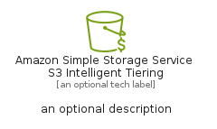
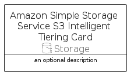

# AmazonSimpleStorageServiceS3IntelligentTiering


```text
aws-q2-2024/Resource/Storage/AmazonSimpleStorageServiceS3IntelligentTiering
```

```text
include('aws-q2-2024/Resource/Storage/AmazonSimpleStorageServiceS3IntelligentTiering')
```


| Illustration | AmazonSimpleStorageServiceS3IntelligentTiering | AmazonSimpleStorageServiceS3IntelligentTieringCard | AmazonSimpleStorageServiceS3IntelligentTieringGroup |
| :---: | :---: | :---: | :---: |
|  |  |  |  |


## Sprites
The item provides the following sriptes:

- `<$AmazonSimpleStorageServiceS3IntelligentTieringXs>`
- `<$AmazonSimpleStorageServiceS3IntelligentTieringSm>`
- `<$AmazonSimpleStorageServiceS3IntelligentTieringMd>`
- `<$AmazonSimpleStorageServiceS3IntelligentTieringLg>`


## AmazonSimpleStorageServiceS3IntelligentTiering

### Load remotely
```plantuml
@startuml
' configures the library
!global $LIB_BASE_LOCATION="https://raw.githubusercontent.com/tmorin/plantuml-libs/master/distribution"

' loads the library's bootstrap
!include $LIB_BASE_LOCATION/bootstrap.puml

' loads the package bootstrap
include('aws-q2-2024/bootstrap')

' loads the Item which embeds the element AmazonSimpleStorageServiceS3IntelligentTiering
include('aws-q2-2024/Resource/Storage/AmazonSimpleStorageServiceS3IntelligentTiering')

' renders the element
AmazonSimpleStorageServiceS3IntelligentTiering('AmazonSimpleStorageServiceS3IntelligentTiering', 'Amazon Simple Storage Service S3 Intelligent Tiering', 'an optional tech label', 'an optional description')
@enduml
```

### Load locally
```plantuml
@startuml
' configures the library
!global $INCLUSION_MODE="local"
!global $LIB_BASE_LOCATION="../../.."

' loads the library's bootstrap
!include $LIB_BASE_LOCATION/bootstrap.puml

' loads the package bootstrap
include('aws-q2-2024/bootstrap')

' loads the Item which embeds the element AmazonSimpleStorageServiceS3IntelligentTiering
include('aws-q2-2024/Resource/Storage/AmazonSimpleStorageServiceS3IntelligentTiering')

' renders the element
AmazonSimpleStorageServiceS3IntelligentTiering('AmazonSimpleStorageServiceS3IntelligentTiering', 'Amazon Simple Storage Service S3 Intelligent Tiering', 'an optional tech label', 'an optional description')
@enduml
```

## AmazonSimpleStorageServiceS3IntelligentTieringCard

### Load remotely
```plantuml
@startuml
' configures the library
!global $LIB_BASE_LOCATION="https://raw.githubusercontent.com/tmorin/plantuml-libs/master/distribution"

' loads the library's bootstrap
!include $LIB_BASE_LOCATION/bootstrap.puml

' loads the package bootstrap
include('aws-q2-2024/bootstrap')

' loads the Item which embeds the element AmazonSimpleStorageServiceS3IntelligentTieringCard
include('aws-q2-2024/Resource/Storage/AmazonSimpleStorageServiceS3IntelligentTiering')

' renders the element
AmazonSimpleStorageServiceS3IntelligentTieringCard('AmazonSimpleStorageServiceS3IntelligentTieringCard', 'Amazon Simple Storage Service S3 Intelligent Tiering Card', 'an optional description')
@enduml
```

### Load locally
```plantuml
@startuml
' configures the library
!global $INCLUSION_MODE="local"
!global $LIB_BASE_LOCATION="../../.."

' loads the library's bootstrap
!include $LIB_BASE_LOCATION/bootstrap.puml

' loads the package bootstrap
include('aws-q2-2024/bootstrap')

' loads the Item which embeds the element AmazonSimpleStorageServiceS3IntelligentTieringCard
include('aws-q2-2024/Resource/Storage/AmazonSimpleStorageServiceS3IntelligentTiering')

' renders the element
AmazonSimpleStorageServiceS3IntelligentTieringCard('AmazonSimpleStorageServiceS3IntelligentTieringCard', 'Amazon Simple Storage Service S3 Intelligent Tiering Card', 'an optional description')
@enduml
```

## AmazonSimpleStorageServiceS3IntelligentTieringGroup

### Load remotely
```plantuml
@startuml
' configures the library
!global $LIB_BASE_LOCATION="https://raw.githubusercontent.com/tmorin/plantuml-libs/master/distribution"

' loads the library's bootstrap
!include $LIB_BASE_LOCATION/bootstrap.puml

' loads the package bootstrap
include('aws-q2-2024/bootstrap')

' loads the Item which embeds the element AmazonSimpleStorageServiceS3IntelligentTieringGroup
include('aws-q2-2024/Resource/Storage/AmazonSimpleStorageServiceS3IntelligentTiering')

' renders the element
AmazonSimpleStorageServiceS3IntelligentTieringGroup('AmazonSimpleStorageServiceS3IntelligentTieringGroup', 'Amazon Simple Storage Service S3 Intelligent Tiering Group', 'an optional tech label') {
    note as note
        the content of the group
    end note
}
@enduml
```

### Load locally
```plantuml
@startuml
' configures the library
!global $INCLUSION_MODE="local"
!global $LIB_BASE_LOCATION="../../.."

' loads the library's bootstrap
!include $LIB_BASE_LOCATION/bootstrap.puml

' loads the package bootstrap
include('aws-q2-2024/bootstrap')

' loads the Item which embeds the element AmazonSimpleStorageServiceS3IntelligentTieringGroup
include('aws-q2-2024/Resource/Storage/AmazonSimpleStorageServiceS3IntelligentTiering')

' renders the element
AmazonSimpleStorageServiceS3IntelligentTieringGroup('AmazonSimpleStorageServiceS3IntelligentTieringGroup', 'Amazon Simple Storage Service S3 Intelligent Tiering Group', 'an optional tech label') {
    note as note
        the content of the group
    end note
}
@enduml
```

