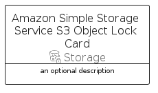

# AmazonSimpleStorageServiceS3ObjectLock


```text
aws-q2-2024/Resource/Storage/AmazonSimpleStorageServiceS3ObjectLock
```

```text
include('aws-q2-2024/Resource/Storage/AmazonSimpleStorageServiceS3ObjectLock')
```


| Illustration | AmazonSimpleStorageServiceS3ObjectLock | AmazonSimpleStorageServiceS3ObjectLockCard | AmazonSimpleStorageServiceS3ObjectLockGroup |
| :---: | :---: | :---: | :---: |
|  |  |  |  |


## Sprites
The item provides the following sriptes:

- `<$AmazonSimpleStorageServiceS3ObjectLockXs>`
- `<$AmazonSimpleStorageServiceS3ObjectLockSm>`
- `<$AmazonSimpleStorageServiceS3ObjectLockMd>`
- `<$AmazonSimpleStorageServiceS3ObjectLockLg>`


## AmazonSimpleStorageServiceS3ObjectLock

### Load remotely
```plantuml
@startuml
' configures the library
!global $LIB_BASE_LOCATION="https://raw.githubusercontent.com/tmorin/plantuml-libs/master/distribution"

' loads the library's bootstrap
!include $LIB_BASE_LOCATION/bootstrap.puml

' loads the package bootstrap
include('aws-q2-2024/bootstrap')

' loads the Item which embeds the element AmazonSimpleStorageServiceS3ObjectLock
include('aws-q2-2024/Resource/Storage/AmazonSimpleStorageServiceS3ObjectLock')

' renders the element
AmazonSimpleStorageServiceS3ObjectLock('AmazonSimpleStorageServiceS3ObjectLock', 'Amazon Simple Storage Service S3 Object Lock', 'an optional tech label', 'an optional description')
@enduml
```

### Load locally
```plantuml
@startuml
' configures the library
!global $INCLUSION_MODE="local"
!global $LIB_BASE_LOCATION="../../.."

' loads the library's bootstrap
!include $LIB_BASE_LOCATION/bootstrap.puml

' loads the package bootstrap
include('aws-q2-2024/bootstrap')

' loads the Item which embeds the element AmazonSimpleStorageServiceS3ObjectLock
include('aws-q2-2024/Resource/Storage/AmazonSimpleStorageServiceS3ObjectLock')

' renders the element
AmazonSimpleStorageServiceS3ObjectLock('AmazonSimpleStorageServiceS3ObjectLock', 'Amazon Simple Storage Service S3 Object Lock', 'an optional tech label', 'an optional description')
@enduml
```

## AmazonSimpleStorageServiceS3ObjectLockCard

### Load remotely
```plantuml
@startuml
' configures the library
!global $LIB_BASE_LOCATION="https://raw.githubusercontent.com/tmorin/plantuml-libs/master/distribution"

' loads the library's bootstrap
!include $LIB_BASE_LOCATION/bootstrap.puml

' loads the package bootstrap
include('aws-q2-2024/bootstrap')

' loads the Item which embeds the element AmazonSimpleStorageServiceS3ObjectLockCard
include('aws-q2-2024/Resource/Storage/AmazonSimpleStorageServiceS3ObjectLock')

' renders the element
AmazonSimpleStorageServiceS3ObjectLockCard('AmazonSimpleStorageServiceS3ObjectLockCard', 'Amazon Simple Storage Service S3 Object Lock Card', 'an optional description')
@enduml
```

### Load locally
```plantuml
@startuml
' configures the library
!global $INCLUSION_MODE="local"
!global $LIB_BASE_LOCATION="../../.."

' loads the library's bootstrap
!include $LIB_BASE_LOCATION/bootstrap.puml

' loads the package bootstrap
include('aws-q2-2024/bootstrap')

' loads the Item which embeds the element AmazonSimpleStorageServiceS3ObjectLockCard
include('aws-q2-2024/Resource/Storage/AmazonSimpleStorageServiceS3ObjectLock')

' renders the element
AmazonSimpleStorageServiceS3ObjectLockCard('AmazonSimpleStorageServiceS3ObjectLockCard', 'Amazon Simple Storage Service S3 Object Lock Card', 'an optional description')
@enduml
```

## AmazonSimpleStorageServiceS3ObjectLockGroup

### Load remotely
```plantuml
@startuml
' configures the library
!global $LIB_BASE_LOCATION="https://raw.githubusercontent.com/tmorin/plantuml-libs/master/distribution"

' loads the library's bootstrap
!include $LIB_BASE_LOCATION/bootstrap.puml

' loads the package bootstrap
include('aws-q2-2024/bootstrap')

' loads the Item which embeds the element AmazonSimpleStorageServiceS3ObjectLockGroup
include('aws-q2-2024/Resource/Storage/AmazonSimpleStorageServiceS3ObjectLock')

' renders the element
AmazonSimpleStorageServiceS3ObjectLockGroup('AmazonSimpleStorageServiceS3ObjectLockGroup', 'Amazon Simple Storage Service S3 Object Lock Group', 'an optional tech label') {
    note as note
        the content of the group
    end note
}
@enduml
```

### Load locally
```plantuml
@startuml
' configures the library
!global $INCLUSION_MODE="local"
!global $LIB_BASE_LOCATION="../../.."

' loads the library's bootstrap
!include $LIB_BASE_LOCATION/bootstrap.puml

' loads the package bootstrap
include('aws-q2-2024/bootstrap')

' loads the Item which embeds the element AmazonSimpleStorageServiceS3ObjectLockGroup
include('aws-q2-2024/Resource/Storage/AmazonSimpleStorageServiceS3ObjectLock')

' renders the element
AmazonSimpleStorageServiceS3ObjectLockGroup('AmazonSimpleStorageServiceS3ObjectLockGroup', 'Amazon Simple Storage Service S3 Object Lock Group', 'an optional tech label') {
    note as note
        the content of the group
    end note
}
@enduml
```

