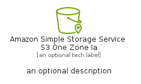

# AmazonSimpleStorageServiceS3OneZoneIa


```text
aws-q2-2024/Resource/Storage/AmazonSimpleStorageServiceS3OneZoneIa
```

```text
include('aws-q2-2024/Resource/Storage/AmazonSimpleStorageServiceS3OneZoneIa')
```


| Illustration | AmazonSimpleStorageServiceS3OneZoneIa | AmazonSimpleStorageServiceS3OneZoneIaCard | AmazonSimpleStorageServiceS3OneZoneIaGroup |
| :---: | :---: | :---: | :---: |
|  |  |  |  |


## Sprites
The item provides the following sriptes:

- `<$AmazonSimpleStorageServiceS3OneZoneIaXs>`
- `<$AmazonSimpleStorageServiceS3OneZoneIaSm>`
- `<$AmazonSimpleStorageServiceS3OneZoneIaMd>`
- `<$AmazonSimpleStorageServiceS3OneZoneIaLg>`


## AmazonSimpleStorageServiceS3OneZoneIa

### Load remotely
```plantuml
@startuml
' configures the library
!global $LIB_BASE_LOCATION="https://raw.githubusercontent.com/tmorin/plantuml-libs/master/distribution"

' loads the library's bootstrap
!include $LIB_BASE_LOCATION/bootstrap.puml

' loads the package bootstrap
include('aws-q2-2024/bootstrap')

' loads the Item which embeds the element AmazonSimpleStorageServiceS3OneZoneIa
include('aws-q2-2024/Resource/Storage/AmazonSimpleStorageServiceS3OneZoneIa')

' renders the element
AmazonSimpleStorageServiceS3OneZoneIa('AmazonSimpleStorageServiceS3OneZoneIa', 'Amazon Simple Storage Service S3 One Zone Ia', 'an optional tech label', 'an optional description')
@enduml
```

### Load locally
```plantuml
@startuml
' configures the library
!global $INCLUSION_MODE="local"
!global $LIB_BASE_LOCATION="../../.."

' loads the library's bootstrap
!include $LIB_BASE_LOCATION/bootstrap.puml

' loads the package bootstrap
include('aws-q2-2024/bootstrap')

' loads the Item which embeds the element AmazonSimpleStorageServiceS3OneZoneIa
include('aws-q2-2024/Resource/Storage/AmazonSimpleStorageServiceS3OneZoneIa')

' renders the element
AmazonSimpleStorageServiceS3OneZoneIa('AmazonSimpleStorageServiceS3OneZoneIa', 'Amazon Simple Storage Service S3 One Zone Ia', 'an optional tech label', 'an optional description')
@enduml
```

## AmazonSimpleStorageServiceS3OneZoneIaCard

### Load remotely
```plantuml
@startuml
' configures the library
!global $LIB_BASE_LOCATION="https://raw.githubusercontent.com/tmorin/plantuml-libs/master/distribution"

' loads the library's bootstrap
!include $LIB_BASE_LOCATION/bootstrap.puml

' loads the package bootstrap
include('aws-q2-2024/bootstrap')

' loads the Item which embeds the element AmazonSimpleStorageServiceS3OneZoneIaCard
include('aws-q2-2024/Resource/Storage/AmazonSimpleStorageServiceS3OneZoneIa')

' renders the element
AmazonSimpleStorageServiceS3OneZoneIaCard('AmazonSimpleStorageServiceS3OneZoneIaCard', 'Amazon Simple Storage Service S3 One Zone Ia Card', 'an optional description')
@enduml
```

### Load locally
```plantuml
@startuml
' configures the library
!global $INCLUSION_MODE="local"
!global $LIB_BASE_LOCATION="../../.."

' loads the library's bootstrap
!include $LIB_BASE_LOCATION/bootstrap.puml

' loads the package bootstrap
include('aws-q2-2024/bootstrap')

' loads the Item which embeds the element AmazonSimpleStorageServiceS3OneZoneIaCard
include('aws-q2-2024/Resource/Storage/AmazonSimpleStorageServiceS3OneZoneIa')

' renders the element
AmazonSimpleStorageServiceS3OneZoneIaCard('AmazonSimpleStorageServiceS3OneZoneIaCard', 'Amazon Simple Storage Service S3 One Zone Ia Card', 'an optional description')
@enduml
```

## AmazonSimpleStorageServiceS3OneZoneIaGroup

### Load remotely
```plantuml
@startuml
' configures the library
!global $LIB_BASE_LOCATION="https://raw.githubusercontent.com/tmorin/plantuml-libs/master/distribution"

' loads the library's bootstrap
!include $LIB_BASE_LOCATION/bootstrap.puml

' loads the package bootstrap
include('aws-q2-2024/bootstrap')

' loads the Item which embeds the element AmazonSimpleStorageServiceS3OneZoneIaGroup
include('aws-q2-2024/Resource/Storage/AmazonSimpleStorageServiceS3OneZoneIa')

' renders the element
AmazonSimpleStorageServiceS3OneZoneIaGroup('AmazonSimpleStorageServiceS3OneZoneIaGroup', 'Amazon Simple Storage Service S3 One Zone Ia Group', 'an optional tech label') {
    note as note
        the content of the group
    end note
}
@enduml
```

### Load locally
```plantuml
@startuml
' configures the library
!global $INCLUSION_MODE="local"
!global $LIB_BASE_LOCATION="../../.."

' loads the library's bootstrap
!include $LIB_BASE_LOCATION/bootstrap.puml

' loads the package bootstrap
include('aws-q2-2024/bootstrap')

' loads the Item which embeds the element AmazonSimpleStorageServiceS3OneZoneIaGroup
include('aws-q2-2024/Resource/Storage/AmazonSimpleStorageServiceS3OneZoneIa')

' renders the element
AmazonSimpleStorageServiceS3OneZoneIaGroup('AmazonSimpleStorageServiceS3OneZoneIaGroup', 'Amazon Simple Storage Service S3 One Zone Ia Group', 'an optional tech label') {
    note as note
        the content of the group
    end note
}
@enduml
```

