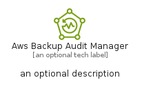

# AwsBackupAuditManager


```text
aws-q2-2024/Resource/Storage/AwsBackupAuditManager
```

```text
include('aws-q2-2024/Resource/Storage/AwsBackupAuditManager')
```


| Illustration | AwsBackupAuditManager | AwsBackupAuditManagerCard | AwsBackupAuditManagerGroup |
| :---: | :---: | :---: | :---: |
|  |  |  |  |


## Sprites
The item provides the following sriptes:

- `<$AwsBackupAuditManagerXs>`
- `<$AwsBackupAuditManagerSm>`
- `<$AwsBackupAuditManagerMd>`
- `<$AwsBackupAuditManagerLg>`


## AwsBackupAuditManager

### Load remotely
```plantuml
@startuml
' configures the library
!global $LIB_BASE_LOCATION="https://raw.githubusercontent.com/tmorin/plantuml-libs/master/distribution"

' loads the library's bootstrap
!include $LIB_BASE_LOCATION/bootstrap.puml

' loads the package bootstrap
include('aws-q2-2024/bootstrap')

' loads the Item which embeds the element AwsBackupAuditManager
include('aws-q2-2024/Resource/Storage/AwsBackupAuditManager')

' renders the element
AwsBackupAuditManager('AwsBackupAuditManager', 'Aws Backup Audit Manager', 'an optional tech label', 'an optional description')
@enduml
```

### Load locally
```plantuml
@startuml
' configures the library
!global $INCLUSION_MODE="local"
!global $LIB_BASE_LOCATION="../../.."

' loads the library's bootstrap
!include $LIB_BASE_LOCATION/bootstrap.puml

' loads the package bootstrap
include('aws-q2-2024/bootstrap')

' loads the Item which embeds the element AwsBackupAuditManager
include('aws-q2-2024/Resource/Storage/AwsBackupAuditManager')

' renders the element
AwsBackupAuditManager('AwsBackupAuditManager', 'Aws Backup Audit Manager', 'an optional tech label', 'an optional description')
@enduml
```

## AwsBackupAuditManagerCard

### Load remotely
```plantuml
@startuml
' configures the library
!global $LIB_BASE_LOCATION="https://raw.githubusercontent.com/tmorin/plantuml-libs/master/distribution"

' loads the library's bootstrap
!include $LIB_BASE_LOCATION/bootstrap.puml

' loads the package bootstrap
include('aws-q2-2024/bootstrap')

' loads the Item which embeds the element AwsBackupAuditManagerCard
include('aws-q2-2024/Resource/Storage/AwsBackupAuditManager')

' renders the element
AwsBackupAuditManagerCard('AwsBackupAuditManagerCard', 'Aws Backup Audit Manager Card', 'an optional description')
@enduml
```

### Load locally
```plantuml
@startuml
' configures the library
!global $INCLUSION_MODE="local"
!global $LIB_BASE_LOCATION="../../.."

' loads the library's bootstrap
!include $LIB_BASE_LOCATION/bootstrap.puml

' loads the package bootstrap
include('aws-q2-2024/bootstrap')

' loads the Item which embeds the element AwsBackupAuditManagerCard
include('aws-q2-2024/Resource/Storage/AwsBackupAuditManager')

' renders the element
AwsBackupAuditManagerCard('AwsBackupAuditManagerCard', 'Aws Backup Audit Manager Card', 'an optional description')
@enduml
```

## AwsBackupAuditManagerGroup

### Load remotely
```plantuml
@startuml
' configures the library
!global $LIB_BASE_LOCATION="https://raw.githubusercontent.com/tmorin/plantuml-libs/master/distribution"

' loads the library's bootstrap
!include $LIB_BASE_LOCATION/bootstrap.puml

' loads the package bootstrap
include('aws-q2-2024/bootstrap')

' loads the Item which embeds the element AwsBackupAuditManagerGroup
include('aws-q2-2024/Resource/Storage/AwsBackupAuditManager')

' renders the element
AwsBackupAuditManagerGroup('AwsBackupAuditManagerGroup', 'Aws Backup Audit Manager Group', 'an optional tech label') {
    note as note
        the content of the group
    end note
}
@enduml
```

### Load locally
```plantuml
@startuml
' configures the library
!global $INCLUSION_MODE="local"
!global $LIB_BASE_LOCATION="../../.."

' loads the library's bootstrap
!include $LIB_BASE_LOCATION/bootstrap.puml

' loads the package bootstrap
include('aws-q2-2024/bootstrap')

' loads the Item which embeds the element AwsBackupAuditManagerGroup
include('aws-q2-2024/Resource/Storage/AwsBackupAuditManager')

' renders the element
AwsBackupAuditManagerGroup('AwsBackupAuditManagerGroup', 'Aws Backup Audit Manager Group', 'an optional tech label') {
    note as note
        the content of the group
    end note
}
@enduml
```

