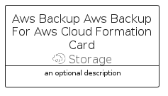

# AwsBackupAwsBackupForAwsCloudFormation


```text
aws-q2-2024/Resource/Storage/AwsBackupAwsBackupForAwsCloudFormation
```

```text
include('aws-q2-2024/Resource/Storage/AwsBackupAwsBackupForAwsCloudFormation')
```


| Illustration | AwsBackupAwsBackupForAwsCloudFormation | AwsBackupAwsBackupForAwsCloudFormationCard | AwsBackupAwsBackupForAwsCloudFormationGroup |
| :---: | :---: | :---: | :---: |
|  |  |  |  |


## Sprites
The item provides the following sriptes:

- `<$AwsBackupAwsBackupForAwsCloudFormationXs>`
- `<$AwsBackupAwsBackupForAwsCloudFormationSm>`
- `<$AwsBackupAwsBackupForAwsCloudFormationMd>`
- `<$AwsBackupAwsBackupForAwsCloudFormationLg>`


## AwsBackupAwsBackupForAwsCloudFormation

### Load remotely
```plantuml
@startuml
' configures the library
!global $LIB_BASE_LOCATION="https://raw.githubusercontent.com/tmorin/plantuml-libs/master/distribution"

' loads the library's bootstrap
!include $LIB_BASE_LOCATION/bootstrap.puml

' loads the package bootstrap
include('aws-q2-2024/bootstrap')

' loads the Item which embeds the element AwsBackupAwsBackupForAwsCloudFormation
include('aws-q2-2024/Resource/Storage/AwsBackupAwsBackupForAwsCloudFormation')

' renders the element
AwsBackupAwsBackupForAwsCloudFormation('AwsBackupAwsBackupForAwsCloudFormation', 'Aws Backup Aws Backup For Aws Cloud Formation', 'an optional tech label', 'an optional description')
@enduml
```

### Load locally
```plantuml
@startuml
' configures the library
!global $INCLUSION_MODE="local"
!global $LIB_BASE_LOCATION="../../.."

' loads the library's bootstrap
!include $LIB_BASE_LOCATION/bootstrap.puml

' loads the package bootstrap
include('aws-q2-2024/bootstrap')

' loads the Item which embeds the element AwsBackupAwsBackupForAwsCloudFormation
include('aws-q2-2024/Resource/Storage/AwsBackupAwsBackupForAwsCloudFormation')

' renders the element
AwsBackupAwsBackupForAwsCloudFormation('AwsBackupAwsBackupForAwsCloudFormation', 'Aws Backup Aws Backup For Aws Cloud Formation', 'an optional tech label', 'an optional description')
@enduml
```

## AwsBackupAwsBackupForAwsCloudFormationCard

### Load remotely
```plantuml
@startuml
' configures the library
!global $LIB_BASE_LOCATION="https://raw.githubusercontent.com/tmorin/plantuml-libs/master/distribution"

' loads the library's bootstrap
!include $LIB_BASE_LOCATION/bootstrap.puml

' loads the package bootstrap
include('aws-q2-2024/bootstrap')

' loads the Item which embeds the element AwsBackupAwsBackupForAwsCloudFormationCard
include('aws-q2-2024/Resource/Storage/AwsBackupAwsBackupForAwsCloudFormation')

' renders the element
AwsBackupAwsBackupForAwsCloudFormationCard('AwsBackupAwsBackupForAwsCloudFormationCard', 'Aws Backup Aws Backup For Aws Cloud Formation Card', 'an optional description')
@enduml
```

### Load locally
```plantuml
@startuml
' configures the library
!global $INCLUSION_MODE="local"
!global $LIB_BASE_LOCATION="../../.."

' loads the library's bootstrap
!include $LIB_BASE_LOCATION/bootstrap.puml

' loads the package bootstrap
include('aws-q2-2024/bootstrap')

' loads the Item which embeds the element AwsBackupAwsBackupForAwsCloudFormationCard
include('aws-q2-2024/Resource/Storage/AwsBackupAwsBackupForAwsCloudFormation')

' renders the element
AwsBackupAwsBackupForAwsCloudFormationCard('AwsBackupAwsBackupForAwsCloudFormationCard', 'Aws Backup Aws Backup For Aws Cloud Formation Card', 'an optional description')
@enduml
```

## AwsBackupAwsBackupForAwsCloudFormationGroup

### Load remotely
```plantuml
@startuml
' configures the library
!global $LIB_BASE_LOCATION="https://raw.githubusercontent.com/tmorin/plantuml-libs/master/distribution"

' loads the library's bootstrap
!include $LIB_BASE_LOCATION/bootstrap.puml

' loads the package bootstrap
include('aws-q2-2024/bootstrap')

' loads the Item which embeds the element AwsBackupAwsBackupForAwsCloudFormationGroup
include('aws-q2-2024/Resource/Storage/AwsBackupAwsBackupForAwsCloudFormation')

' renders the element
AwsBackupAwsBackupForAwsCloudFormationGroup('AwsBackupAwsBackupForAwsCloudFormationGroup', 'Aws Backup Aws Backup For Aws Cloud Formation Group', 'an optional tech label') {
    note as note
        the content of the group
    end note
}
@enduml
```

### Load locally
```plantuml
@startuml
' configures the library
!global $INCLUSION_MODE="local"
!global $LIB_BASE_LOCATION="../../.."

' loads the library's bootstrap
!include $LIB_BASE_LOCATION/bootstrap.puml

' loads the package bootstrap
include('aws-q2-2024/bootstrap')

' loads the Item which embeds the element AwsBackupAwsBackupForAwsCloudFormationGroup
include('aws-q2-2024/Resource/Storage/AwsBackupAwsBackupForAwsCloudFormation')

' renders the element
AwsBackupAwsBackupForAwsCloudFormationGroup('AwsBackupAwsBackupForAwsCloudFormationGroup', 'Aws Backup Aws Backup For Aws Cloud Formation Group', 'an optional tech label') {
    note as note
        the content of the group
    end note
}
@enduml
```

