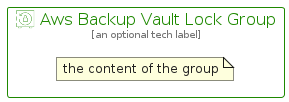

# AwsBackupVaultLock


```text
aws-q2-2024/Resource/Storage/AwsBackupVaultLock
```

```text
include('aws-q2-2024/Resource/Storage/AwsBackupVaultLock')
```


| Illustration | AwsBackupVaultLock | AwsBackupVaultLockCard | AwsBackupVaultLockGroup |
| :---: | :---: | :---: | :---: |
|  |  |  |  |


## Sprites
The item provides the following sriptes:

- `<$AwsBackupVaultLockXs>`
- `<$AwsBackupVaultLockSm>`
- `<$AwsBackupVaultLockMd>`
- `<$AwsBackupVaultLockLg>`


## AwsBackupVaultLock

### Load remotely
```plantuml
@startuml
' configures the library
!global $LIB_BASE_LOCATION="https://raw.githubusercontent.com/tmorin/plantuml-libs/master/distribution"

' loads the library's bootstrap
!include $LIB_BASE_LOCATION/bootstrap.puml

' loads the package bootstrap
include('aws-q2-2024/bootstrap')

' loads the Item which embeds the element AwsBackupVaultLock
include('aws-q2-2024/Resource/Storage/AwsBackupVaultLock')

' renders the element
AwsBackupVaultLock('AwsBackupVaultLock', 'Aws Backup Vault Lock', 'an optional tech label', 'an optional description')
@enduml
```

### Load locally
```plantuml
@startuml
' configures the library
!global $INCLUSION_MODE="local"
!global $LIB_BASE_LOCATION="../../.."

' loads the library's bootstrap
!include $LIB_BASE_LOCATION/bootstrap.puml

' loads the package bootstrap
include('aws-q2-2024/bootstrap')

' loads the Item which embeds the element AwsBackupVaultLock
include('aws-q2-2024/Resource/Storage/AwsBackupVaultLock')

' renders the element
AwsBackupVaultLock('AwsBackupVaultLock', 'Aws Backup Vault Lock', 'an optional tech label', 'an optional description')
@enduml
```

## AwsBackupVaultLockCard

### Load remotely
```plantuml
@startuml
' configures the library
!global $LIB_BASE_LOCATION="https://raw.githubusercontent.com/tmorin/plantuml-libs/master/distribution"

' loads the library's bootstrap
!include $LIB_BASE_LOCATION/bootstrap.puml

' loads the package bootstrap
include('aws-q2-2024/bootstrap')

' loads the Item which embeds the element AwsBackupVaultLockCard
include('aws-q2-2024/Resource/Storage/AwsBackupVaultLock')

' renders the element
AwsBackupVaultLockCard('AwsBackupVaultLockCard', 'Aws Backup Vault Lock Card', 'an optional description')
@enduml
```

### Load locally
```plantuml
@startuml
' configures the library
!global $INCLUSION_MODE="local"
!global $LIB_BASE_LOCATION="../../.."

' loads the library's bootstrap
!include $LIB_BASE_LOCATION/bootstrap.puml

' loads the package bootstrap
include('aws-q2-2024/bootstrap')

' loads the Item which embeds the element AwsBackupVaultLockCard
include('aws-q2-2024/Resource/Storage/AwsBackupVaultLock')

' renders the element
AwsBackupVaultLockCard('AwsBackupVaultLockCard', 'Aws Backup Vault Lock Card', 'an optional description')
@enduml
```

## AwsBackupVaultLockGroup

### Load remotely
```plantuml
@startuml
' configures the library
!global $LIB_BASE_LOCATION="https://raw.githubusercontent.com/tmorin/plantuml-libs/master/distribution"

' loads the library's bootstrap
!include $LIB_BASE_LOCATION/bootstrap.puml

' loads the package bootstrap
include('aws-q2-2024/bootstrap')

' loads the Item which embeds the element AwsBackupVaultLockGroup
include('aws-q2-2024/Resource/Storage/AwsBackupVaultLock')

' renders the element
AwsBackupVaultLockGroup('AwsBackupVaultLockGroup', 'Aws Backup Vault Lock Group', 'an optional tech label') {
    note as note
        the content of the group
    end note
}
@enduml
```

### Load locally
```plantuml
@startuml
' configures the library
!global $INCLUSION_MODE="local"
!global $LIB_BASE_LOCATION="../../.."

' loads the library's bootstrap
!include $LIB_BASE_LOCATION/bootstrap.puml

' loads the package bootstrap
include('aws-q2-2024/bootstrap')

' loads the Item which embeds the element AwsBackupVaultLockGroup
include('aws-q2-2024/Resource/Storage/AwsBackupVaultLock')

' renders the element
AwsBackupVaultLockGroup('AwsBackupVaultLockGroup', 'Aws Backup Vault Lock Group', 'an optional tech label') {
    note as note
        the content of the group
    end note
}
@enduml
```

