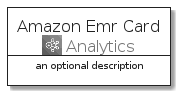
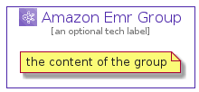

# AmazonEmr


```text
aws-q3-2021/Architecture/Analytics/AmazonEmr
```

```text
include('aws-q3-2021/Architecture/Analytics/AmazonEmr')
```


| Illustration | AmazonEmr | AmazonEmrCard | AmazonEmrGroup |
| :---: | :---: | :---: | :---: |
|  |  |  |  |


## AmazonEmr

### Load remotely
```plantuml
@startuml
' configures the library
!global $LIB_BASE_LOCATION="https://github.com/tmorin/plantuml-libs/distribution"

' loads the library's bootstrap
!include $LIB_BASE_LOCATION/bootstrap.puml

' loads the package bootstrap
include('aws-q3-2021/bootstrap')

' loads the Item which embeds the element AmazonEmr
include('aws-q3-2021/Architecture/Analytics/AmazonEmr')

' renders the element
AmazonEmr('AmazonEmr', 'Amazon Emr', 'an optional tech label')
@enduml
```

### Load locally
```plantuml
@startuml
' configures the library
!global $INCLUSION_MODE="local"
!global $LIB_BASE_LOCATION="../../.."

' loads the library's bootstrap
!include $LIB_BASE_LOCATION/bootstrap.puml

' loads the package bootstrap
include('aws-q3-2021/bootstrap')

' loads the Item which embeds the element AmazonEmr
include('aws-q3-2021/Architecture/Analytics/AmazonEmr')

' renders the element
AmazonEmr('AmazonEmr', 'Amazon Emr', 'an optional tech label')
@enduml
```

## AmazonEmrCard

### Load remotely
```plantuml
@startuml
' configures the library
!global $LIB_BASE_LOCATION="https://github.com/tmorin/plantuml-libs/distribution"

' loads the library's bootstrap
!include $LIB_BASE_LOCATION/bootstrap.puml

' loads the package bootstrap
include('aws-q3-2021/bootstrap')

' loads the Item which embeds the element AmazonEmrCard
include('aws-q3-2021/Architecture/Analytics/AmazonEmr')

' renders the element
AmazonEmrCard('AmazonEmrCard', 'Amazon Emr Card', 'an optional description')
@enduml
```

### Load locally
```plantuml
@startuml
' configures the library
!global $INCLUSION_MODE="local"
!global $LIB_BASE_LOCATION="../../.."

' loads the library's bootstrap
!include $LIB_BASE_LOCATION/bootstrap.puml

' loads the package bootstrap
include('aws-q3-2021/bootstrap')

' loads the Item which embeds the element AmazonEmrCard
include('aws-q3-2021/Architecture/Analytics/AmazonEmr')

' renders the element
AmazonEmrCard('AmazonEmrCard', 'Amazon Emr Card', 'an optional description')
@enduml
```

## AmazonEmrGroup

### Load remotely
```plantuml
@startuml
' configures the library
!global $LIB_BASE_LOCATION="https://github.com/tmorin/plantuml-libs/distribution"

' loads the library's bootstrap
!include $LIB_BASE_LOCATION/bootstrap.puml

' loads the package bootstrap
include('aws-q3-2021/bootstrap')

' loads the Item which embeds the element AmazonEmrGroup
include('aws-q3-2021/Architecture/Analytics/AmazonEmr')

' renders the element
AmazonEmrGroup('AmazonEmrGroup', 'Amazon Emr Group', 'an optional tech label') {
    note as note
        the content of the group
    end note
}
@enduml
```

### Load locally
```plantuml
@startuml
' configures the library
!global $INCLUSION_MODE="local"
!global $LIB_BASE_LOCATION="../../.."

' loads the library's bootstrap
!include $LIB_BASE_LOCATION/bootstrap.puml

' loads the package bootstrap
include('aws-q3-2021/bootstrap')

' loads the Item which embeds the element AmazonEmrGroup
include('aws-q3-2021/Architecture/Analytics/AmazonEmr')

' renders the element
AmazonEmrGroup('AmazonEmrGroup', 'Amazon Emr Group', 'an optional tech label') {
    note as note
        the content of the group
    end note
}
@enduml
```

