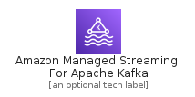
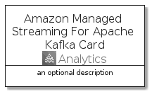

# AmazonManagedStreamingForApacheKafka


```text
aws-q3-2021/Architecture/Analytics/AmazonManagedStreamingForApacheKafka
```

```text
include('aws-q3-2021/Architecture/Analytics/AmazonManagedStreamingForApacheKafka')
```


| Illustration | AmazonManagedStreamingForApacheKafka | AmazonManagedStreamingForApacheKafkaCard | AmazonManagedStreamingForApacheKafkaGroup |
| :---: | :---: | :---: | :---: |
|  |  |  |  |


## AmazonManagedStreamingForApacheKafka

### Load remotely
```plantuml
@startuml
' configures the library
!global $LIB_BASE_LOCATION="https://github.com/tmorin/plantuml-libs/distribution"

' loads the library's bootstrap
!include $LIB_BASE_LOCATION/bootstrap.puml

' loads the package bootstrap
include('aws-q3-2021/bootstrap')

' loads the Item which embeds the element AmazonManagedStreamingForApacheKafka
include('aws-q3-2021/Architecture/Analytics/AmazonManagedStreamingForApacheKafka')

' renders the element
AmazonManagedStreamingForApacheKafka('AmazonManagedStreamingForApacheKafka', 'Amazon Managed Streaming For Apache Kafka', 'an optional tech label')
@enduml
```

### Load locally
```plantuml
@startuml
' configures the library
!global $INCLUSION_MODE="local"
!global $LIB_BASE_LOCATION="../../.."

' loads the library's bootstrap
!include $LIB_BASE_LOCATION/bootstrap.puml

' loads the package bootstrap
include('aws-q3-2021/bootstrap')

' loads the Item which embeds the element AmazonManagedStreamingForApacheKafka
include('aws-q3-2021/Architecture/Analytics/AmazonManagedStreamingForApacheKafka')

' renders the element
AmazonManagedStreamingForApacheKafka('AmazonManagedStreamingForApacheKafka', 'Amazon Managed Streaming For Apache Kafka', 'an optional tech label')
@enduml
```

## AmazonManagedStreamingForApacheKafkaCard

### Load remotely
```plantuml
@startuml
' configures the library
!global $LIB_BASE_LOCATION="https://github.com/tmorin/plantuml-libs/distribution"

' loads the library's bootstrap
!include $LIB_BASE_LOCATION/bootstrap.puml

' loads the package bootstrap
include('aws-q3-2021/bootstrap')

' loads the Item which embeds the element AmazonManagedStreamingForApacheKafkaCard
include('aws-q3-2021/Architecture/Analytics/AmazonManagedStreamingForApacheKafka')

' renders the element
AmazonManagedStreamingForApacheKafkaCard('AmazonManagedStreamingForApacheKafkaCard', 'Amazon Managed Streaming For Apache Kafka Card', 'an optional description')
@enduml
```

### Load locally
```plantuml
@startuml
' configures the library
!global $INCLUSION_MODE="local"
!global $LIB_BASE_LOCATION="../../.."

' loads the library's bootstrap
!include $LIB_BASE_LOCATION/bootstrap.puml

' loads the package bootstrap
include('aws-q3-2021/bootstrap')

' loads the Item which embeds the element AmazonManagedStreamingForApacheKafkaCard
include('aws-q3-2021/Architecture/Analytics/AmazonManagedStreamingForApacheKafka')

' renders the element
AmazonManagedStreamingForApacheKafkaCard('AmazonManagedStreamingForApacheKafkaCard', 'Amazon Managed Streaming For Apache Kafka Card', 'an optional description')
@enduml
```

## AmazonManagedStreamingForApacheKafkaGroup

### Load remotely
```plantuml
@startuml
' configures the library
!global $LIB_BASE_LOCATION="https://github.com/tmorin/plantuml-libs/distribution"

' loads the library's bootstrap
!include $LIB_BASE_LOCATION/bootstrap.puml

' loads the package bootstrap
include('aws-q3-2021/bootstrap')

' loads the Item which embeds the element AmazonManagedStreamingForApacheKafkaGroup
include('aws-q3-2021/Architecture/Analytics/AmazonManagedStreamingForApacheKafka')

' renders the element
AmazonManagedStreamingForApacheKafkaGroup('AmazonManagedStreamingForApacheKafkaGroup', 'Amazon Managed Streaming For Apache Kafka Group', 'an optional tech label') {
    note as note
        the content of the group
    end note
}
@enduml
```

### Load locally
```plantuml
@startuml
' configures the library
!global $INCLUSION_MODE="local"
!global $LIB_BASE_LOCATION="../../.."

' loads the library's bootstrap
!include $LIB_BASE_LOCATION/bootstrap.puml

' loads the package bootstrap
include('aws-q3-2021/bootstrap')

' loads the Item which embeds the element AmazonManagedStreamingForApacheKafkaGroup
include('aws-q3-2021/Architecture/Analytics/AmazonManagedStreamingForApacheKafka')

' renders the element
AmazonManagedStreamingForApacheKafkaGroup('AmazonManagedStreamingForApacheKafkaGroup', 'Amazon Managed Streaming For Apache Kafka Group', 'an optional tech label') {
    note as note
        the content of the group
    end note
}
@enduml
```

