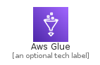
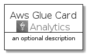
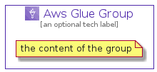

# AwsGlue


```text
aws-q3-2021/Architecture/Analytics/AwsGlue
```

```text
include('aws-q3-2021/Architecture/Analytics/AwsGlue')
```


| Illustration | AwsGlue | AwsGlueCard | AwsGlueGroup |
| :---: | :---: | :---: | :---: |
|  |  |  |  |


## AwsGlue

### Load remotely
```plantuml
@startuml
' configures the library
!global $LIB_BASE_LOCATION="https://github.com/tmorin/plantuml-libs/distribution"

' loads the library's bootstrap
!include $LIB_BASE_LOCATION/bootstrap.puml

' loads the package bootstrap
include('aws-q3-2021/bootstrap')

' loads the Item which embeds the element AwsGlue
include('aws-q3-2021/Architecture/Analytics/AwsGlue')

' renders the element
AwsGlue('AwsGlue', 'Aws Glue', 'an optional tech label')
@enduml
```

### Load locally
```plantuml
@startuml
' configures the library
!global $INCLUSION_MODE="local"
!global $LIB_BASE_LOCATION="../../.."

' loads the library's bootstrap
!include $LIB_BASE_LOCATION/bootstrap.puml

' loads the package bootstrap
include('aws-q3-2021/bootstrap')

' loads the Item which embeds the element AwsGlue
include('aws-q3-2021/Architecture/Analytics/AwsGlue')

' renders the element
AwsGlue('AwsGlue', 'Aws Glue', 'an optional tech label')
@enduml
```

## AwsGlueCard

### Load remotely
```plantuml
@startuml
' configures the library
!global $LIB_BASE_LOCATION="https://github.com/tmorin/plantuml-libs/distribution"

' loads the library's bootstrap
!include $LIB_BASE_LOCATION/bootstrap.puml

' loads the package bootstrap
include('aws-q3-2021/bootstrap')

' loads the Item which embeds the element AwsGlueCard
include('aws-q3-2021/Architecture/Analytics/AwsGlue')

' renders the element
AwsGlueCard('AwsGlueCard', 'Aws Glue Card', 'an optional description')
@enduml
```

### Load locally
```plantuml
@startuml
' configures the library
!global $INCLUSION_MODE="local"
!global $LIB_BASE_LOCATION="../../.."

' loads the library's bootstrap
!include $LIB_BASE_LOCATION/bootstrap.puml

' loads the package bootstrap
include('aws-q3-2021/bootstrap')

' loads the Item which embeds the element AwsGlueCard
include('aws-q3-2021/Architecture/Analytics/AwsGlue')

' renders the element
AwsGlueCard('AwsGlueCard', 'Aws Glue Card', 'an optional description')
@enduml
```

## AwsGlueGroup

### Load remotely
```plantuml
@startuml
' configures the library
!global $LIB_BASE_LOCATION="https://github.com/tmorin/plantuml-libs/distribution"

' loads the library's bootstrap
!include $LIB_BASE_LOCATION/bootstrap.puml

' loads the package bootstrap
include('aws-q3-2021/bootstrap')

' loads the Item which embeds the element AwsGlueGroup
include('aws-q3-2021/Architecture/Analytics/AwsGlue')

' renders the element
AwsGlueGroup('AwsGlueGroup', 'Aws Glue Group', 'an optional tech label') {
    note as note
        the content of the group
    end note
}
@enduml
```

### Load locally
```plantuml
@startuml
' configures the library
!global $INCLUSION_MODE="local"
!global $LIB_BASE_LOCATION="../../.."

' loads the library's bootstrap
!include $LIB_BASE_LOCATION/bootstrap.puml

' loads the package bootstrap
include('aws-q3-2021/bootstrap')

' loads the Item which embeds the element AwsGlueGroup
include('aws-q3-2021/Architecture/Analytics/AwsGlue')

' renders the element
AwsGlueGroup('AwsGlueGroup', 'Aws Glue Group', 'an optional tech label') {
    note as note
        the content of the group
    end note
}
@enduml
```

