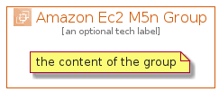

# AmazonEc2M5N


```text
aws-q3-2021/Architecture/Compute/AmazonEc2M5N
```

```text
include('aws-q3-2021/Architecture/Compute/AmazonEc2M5N')
```


| Illustration | AmazonEc2M5N | AmazonEc2M5NCard | AmazonEc2M5NGroup |
| :---: | :---: | :---: | :---: |
|  |  |  |  |


## AmazonEc2M5N

### Load remotely
```plantuml
@startuml
' configures the library
!global $LIB_BASE_LOCATION="https://github.com/tmorin/plantuml-libs/distribution"

' loads the library's bootstrap
!include $LIB_BASE_LOCATION/bootstrap.puml

' loads the package bootstrap
include('aws-q3-2021/bootstrap')

' loads the Item which embeds the element AmazonEc2M5N
include('aws-q3-2021/Architecture/Compute/AmazonEc2M5N')

' renders the element
AmazonEc2M5N('AmazonEc2M5n', 'Amazon Ec2 M5n', 'an optional tech label')
@enduml
```

### Load locally
```plantuml
@startuml
' configures the library
!global $INCLUSION_MODE="local"
!global $LIB_BASE_LOCATION="../../.."

' loads the library's bootstrap
!include $LIB_BASE_LOCATION/bootstrap.puml

' loads the package bootstrap
include('aws-q3-2021/bootstrap')

' loads the Item which embeds the element AmazonEc2M5N
include('aws-q3-2021/Architecture/Compute/AmazonEc2M5N')

' renders the element
AmazonEc2M5N('AmazonEc2M5n', 'Amazon Ec2 M5n', 'an optional tech label')
@enduml
```

## AmazonEc2M5NCard

### Load remotely
```plantuml
@startuml
' configures the library
!global $LIB_BASE_LOCATION="https://github.com/tmorin/plantuml-libs/distribution"

' loads the library's bootstrap
!include $LIB_BASE_LOCATION/bootstrap.puml

' loads the package bootstrap
include('aws-q3-2021/bootstrap')

' loads the Item which embeds the element AmazonEc2M5NCard
include('aws-q3-2021/Architecture/Compute/AmazonEc2M5N')

' renders the element
AmazonEc2M5NCard('AmazonEc2M5nCard', 'Amazon Ec2 M5n Card', 'an optional description')
@enduml
```

### Load locally
```plantuml
@startuml
' configures the library
!global $INCLUSION_MODE="local"
!global $LIB_BASE_LOCATION="../../.."

' loads the library's bootstrap
!include $LIB_BASE_LOCATION/bootstrap.puml

' loads the package bootstrap
include('aws-q3-2021/bootstrap')

' loads the Item which embeds the element AmazonEc2M5NCard
include('aws-q3-2021/Architecture/Compute/AmazonEc2M5N')

' renders the element
AmazonEc2M5NCard('AmazonEc2M5nCard', 'Amazon Ec2 M5n Card', 'an optional description')
@enduml
```

## AmazonEc2M5NGroup

### Load remotely
```plantuml
@startuml
' configures the library
!global $LIB_BASE_LOCATION="https://github.com/tmorin/plantuml-libs/distribution"

' loads the library's bootstrap
!include $LIB_BASE_LOCATION/bootstrap.puml

' loads the package bootstrap
include('aws-q3-2021/bootstrap')

' loads the Item which embeds the element AmazonEc2M5NGroup
include('aws-q3-2021/Architecture/Compute/AmazonEc2M5N')

' renders the element
AmazonEc2M5NGroup('AmazonEc2M5nGroup', 'Amazon Ec2 M5n Group', 'an optional tech label') {
    note as note
        the content of the group
    end note
}
@enduml
```

### Load locally
```plantuml
@startuml
' configures the library
!global $INCLUSION_MODE="local"
!global $LIB_BASE_LOCATION="../../.."

' loads the library's bootstrap
!include $LIB_BASE_LOCATION/bootstrap.puml

' loads the package bootstrap
include('aws-q3-2021/bootstrap')

' loads the Item which embeds the element AmazonEc2M5NGroup
include('aws-q3-2021/Architecture/Compute/AmazonEc2M5N')

' renders the element
AmazonEc2M5NGroup('AmazonEc2M5nGroup', 'Amazon Ec2 M5n Group', 'an optional tech label') {
    note as note
        the content of the group
    end note
}
@enduml
```

