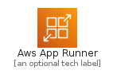
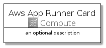
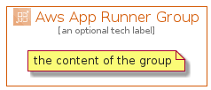

# AwsAppRunner


```text
aws-q3-2021/Architecture/Compute/AwsAppRunner
```

```text
include('aws-q3-2021/Architecture/Compute/AwsAppRunner')
```


| Illustration | AwsAppRunner | AwsAppRunnerCard | AwsAppRunnerGroup |
| :---: | :---: | :---: | :---: |
|  |  |  |  |


## AwsAppRunner

### Load remotely
```plantuml
@startuml
' configures the library
!global $LIB_BASE_LOCATION="https://raw.githubusercontent.com/tmorin/plantuml-libs/master/distribution"

' loads the library's bootstrap
!include $LIB_BASE_LOCATION/bootstrap.puml

' loads the package bootstrap
include('aws-q3-2021/bootstrap')

' loads the Item which embeds the element AwsAppRunner
include('aws-q3-2021/Architecture/Compute/AwsAppRunner')

' renders the element
AwsAppRunner('AwsAppRunner', 'Aws App Runner', 'an optional tech label')
@enduml
```

### Load locally
```plantuml
@startuml
' configures the library
!global $INCLUSION_MODE="local"
!global $LIB_BASE_LOCATION="../../.."

' loads the library's bootstrap
!include $LIB_BASE_LOCATION/bootstrap.puml

' loads the package bootstrap
include('aws-q3-2021/bootstrap')

' loads the Item which embeds the element AwsAppRunner
include('aws-q3-2021/Architecture/Compute/AwsAppRunner')

' renders the element
AwsAppRunner('AwsAppRunner', 'Aws App Runner', 'an optional tech label')
@enduml
```

## AwsAppRunnerCard

### Load remotely
```plantuml
@startuml
' configures the library
!global $LIB_BASE_LOCATION="https://raw.githubusercontent.com/tmorin/plantuml-libs/master/distribution"

' loads the library's bootstrap
!include $LIB_BASE_LOCATION/bootstrap.puml

' loads the package bootstrap
include('aws-q3-2021/bootstrap')

' loads the Item which embeds the element AwsAppRunnerCard
include('aws-q3-2021/Architecture/Compute/AwsAppRunner')

' renders the element
AwsAppRunnerCard('AwsAppRunnerCard', 'Aws App Runner Card', 'an optional description')
@enduml
```

### Load locally
```plantuml
@startuml
' configures the library
!global $INCLUSION_MODE="local"
!global $LIB_BASE_LOCATION="../../.."

' loads the library's bootstrap
!include $LIB_BASE_LOCATION/bootstrap.puml

' loads the package bootstrap
include('aws-q3-2021/bootstrap')

' loads the Item which embeds the element AwsAppRunnerCard
include('aws-q3-2021/Architecture/Compute/AwsAppRunner')

' renders the element
AwsAppRunnerCard('AwsAppRunnerCard', 'Aws App Runner Card', 'an optional description')
@enduml
```

## AwsAppRunnerGroup

### Load remotely
```plantuml
@startuml
' configures the library
!global $LIB_BASE_LOCATION="https://raw.githubusercontent.com/tmorin/plantuml-libs/master/distribution"

' loads the library's bootstrap
!include $LIB_BASE_LOCATION/bootstrap.puml

' loads the package bootstrap
include('aws-q3-2021/bootstrap')

' loads the Item which embeds the element AwsAppRunnerGroup
include('aws-q3-2021/Architecture/Compute/AwsAppRunner')

' renders the element
AwsAppRunnerGroup('AwsAppRunnerGroup', 'Aws App Runner Group', 'an optional tech label') {
    note as note
        the content of the group
    end note
}
@enduml
```

### Load locally
```plantuml
@startuml
' configures the library
!global $INCLUSION_MODE="local"
!global $LIB_BASE_LOCATION="../../.."

' loads the library's bootstrap
!include $LIB_BASE_LOCATION/bootstrap.puml

' loads the package bootstrap
include('aws-q3-2021/bootstrap')

' loads the Item which embeds the element AwsAppRunnerGroup
include('aws-q3-2021/Architecture/Compute/AwsAppRunner')

' renders the element
AwsAppRunnerGroup('AwsAppRunnerGroup', 'Aws App Runner Group', 'an optional tech label') {
    note as note
        the content of the group
    end note
}
@enduml
```

